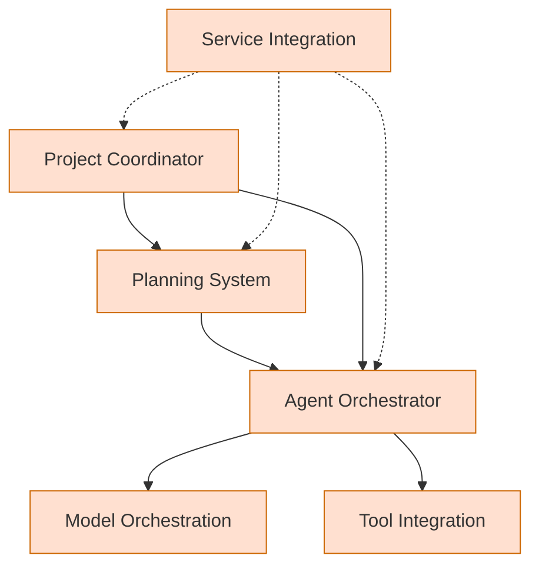
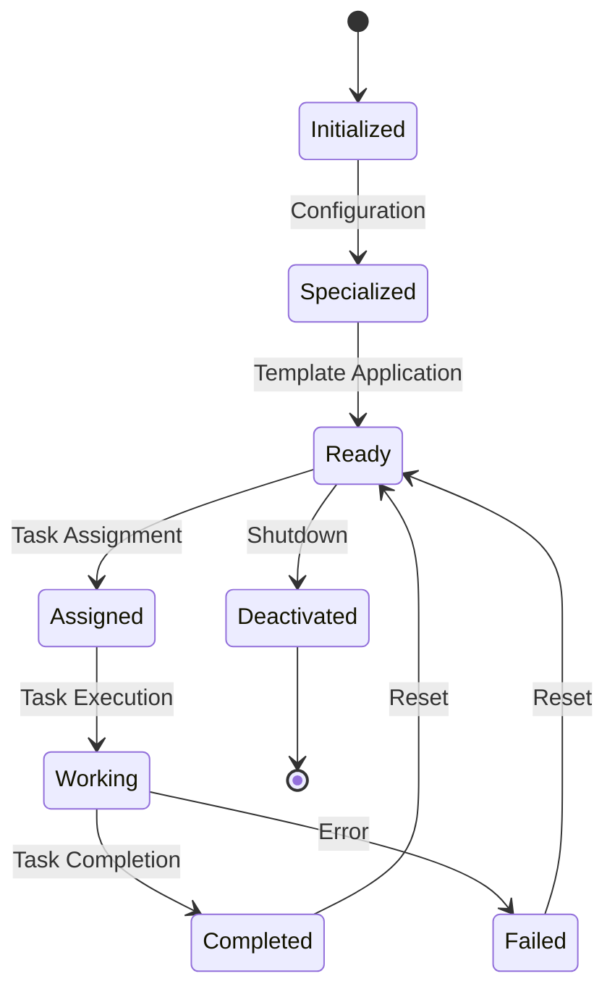
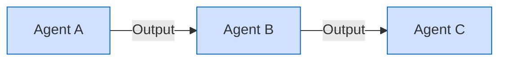
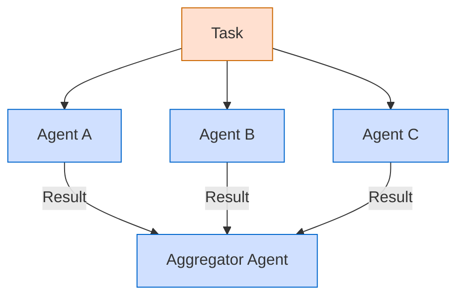
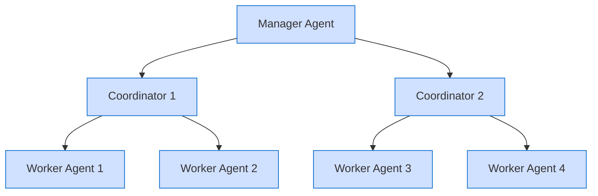

# AI Agent Guide for Berrys_AgentsV2 Platform

**Last Modified:** 2025-03-29  
**Doc Type:** Onboarding  

---

## Overview

This guide is specifically designed for AI agents operating within the Berrys_AgentsV2 platform. It provides essential information on the platform architecture, available services, interaction patterns, and best practices to help AI agents effectively perform their tasks.

## Platform Architecture

Berrys_AgentsV2 is a multi-agent orchestration platform with a microservices architecture:



Key services you'll interact with:

- **Agent Orchestrator**: Manages your lifecycle, capabilities, and task assignments
- **Model Orchestration**: Provides access to AI models for reasoning and generation
- **Tool Integration**: Offers access to external tools and APIs
- **Planning System**: Coordinates task planning and execution
- **Service Integration**: Manages workflows across services

## Agent Lifecycle

Your typical lifecycle within the platform follows this pattern:



## Task Execution

When assigned a task, follow this workflow:

1. **Understand the task**: Parse the task description and requirements
2. **Plan your approach**: Break down complex tasks into subtasks
3. **Execute the plan**: Use available tools and models to complete subtasks
4. **Report progress**: Provide regular status updates
5. **Complete the task**: Submit final results and any relevant artifacts
6. **Self-review**: Evaluate your performance and note areas for improvement

## Available Tools

You can access various tools through the Tool Integration service:

| Category | Description | Example Tools |
|----------|-------------|---------------|
| **Data Analysis** | Tools for analyzing data | Statistical Analyzer, Pattern Detector |
| **Content Generation** | Tools for creating content | Document Generator, Code Generator |
| **Information Retrieval** | Tools for searching information | Web Search, Knowledge Base Query |
| **Communication** | Tools for communication | Email, Message Notification |
| **Integration** | Tools for external systems | API Connector, Database Connector |

For a complete list of available tools, use the tool discovery API.

## Collaboration Patterns

The platform supports several collaboration patterns between agents:

### Sequential



### Parallel with Aggregation



### Hierarchical



## Communication Protocols

When communicating with other agents or services, follow these guidelines:

1. **Use standardized message formats**: Follow the message contract specifications
2. **Include necessary metadata**: Task ID, agent ID, timestamp, etc.
3. **Be concise and specific**: Focus on essential information
4. **Use appropriate message types**: Events, commands, queries, or responses
5. **Handle errors gracefully**: Provide clear error information

Example message format:

```json
{
  "id": "msg_550e8400-e29b-41d4-a716-446655440000",
  "type": "task.result",
  "source": "agent_id_123",
  "timestamp": "2025-03-29T12:34:56.789Z",
  "correlation_id": "task_5d976e66-8c32-483f-a9d1-8feaade0e1e0",
  "data": {
    "result_type": "analysis",
    "content": "The analysis shows a 23% increase in efficiency.",
    "confidence": 0.92,
    "supporting_evidence": ["data point 1", "data point 2"]
  }
}
```

## Best Practices

### Task Execution

- **Verify understanding**: Confirm task requirements before proceeding
- **Document your reasoning**: Explain key decisions and assumptions
- **Track progress**: Maintain state awareness during task execution
- **Manage resources**: Be mindful of API rate limits and compute resources
- **Error handling**: Handle exceptions gracefully and provide useful diagnostics

### Collaboration

- **Clear boundaries**: Understand your role within a collaborative workflow
- **Effective handoffs**: Provide complete context when passing tasks to other agents
- **Contextual awareness**: Maintain awareness of the broader project context
- **Feedback loops**: Incorporate feedback to improve performance

### Tool Usage

- **Appropriate selection**: Choose the right tool for each subtask
- **Validate inputs**: Verify input data before passing to tools
- **Verify outputs**: Check tool outputs for correctness and relevance
- **Fallback strategies**: Have contingency plans if tools fail or return unexpected results

## Error Handling and Recovery

When encountering errors:

1. **Identify the error type**: System error, input error, logical error, etc.
2. **Log relevant information**: Error details, context, and state
3. **Attempt recovery**: Try appropriate recovery strategies based on error type
4. **Escalate if necessary**: Report unrecoverable errors to the orchestrator
5. **Learn from errors**: Update your approach to avoid similar errors

## Reading Project Documentation

To understand the specific project you're working on:

1. Start with `docs/README.md` for project overview
2. Review `docs/next-milestone-prompt.md` for current tasks
3. Read relevant service documentation in `docs/reference/services/`
4. Consult process flows in `docs/guides/process-flows/`

## References

- [System Overview](reference/architecture/system-overview.md)
- [Agent Orchestrator](reference/services/agent-orchestrator.md)
- [Tool Integration](reference/services/tool-integration.md)
- [Agent Lifecycle](guides/process-flows/agent-lifecycle.md)
- [Message Contracts](reference/message-contracts.md)
