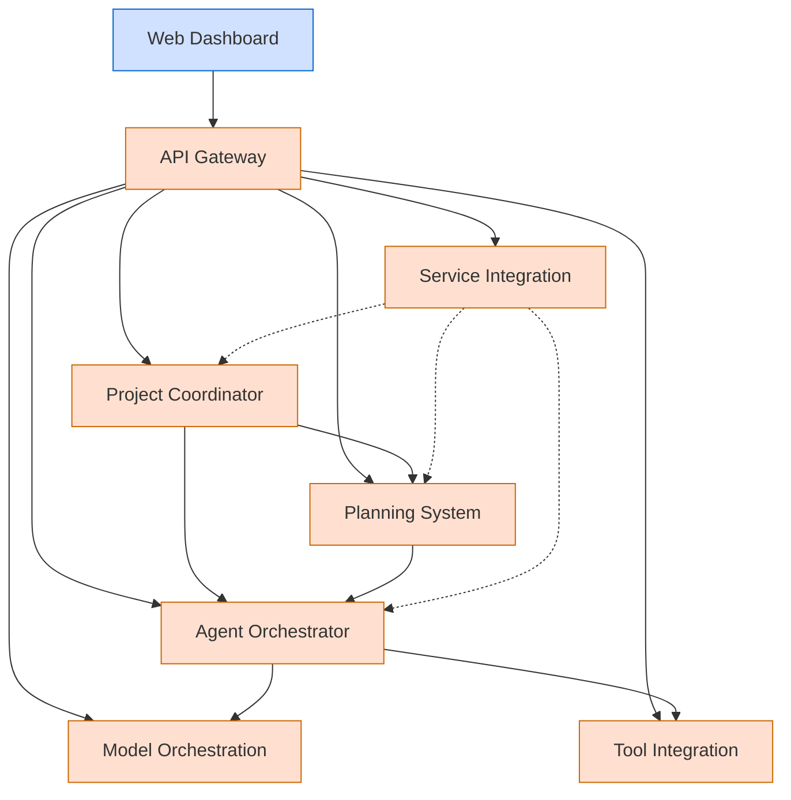

# Berrys_AgentsV2 Platform

**Last Modified:** 2025-03-29  
**Doc Type:** Onboarding  

---

## Overview

Berrys_AgentsV2 is a comprehensive multi-agent orchestration platform designed to enable intelligent agents to collaborate on complex tasks. The platform provides scalable, resilient infrastructure for deploying, managing, and coordinating AI agents across various domains and use cases.

## Core Features

- **Agent Orchestration**: Create, deploy, and manage AI agents
- **Task Planning**: Decompose complex tasks and coordinate execution
- **Model Integration**: Connect to various AI models with standardized interfaces
- **Tool Integration**: Provide agents with access to external tools and APIs
- **Service Integration**: Coordinate workflows across multiple services
- **Web Dashboard**: Visualize and manage platform activities

## Architecture

The platform follows a microservices architecture with specialized services:

For more details on the architecture, see [System Overview](reference/architecture/system-overview.md).

## Getting Started

For new team members and AI agents, we recommend the following starting points:

- [AI Agent Guide](AI_AGENT_GUIDE.md) - Guide specifically for AI agents
- [Onboarding Guide](onboarding/README.md) - Quick start for new team members

## Services

The platform consists of the following core services:

| Service | Purpose | Documentation |
|---------|---------|---------------|
| **API Gateway** | Central entry point for all external requests | [API Gateway](reference/services/api-gateway.md) |
| **Web Dashboard** | User interface for platform management | [Web Dashboard](reference/services/web-dashboard.md) |
| **Project Coordinator** | Manages projects and workflows | [Project Coordinator](reference/services/project-coordinator.md) |
| **Planning System** | Manages task planning and execution | [Planning System](reference/services/planning-system.md) |
| **Agent Orchestrator** | Manages agent lifecycle | [Agent Orchestrator](reference/services/agent-orchestrator.md) |
| **Model Orchestration** | Manages AI model interactions | [Model Orchestration](reference/services/model-orchestration.md) |
| **Tool Integration** | Enables external tool usage | [Tool Integration](reference/services/tool-integration.md) |
| **Service Integration** | Coordinates workflows | [Service Integration](reference/services/service-integration.md) |

## Documentation Structure

Our documentation is organized into the following categories:

- **[Reference](reference/)**: Technical documentation on system components
- **[Guides](guides/)**: How-to guides for common tasks
- **[Best Practices](best-practices/)**: Recommended approaches and standards

For documentation standards and guidelines, see the [Documentation Maintenance Plan](best-practices/documentation-maintenance-plan.md).

## Development

For developers working on the platform, we recommend reviewing:

- [Service Development Guide](guides/developer-guides/service-development.md)
- [Testing Guide](guides/developer-guides/testing.md)
- [CI/CD Guide](guides/developer-guides/ci-cd.md)
- [Troubleshooting Guide](guides/developer-guides/troubleshooting.md)

## Deployment

For information on deploying the platform, see:

- [Production Deployment Guide](guides/deployment/production.md)
- [Deployment Workflow](guides/process-flows/deployment-workflow.md)

## Current Development Focus

See [Next Milestone](next-milestone-prompt.md) for information on the current development focus and upcoming tasks.

## License

Copyright © 2025 Berry Inc. All rights reserved.
