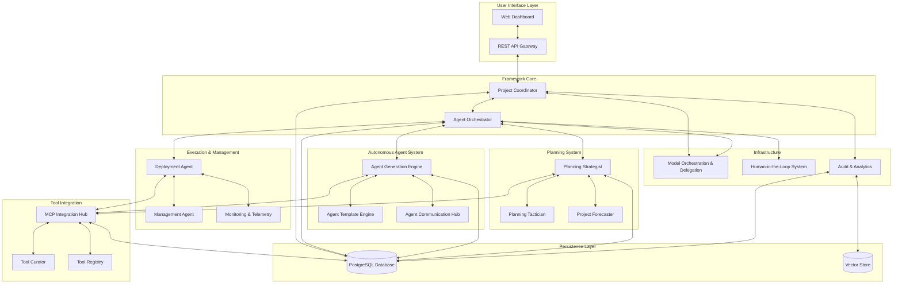
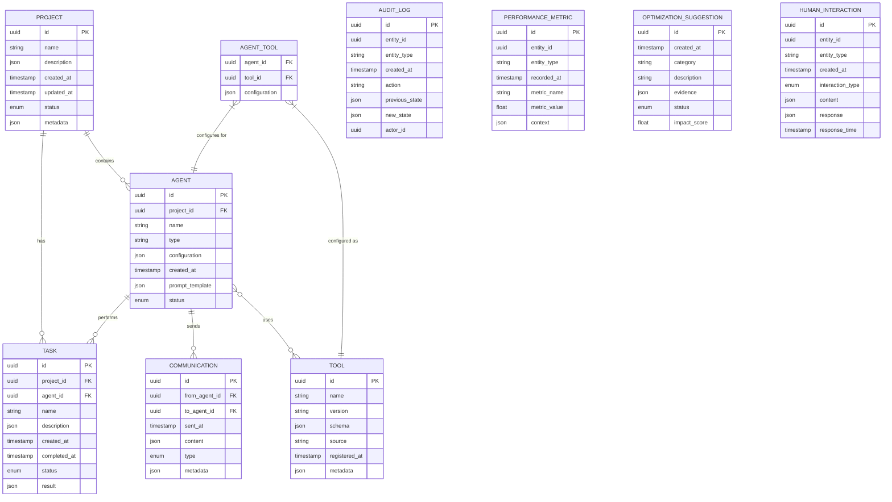
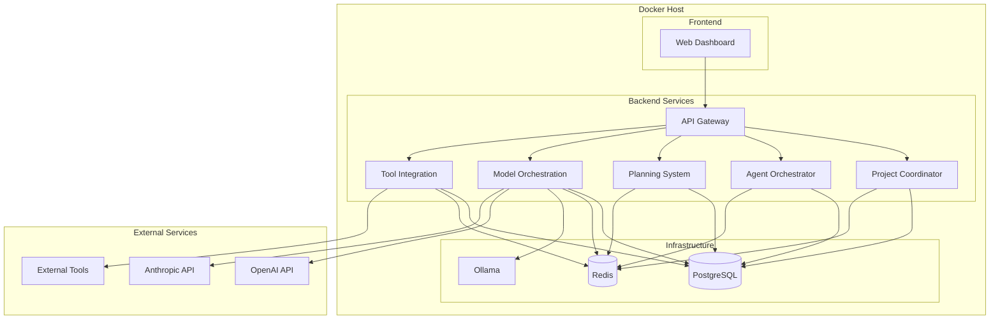

# Project-based MAS Framework Architecture

This document provides a detailed overview of the architecture for the Project-based Multi-Agent System Framework.

## System Overview

The framework is designed as a microservices architecture with the following key components:

## Component Details

### 1. User Interface Layer

- **Web Dashboard**: React-based frontend for user interaction with the system.
- **REST API Gateway**: FastAPI-based API gateway that serves as the entry point for all requests.

### 2. Framework Core

- **Project Coordinator**: Manages project lifecycle and coordinates between different components.
- **Agent Orchestrator**: Manages agent lifecycle, coordination, and communication.

### 3. Autonomous Agent System

- **Agent Generation Engine**: Transforms project requirements into specialized agents.
- **Agent Template Engine**: Maintains and customizes agent templates.
- **Agent Communication Hub**: Facilitates communication between agents.

### 4. Planning System

- **Planning Strategist**: Handles high-level project planning and resource allocation.
- **Planning Tactician**: Breaks down plans into executable tasks with dependencies.
- **Project Forecaster**: Predicts project timelines and identifies potential bottlenecks.

### 5. Execution & Management

- **Deployment Agent**: Triggers execution of tasks and manages deployment.
- **Management Agent**: Oversees execution and handles exceptions.
- **Monitoring & Telemetry**: Collects performance metrics and monitors system health.

### 6. Tool Integration

- **MCP Integration Hub**: Integrates with Model Context Protocol servers.
- **Tool Curator**: Discovers and evaluates external tools.
- **Tool Registry**: Maintains a registry of available tools.

### 7. Infrastructure

- **Model Orchestration & Delegation**: Routes requests to appropriate AI models.
- **Human-in-the-Loop System**: Manages human interactions and approvals.
- **Audit & Analytics**: Logs system activities and generates insights.

### 8. Persistence Layer

- **PostgreSQL Database**: Stores structured data for the system.
- **Vector Store**: Stores embeddings for similarity search.

## Data Model

The core data model for the system is as follows:

## Communication Patterns

The system uses the following communication patterns:

1. **REST API**: For synchronous communication between the web dashboard and API gateway.
2. **Event-based**: For asynchronous communication between services using Redis pub/sub.
3. **Command-based**: For request-response patterns between services.

## Model Orchestration Strategy

The Model Orchestration & Delegation system intelligently routes requests to the most appropriate AI model based on:

1. **Task Classification**: Categorizes requests by complexity and requirements.
2. **Capability Matching**: Matches task requirements with model capabilities.
3. **Cost Optimization**: Balances cost and performance considerations.
4. **Fallback Mechanisms**: Provides graceful degradation when preferred models are unavailable.

## Human-in-the-Loop Protocol

The Human-in-the-Loop system determines when human intervention is required:

1. **Approval Workflows**: For critical decisions that require human approval.
2. **Feedback Collection**: For gathering human feedback on system outputs.
3. **Clarification Requests**: For resolving ambiguities in requirements.
4. **Notifications**: For keeping humans informed of important events.

## Deployment Architecture

The system is deployed using Docker containers with the following architecture:

## Security Considerations

1. **Authentication**: JWT-based authentication for API access.
2. **Authorization**: Role-based access control for different operations.
3. **Data Protection**: Encryption of sensitive data in transit and at rest.
4. **API Security**: Rate limiting, input validation, and protection against common attacks.

## Scalability Considerations

1. **Horizontal Scaling**: Services can be scaled independently based on load.
2. **Database Scaling**: PostgreSQL can be scaled using replication and sharding.
3. **Caching**: Redis is used for caching frequently accessed data.
4. **Asynchronous Processing**: Long-running tasks are processed asynchronously.
