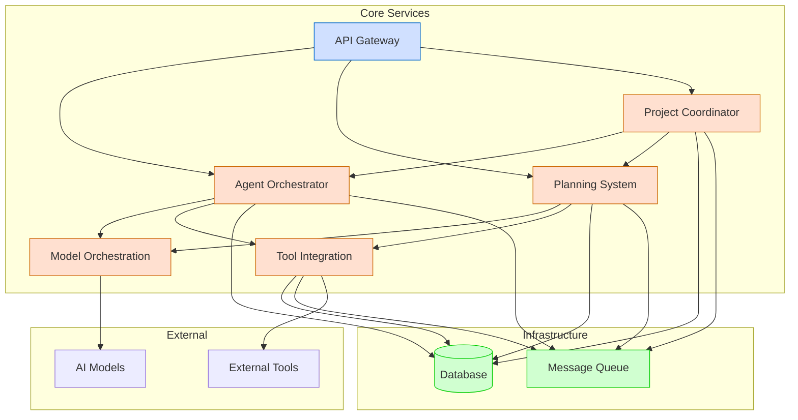
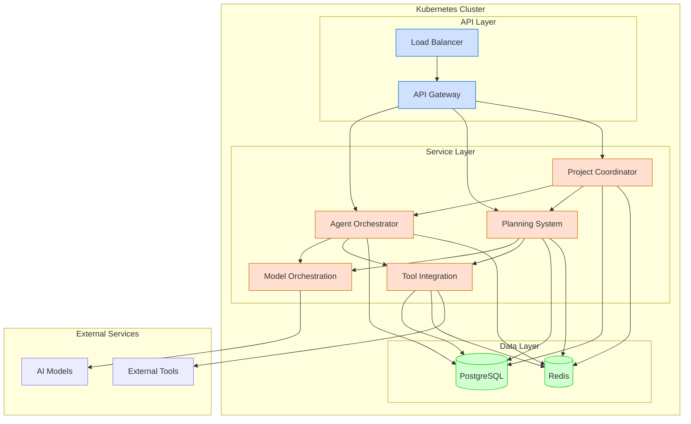

# Architecture Documentation

This section provides comprehensive documentation of the Berrys_AgentsV2 system architecture, including its components, interactions, and design principles.

## Quick Navigation

- [System Overview](system-overview.md): High-level overview of the system architecture
- [Service Architecture](service-architecture.md): Detailed architecture of individual services
- [Web Dashboard](web-dashboard.md): Detailed architecture of the web dashboard component
- [Data Model](data-model.md): Database schema and data relationships
- [Communication Patterns](communication-patterns.md): How services communicate with each other
- [Security Architecture](security-architecture.md): Security considerations and implementations

## Architecture Overview

Berrys_AgentsV2 is built using a microservices architecture with the following key components:

## Key Components

### API Gateway

The API Gateway serves as the entry point for all client requests. It routes requests to the appropriate services, handles authentication and authorization, and provides a unified API for external integrations.

### Agent Orchestrator

The Agent Orchestrator manages the lifecycle of agents, including creation, initialization, coordination, and communication. It works with the Model Orchestration service to execute agent tasks and with the Tool Integration service to provide agents with access to external tools.

### Planning System

The Planning System handles project planning, task breakdown, and resource allocation. It works with the Model Orchestration service to generate plans and with the Agent Orchestrator to assign tasks to agents.

### Model Orchestration

The Model Orchestration service manages interaction with AI models from various providers. It selects the appropriate model for each task, handles request routing, and processes responses.

### Tool Integration

The Tool Integration service provides agents with access to external tools and services. It discovers, evaluates, and integrates tools that can help agents complete their tasks.

### Project Coordinator

The Project Coordinator manages the lifecycle of projects, including creation, tracking, and coordination. It works with the Agent Orchestrator and Planning System to ensure that projects are executed successfully.

## Design Principles

The architecture of Berrys_AgentsV2 is guided by the following design principles:

1. **Microservices Architecture**: Each component is implemented as a separate service with a well-defined API, allowing for independent development, deployment, and scaling.

2. **Event-Driven Communication**: Services communicate with each other using events, allowing for loose coupling and asynchronous processing.

3. **Domain-Driven Design**: The system is organized around business domains, with each service responsible for a specific domain.

4. **Polyglot Persistence**: Different services use different storage technologies based on their specific requirements.

5. **API-First Design**: All services expose well-defined APIs that are designed before implementation.

6. **Containerization**: All services are containerized using Docker, allowing for consistent deployment across environments.

7. **Infrastructure as Code**: All infrastructure is defined as code, allowing for reproducible deployments.

## Technology Stack

The Berrys_AgentsV2 system uses the following technologies:

- **Programming Languages**: Python, TypeScript
- **Web Framework**: FastAPI
- **Frontend Framework**: React
- **Database**: PostgreSQL
- **Message Queue**: Redis
- **Containerization**: Docker
- **Container Orchestration**: Docker Compose (development), Kubernetes (production)
- **CI/CD**: GitHub Actions
- **Monitoring**: Prometheus, Grafana
- **Logging**: ELK Stack (Elasticsearch, Logstash, Kibana)

## Deployment Architecture

The system can be deployed in different environments:

### Development Environment

In the development environment, all services are deployed on a single machine using Docker Compose. This allows for easy local development and testing.

### Production Environment

In the production environment, the system is deployed on a Kubernetes cluster. This allows for high availability, scalability, and automated management.

## Evolution and Future Directions

The architecture of Berrys_AgentsV2 is designed to evolve over time. Future directions include:

1. **Enhanced Agent Capabilities**: Adding more specialized agent types and improving agent collaboration.

2. **Advanced Planning**: Implementing more sophisticated planning algorithms and optimization techniques.

3. **Improved Tool Integration**: Expanding the range of tools that agents can use and improving tool discovery.

4. **Enhanced Human-in-the-Loop**: Improving the interaction between agents and humans, including better feedback mechanisms.

5. **Scalability Improvements**: Enhancing the system's ability to handle large numbers of projects, agents, and tasks.
