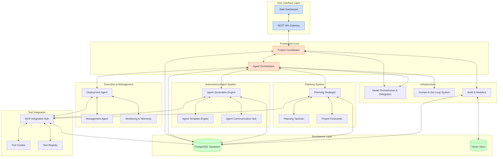

# System Overview

This document provides a detailed overview of the Berrys_AgentsV2 system architecture, including its components, interactions, and design principles.

## System Architecture

Berrys_AgentsV2 is built using a microservices architecture with the following key components:

## Component Details

### 1. User Interface Layer

- **Web Dashboard**: React-based frontend for user interaction with the system.
  - Provides a visual interface for managing projects, agents, and tasks
  - Displays real-time status and analytics
  - Supports human-in-the-loop interactions

- **REST API Gateway**: FastAPI-based API gateway that serves as the entry point for all requests.
  - Routes requests to appropriate services
  - Handles authentication and authorization
  - Provides a unified API for external integrations

### 2. Framework Core

- **Project Coordinator**: Manages project lifecycle and coordinates between different components.
  - Creates and manages projects
  - Tracks project status and progress
  - Coordinates activities across services

- **Agent Orchestrator**: Manages agent lifecycle, coordination, and communication.
  - Creates and initializes agents
  - Manages agent state and lifecycle
  - Coordinates agent activities
  - Facilitates agent communication

### 3. Autonomous Agent System

- **Agent Generation Engine**: Transforms project requirements into specialized agents.
  - Analyzes project requirements
  - Determines required agent types
  - Generates agent configurations
  - Creates agent instances

- **Agent Template Engine**: Maintains and customizes agent templates.
  - Stores template definitions
  - Customizes templates based on requirements
  - Manages template versions

- **Agent Communication Hub**: Facilitates communication between agents.
  - Routes messages between agents
  - Manages communication protocols
  - Logs communication for auditing

### 4. Planning System

- **Planning Strategist**: Handles high-level project planning and resource allocation.
  - Creates high-level project plans
  - Allocates resources to tasks
  - Defines project phases and milestones

- **Planning Tactician**: Breaks down plans into executable tasks with dependencies.
  - Creates detailed task breakdowns
  - Defines task dependencies
  - Assigns tasks to agents

- **Project Forecaster**: Predicts project timelines and identifies potential bottlenecks.
  - Estimates task durations
  - Predicts project completion dates
  - Identifies potential bottlenecks
  - Suggests optimizations

### 5. Execution & Management

- **Deployment Agent**: Triggers execution of tasks and manages deployment.
  - Initiates task execution
  - Monitors task progress
  - Handles deployment to production environments

- **Management Agent**: Oversees execution and handles exceptions.
  - Monitors execution status
  - Handles exceptions and errors
  - Implements recovery strategies

- **Monitoring & Telemetry**: Collects performance metrics and monitors system health.
  - Collects system metrics
  - Monitors service health
  - Generates alerts for issues
  - Provides performance dashboards

### 6. Tool Integration

- **MCP Integration Hub**: Integrates with Model Context Protocol servers.
  - Discovers MCP servers
  - Manages MCP server connections
  - Routes requests to appropriate MCP servers

- **Tool Curator**: Discovers and evaluates external tools.
  - Searches for relevant tools
  - Evaluates tool capabilities
  - Recommends tools for specific tasks

- **Tool Registry**: Maintains a registry of available tools.
  - Stores tool metadata
  - Manages tool versions
  - Provides tool discovery APIs

### 7. Infrastructure

- **Model Orchestration & Delegation**: Routes requests to appropriate AI models.
  - Selects appropriate models for tasks
  - Manages model quotas and costs
  - Handles model fallbacks
  - Optimizes prompt construction

- **Human-in-the-Loop System**: Manages human interactions and approvals.
  - Determines when human input is needed
  - Routes requests to appropriate humans
  - Collects and processes human feedback

- **Audit & Analytics**: Logs system activities and generates insights.
  - Records all system activities
  - Generates audit trails
  - Provides analytics dashboards
  - Identifies optimization opportunities

### 8. Persistence Layer

- **PostgreSQL Database**: Stores structured data for the system.
  - Stores project data
  - Stores agent configurations
  - Stores task definitions and status
  - Provides ACID transactions

- **Vector Store**: Stores embeddings for similarity search.
  - Stores vector embeddings
  - Provides similarity search capabilities
  - Supports semantic search

## Communication Patterns

The system uses the following communication patterns:

1. **REST API**: For synchronous communication between the web dashboard and API gateway.
   - HTTP/JSON-based communication
   - Request-response pattern
   - Stateless interactions

2. **Event-based**: For asynchronous communication between services using Redis pub/sub.
   - Publish-subscribe pattern
   - Asynchronous processing
   - Loose coupling between services

3. **Command-based**: For request-response patterns between services.
   - Command pattern
   - Direct service-to-service communication
   - Synchronous or asynchronous execution

## Model Orchestration Strategy

The Model Orchestration & Delegation system intelligently routes requests to the most appropriate AI model based on:

1. **Task Classification**: Categorizes requests by complexity and requirements.
   - Analyzes request content
   - Determines task type
   - Identifies specific requirements

2. **Capability Matching**: Matches task requirements with model capabilities.
   - Maintains model capability profiles
   - Matches requirements to capabilities
   - Considers model strengths and weaknesses

3. **Cost Optimization**: Balances cost and performance considerations.
   - Considers model pricing
   - Optimizes for cost-effectiveness
   - Respects budget constraints

4. **Fallback Mechanisms**: Provides graceful degradation when preferred models are unavailable.
   - Implements fallback strategies
   - Handles model unavailability
   - Ensures service continuity

## Human-in-the-Loop Protocol

The Human-in-the-Loop system determines when human intervention is required:

1. **Approval Workflows**: For critical decisions that require human approval.
   - Identifies decisions requiring approval
   - Routes approval requests to appropriate humans
   - Tracks approval status

2. **Feedback Collection**: For gathering human feedback on system outputs.
   - Collects feedback on system outputs
   - Incorporates feedback into future decisions
   - Improves system performance over time

3. **Clarification Requests**: For resolving ambiguities in requirements.
   - Identifies ambiguous requirements
   - Formulates clarification questions
   - Processes clarification responses

4. **Notifications**: For keeping humans informed of important events.
   - Generates notifications for important events
   - Routes notifications to appropriate humans
   - Tracks notification status

## Security Considerations

1. **Authentication**: JWT-based authentication for API access.
   - Secure token generation and validation
   - Token expiration and renewal
   - Role-based access control

2. **Authorization**: Role-based access control for different operations.
   - Fine-grained permission system
   - Role-based access control
   - Resource-level permissions

3. **Data Protection**: Encryption of sensitive data in transit and at rest.
   - TLS for data in transit
   - Database encryption for data at rest
   - Secure credential storage

4. **API Security**: Rate limiting, input validation, and protection against common attacks.
   - Rate limiting to prevent abuse
   - Input validation to prevent injection attacks
   - Protection against common web vulnerabilities

## Scalability Considerations

1. **Horizontal Scaling**: Services can be scaled independently based on load.
   - Stateless service design
   - Container orchestration
   - Load balancing

2. **Database Scaling**: PostgreSQL can be scaled using replication and sharding.
   - Read replicas for scaling reads
   - Sharding for scaling writes
   - Connection pooling

3. **Caching**: Redis is used for caching frequently accessed data.
   - Distributed caching
   - Cache invalidation strategies
   - Optimized cache usage

4. **Asynchronous Processing**: Long-running tasks are processed asynchronously.
   - Message queues for task distribution
   - Background workers for processing
   - Task prioritization
