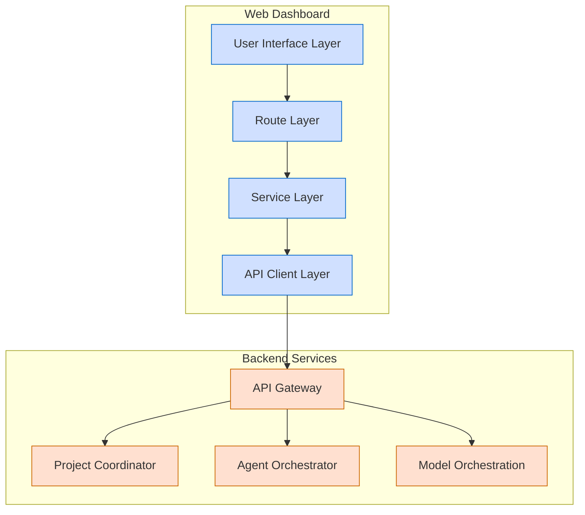
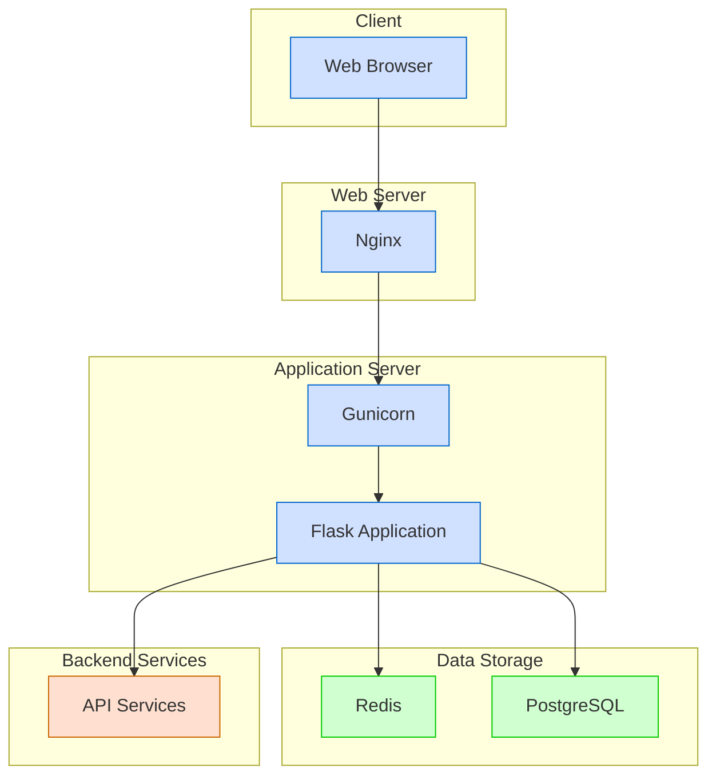

# Web Dashboard Architecture

This document provides a detailed overview of the Web Dashboard component of the Berrys_AgentsV2 system, including its architecture, design decisions, and integration with other system components.

## Overview

The Web Dashboard serves as the primary user interface for the Berrys_AgentsV2 system, providing a comprehensive UI for monitoring and managing the Multi-Agent System (MAS) Framework. It enables users to submit new project requests via a chatbot interface, track ongoing projects, and visualize system activity.

## Architecture

The Web Dashboard follows a layered architecture with the following components:

### 1. User Interface Layer

- **Templates**: Jinja2 templates for rendering HTML pages
  - Organized by feature area (main, projects, chat, settings, errors)
  - Uses a base template for common layout and navigation
  - Responsive design using Bootstrap 5

- **Static Assets**: CSS, JavaScript, and image files
  - Custom CSS for styling components
  - JavaScript for client-side functionality
  - Third-party libraries for enhanced UI components

### 2. Route Layer

- **Route Modules**: Feature-specific route modules
  - Direct route registration (not using Blueprints)
  - Organized by feature area (main, projects, chat, settings, auth, errors)
  - Handles HTTP requests and renders templates

- **Error Handlers**: Centralized error handling
  - Custom error pages for common HTTP errors (400, 403, 404, 500)
  - Logging of error details for debugging

### 3. Service Layer

- **Business Logic**: Implements application-specific logic
  - Project management
  - Chat functionality
  - Settings management
  - Authentication and authorization

- **Data Processing**: Transforms data between API and UI formats
  - Data validation
  - Format conversion
  - Data aggregation

### 4. API Client Layer

- **Base API Client**: Foundation class for API communication
  - HTTP request handling
  - Error handling
  - Response parsing

- **Service-Specific Clients**: Clients for specific backend services
  - AgentOrchestratorClient
  - ProjectCoordinatorClient
  - ModelOrchestrationClient (planned)

## Key Features

### 1. Project Dashboard

The dashboard provides a comprehensive view of ongoing projects, including:

- Project status and progress
- Recent activities
- Key metrics and statistics
- Timeline visualization
- Resource allocation

### 2. Chat Interface

The chat interface enables users to:

- Submit new project requests
- Interact with the system using natural language
- Receive real-time responses
- View chat history
- Upload and share files

### 3. Project Management

The project management interface allows users to:

- Create and configure projects
- Assign agents to projects
- Track project progress
- View project details and artifacts
- Manage project settings

### 4. Settings Management

The settings interface enables users to configure:

- User preferences
- Display settings
- API connections
- Notification preferences
- System behavior

## Integration with Backend Services

The Web Dashboard integrates with the following backend services:

### 1. API Gateway

- Routes API requests to appropriate services
- Handles authentication and authorization
- Provides a unified API for the Web Dashboard

### 2. Project Coordinator

- Manages project lifecycle
- Tracks project status and progress
- Coordinates activities across services

### 3. Agent Orchestrator

- Manages agent lifecycle
- Coordinates agent activities
- Facilitates agent communication

### 4. Model Orchestration

- Routes requests to appropriate AI models
- Manages model quotas and costs
- Optimizes prompt construction

## Authentication and Authorization

The Web Dashboard implements a comprehensive authentication and authorization system:

- User authentication using Flask-Login
- Role-based access control
- Secure password handling
- Session management
- CSRF protection

## Deployment Architecture

The Web Dashboard can be deployed in various configurations:

### 1. Development

- Flask development server
- SQLite database
- Local API services

### 2. Production

- Gunicorn WSGI server
- PostgreSQL database
- Redis for caching and sessions
- Nginx as a reverse proxy
- Containerized deployment using Docker

## Performance Considerations

The Web Dashboard implements several strategies to ensure optimal performance:

- **Caching**: Redis-based caching for frequently accessed data
- **Asynchronous Loading**: Loading non-critical data asynchronously
- **Pagination**: Paginating large data sets
- **Lazy Loading**: Loading data only when needed
- **Optimized Queries**: Efficient API queries to minimize response times

## Security Considerations

The Web Dashboard implements several security measures:

- **HTTPS**: Secure communication using TLS
- **CSRF Protection**: Prevention of cross-site request forgery attacks
- **XSS Protection**: Prevention of cross-site scripting attacks
- **Content Security Policy**: Restriction of resource loading
- **Secure Cookies**: Protection of session cookies
- **Input Validation**: Validation of all user inputs
- **Rate Limiting**: Prevention of brute force attacks

## Future Enhancements

Planned enhancements for the Web Dashboard include:

- **Real-Time Updates**: WebSocket integration for live updates
- **Advanced Visualizations**: Interactive charts and graphs
- **Customizable Dashboard**: User-configurable dashboard layout
- **Mobile Application**: Native mobile application for on-the-go access
- **Offline Support**: Progressive Web App features for offline usage
- **Multi-language Support**: Internationalization and localization
