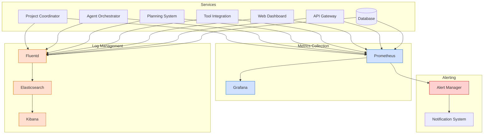

# Monitoring and Alerting Guide

**Last Modified:** 2025-03-29  
**Completion Date:** 2025-03-28  
**Doc Type:** Guide  

---

## Overview

This guide outlines the monitoring and alerting system for Berrys_AgentsV2. It provides details on metrics collection, log aggregation, alerting rules, and dashboards for monitoring system health and performance.

## Monitoring Architecture

The monitoring system uses a combination of tools to provide comprehensive visibility into the system:

## Key Metrics

### System-Level Metrics

1. **Resource Utilization**
   - CPU usage (per service)
   - Memory usage (per service)
   - Disk I/O
   - Network I/O

2. **Service Health**
   - Service uptime
   - Restart count
   - Health check status

### Application-Level Metrics

1. **API Performance**
   - Request rate
   - Error rate
   - Latency (p50, p90, p99)
   - Request duration

2. **Database Performance**
   - Query execution time
   - Connection pool utilization
   - Transaction rate
   - Lock contention

3. **Business Metrics**
   - Project creation rate
   - Agent activation rate
   - Task completion rate
   - Error occurrence rate

## Log Management

### Log Collection

Logs are collected using Fluentd and stored in Elasticsearch with the following structure:

1. **Service Logs**
   - Standard output/error logs
   - Application logs
   - System logs

2. **Log Format**
   - JSON structured logging
   - Includes timestamp, service name, log level, message
   - Contextual information (request ID, user ID, etc.)

### Log Retention

- Production logs: 90 days
- Non-production logs: 30 days
- Security logs: 1 year

## Alerting Rules

### Critical Alerts

These alerts require immediate attention and may indicate service disruption:

1. **Service Health**
   - Service down for > 1 minute
   - Multiple service restarts within 5 minutes
   - Health check failures

2. **Resource Utilization**
   - CPU usage > 90% for > 5 minutes
   - Memory usage > 90% for > 5 minutes
   - Disk usage > 90%

3. **Database**
   - Database connection failures
   - High lock contention
   - Replication lag > 1 minute

### Warning Alerts

These alerts indicate potential issues that require investigation:

1. **Service Performance**
   - API latency > 500ms (p90)
   - Error rate > 1% of requests
   - Query execution time > 1 second

2. **Resource Utilization**
   - CPU usage > 75% for > 15 minutes
   - Memory usage > 75% for > 15 minutes
   - Disk usage > 80%

3. **Business Metrics**
   - Task failure rate > 5%
   - Agent error rate > 2%
   - Project creation failures

## Dashboards

### Overview Dashboard

Provides a high-level view of system health:

- Service health status
- Resource utilization
- Request rates and errors
- Alert overview

### Service-Specific Dashboards

Detailed view of each service:

1. **Project Coordinator Dashboard**
   - Project creation metrics
   - Coordinator API performance
   - Database interactions
   - Error rates

2. **Agent Orchestrator Dashboard**
   - Agent lifecycle metrics
   - Agent performance
   - Communication metrics
   - Error rates

3. **Planning System Dashboard**
   - Planning metrics
   - Task allocation
   - Resource utilization
   - Error rates

### Business Metrics Dashboard

Tracks business-level metrics:

- Active projects
- Active agents
- Completed tasks
- Success rates
- User activity

## Incident Response

### Alert Notification

Alerts are delivered through multiple channels:

- Email notifications
- Slack/Teams integration
- SMS for critical alerts
- On-call rotation

### Escalation Path

1. **Level 1: On-Call Engineer**
   - First responder for all alerts
   - Initial triage and containment
   - Resolution of known issues

2. **Level 2: Service Owner**
   - Escalation for complex issues
   - Deeper service expertise
   - Coordination of response

3. **Level 3: System Architect**
   - Escalation for systemic issues
   - Cross-service coordination
   - Architectural guidance

### Incident Documentation

All incidents should be documented:

- Alert details
- Impact assessment
- Resolution steps
- Root cause analysis
- Preventive measures

## Health Checks

### Endpoint Health Checks

Each service exposes health check endpoints:

- `/health/liveness`: Service is running
- `/health/readiness`: Service is ready to accept requests
- `/health/status`: Detailed status information

### Dependency Health Checks

Services check the health of their dependencies:

- Database connections
- External service availability
- Required resources

## Performance Testing

### Load Testing

Regular load testing is performed to:

- Establish baseline performance
- Identify performance bottlenecks
- Validate scaling capabilities
- Verify alerting thresholds

### Stress Testing

Periodic stress testing to:

- Identify breaking points
- Validate failover mechanisms
- Test recovery procedures
- Validate alert thresholds

## Reference

- [Prometheus Documentation](https://prometheus.io/docs/introduction/overview/)
- [Grafana Documentation](https://grafana.com/docs/)
- [Elasticsearch Documentation](https://www.elastic.co/guide/index.html)
- [Incident Response Guide](incident-response-guide.md)
