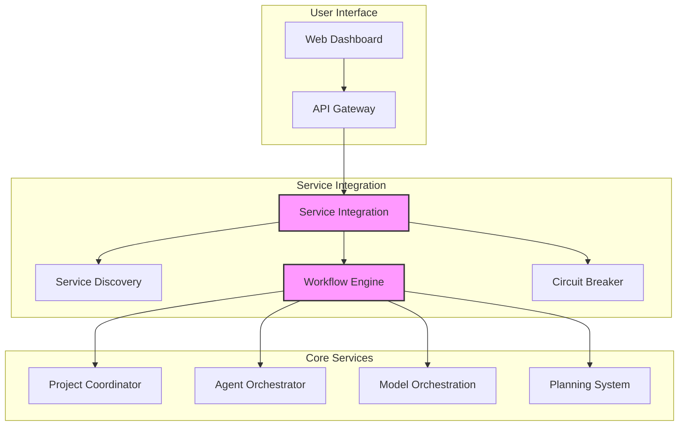
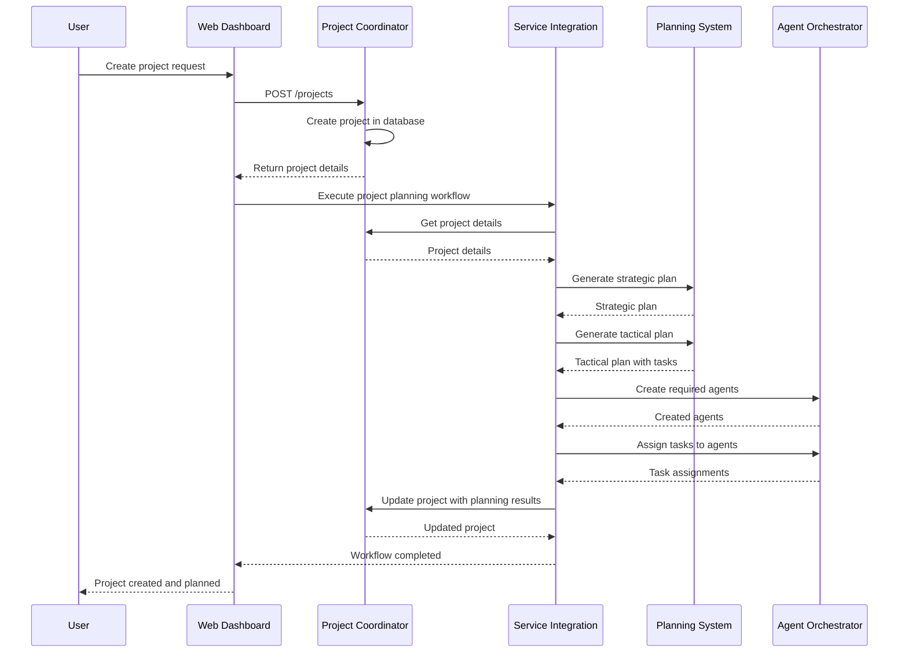
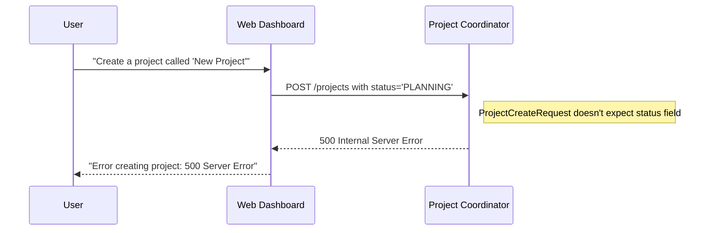
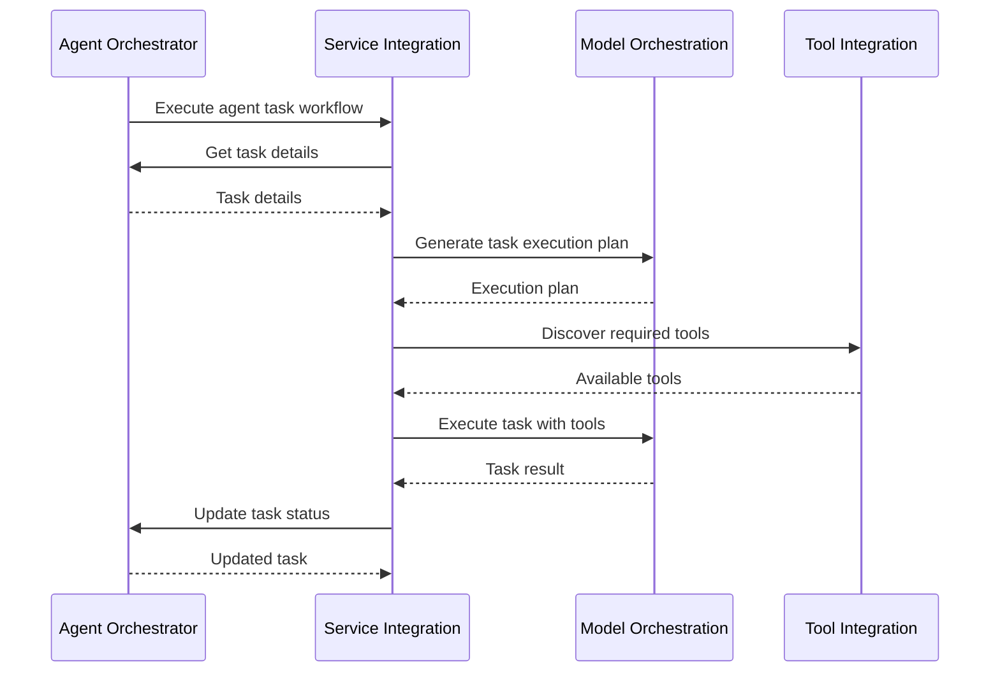

# Service Integration Workflow Guide

This guide documents the complete flow of cross-service operations in the Berrys_AgentsV2 system, focusing on how services interact with each other through the Service Integration service.

## Overview

The Service Integration service acts as the glue that binds together all the different microservices in the system. It provides:

1. **Service Discovery**: Allows services to find and connect to each other dynamically
2. **Service Registry**: Enables services to register their capabilities and endpoints
3. **Cross-Service Workflows**: Coordinates operations across multiple services
4. **System Health Monitoring**: Tracks the health of all registered services
5. **Circuit Breaking**: Prevents cascading failures across the system

## Architecture



## Key Workflows

### 1. Project Creation Workflow

The project creation workflow involves multiple services and is triggered when a user creates a new project via the Web Dashboard or chat interface.

#### Normal Flow



#### Current Issue: Project Creation via Chat

When creating a project via the chat interface, the system encounters a 500 error due to a model mismatch:



### 2. Agent Task Execution Workflow

The agent task execution workflow is triggered when an agent needs to execute a task.



## Service Dependencies

Understanding service dependencies is crucial for diagnosing issues in cross-service workflows:

| Workflow | Required Services | Optional Services |
|----------|-------------------|-------------------|
| Project Creation | Web Dashboard, Project Coordinator | Planning System, Agent Orchestrator |
| Project Planning | Project Coordinator, Planning System, Agent Orchestrator | Model Orchestration |
| Agent Task Execution | Agent Orchestrator, Model Orchestration | Tool Integration |
| Human Interaction | Agent Orchestrator, Web Dashboard | Project Coordinator |

## Common Issues and Solutions

### 1. Service Unavailability

**Issue**: A required service is unavailable, causing the workflow to fail.

**Example Error**:
```
WorkflowError: Service not found: No service of type PLANNING_SYSTEM found
```

**Solutions**:
- Implement fallback mechanisms for non-critical services
- Add comprehensive error handling in workflows
- Make certain services optional in workflows
- Implement service mocks for development and testing

### 2. Model Mismatches

**Issue**: Different services expect different fields in API models.

**Example**: The Web Dashboard sends a `status` field in project creation requests, but the Project Coordinator doesn't expect it.

**Solutions**:
- Use adapters to transform requests between services
- Ensure API models are consistent across services
- Document field differences in the Entity Representation Alignment guide
- Add validation to catch and handle unexpected fields

### 3. Circuit Breaker Trips

**Issue**: The circuit breaker trips due to too many failures, preventing further requests.

**Solutions**:
- Implement retry logic with exponential backoff
- Add fallback mechanisms for critical operations
- Monitor circuit breaker status and alert on trips
- Implement graceful degradation for non-critical features

## Best Practices

### 1. Service Registration

All services should register themselves with the Service Integration service on startup:

```python
# On service startup
await service_client.post(
    "http://service-integration:8090/registry/services",
    data={
        "name": "my-service",
        "type": "MY_SERVICE_TYPE",
        "url": "http://my-service:8000",
        "health_url": "http://my-service:8000/health",
        "metadata": {
            "version": "1.0.0"
        }
    }
)
```

### 2. Health Checks

Implement comprehensive health checks that verify all dependencies:

```python
@app.get("/health")
async def health_check():
    """Health check endpoint."""
    # Check database connection
    db_healthy = await check_database_connection()
    
    # Check cache connection
    cache_healthy = await check_cache_connection()
    
    # Check other dependencies
    dependencies_healthy = await check_dependencies()
    
    # Overall health status
    healthy = db_healthy and cache_healthy and dependencies_healthy
    
    return {
        "status": "healthy" if healthy else "unhealthy",
        "database": db_healthy,
        "cache": cache_healthy,
        "dependencies": dependencies_healthy,
        "timestamp": datetime.utcnow().isoformat()
    }
```

### 3. Circuit Breaker Configuration

Configure circuit breakers appropriately for different types of services:

```python
# For critical services
critical_circuit_breaker = CircuitBreaker(
    failure_threshold=5,
    recovery_timeout=30,
    timeout=5
)

# For non-critical services
non_critical_circuit_breaker = CircuitBreaker(
    failure_threshold=3,
    recovery_timeout=60,
    timeout=10
)
```

### 4. Workflow Error Handling

Implement comprehensive error handling in workflows:

```python
try:
    # Get Planning System service
    planning_service = await self.service_discovery.get_service_by_type(ServiceType.PLANNING_SYSTEM)
    
    # Generate strategic plan
    response = await self.service_client.post(
        service=planning_service,
        endpoint="/plans/strategic",
        data={...}
    )
except ServiceNotFoundError:
    # Fallback to a simpler plan generation if Planning System is unavailable
    self.logger.warning("Planning System unavailable, using fallback plan generation")
    response = self._generate_fallback_plan(project)
except ServiceConnectionError:
    # Handle connection errors
    self.logger.error("Connection error with Planning System")
    raise WorkflowError("Could not connect to Planning System")
except Exception as e:
    # Handle unexpected errors
    self.logger.exception(f"Unexpected error in workflow: {str(e)}")
    raise WorkflowError(f"Workflow error: {str(e)}")
```

## Conclusion

The Service Integration service plays a critical role in the Berrys_AgentsV2 system, enabling seamless communication and coordination between services. By understanding the workflows and implementing best practices, you can ensure robust and resilient cross-service operations.

For more information, see:
- [Entity Representation Alignment](./entity-representation-alignment.md)
- [Troubleshooting Guide](./troubleshooting-guide.md)
- [Model Standardization Progress](./model-standardization-progress.md)
