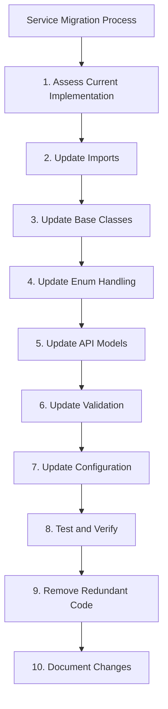

# Service Migration to Shared Components Guide

> **Draft-of-Thought Documentation**: This document provides a comprehensive guide for migrating services to use the shared components developed during the Code Centralization milestone. It serves as both a reference and a step-by-step guide for developers.

## Overview

This guide outlines the process for migrating services to use the shared components developed during the Code Centralization milestone. The shared components provide consistent implementations of common functionality across services, including:

- UUID type handling
- Model conversion utilities
- Enhanced base models
- Standardized API responses
- Validation utilities
- Configuration management



## Prerequisites

Before starting the migration process, ensure that:

1. The service has been standardized according to the [Service Standardization Plan](service-standardization-plan.md)
2. The service uses singular table names
3. The service uses string columns with validation for enum values
4. The service imports shared enums from `shared/models/src/enums.py`

## Migration Steps

### 1. Assess Current Implementation

Start by assessing the current implementation of the service to identify areas that need to be migrated:

- Identify custom UUID type implementations
- Identify model conversion utilities
- Identify base model classes
- Identify API response models
- Identify validation utilities
- Identify configuration management

### 2. Update Imports

Update imports to use the shared components:

```python
# Before
from uuid import uuid4
from sqlalchemy import TypeDecorator, String

class UUID(TypeDecorator):
    impl = String
    # ...

# After
from shared.utils.src.database import UUID, generate_uuid
```

### 3. Update Base Classes

Replace local base classes with shared base classes:

```python
# Before
class Base:
    id = Column(UUID, primary_key=True, default=lambda: str(uuid4()))
    created_at = Column(DateTime, default=func.now())
    updated_at = Column(DateTime, default=func.now(), onupdate=func.now())

# After
from shared.models.src.base import StandardModel

class MyModel(StandardModel):
    # No need to define id, created_at, updated_at
    # They are inherited from StandardModel
```

### 4. Update Enum Handling

Replace direct enum usage with shared enum handling:

```python
# Before
status = Column(String(20), nullable=False)
# Manual validation in code

# After
from shared.models.src.base import enum_column
from shared.models.src.enums import ProjectStatus

status = enum_column(ProjectStatus, nullable=False, default=ProjectStatus.DRAFT)

# Add enum validation
__enum_columns__ = {
    "status": ProjectStatus
}
```

### 5. Update API Models

Replace custom API models with shared API models:

```python
# Before
class ProjectResponse:
    def __init__(self, success, data=None, message=None):
        self.success = success
        self.data = data
        self.message = message

# After
from shared.models.src.api.responses import create_data_response_model

ProjectResponse = create_data_response_model(Project)
```

For request models:

```python
# Before
class ListProjectsRequest(BaseModel):
    page: int = 1
    page_size: int = 20
    sort_by: Optional[str] = None
    sort_direction: Optional[str] = None

# After
from shared.models.src.api.requests import ListRequestParams

class ListProjectsRequest(ListRequestParams):
    # Add any project-specific parameters
    pass
```

### 6. Update Validation

Replace custom validation with shared validation utilities:

```python
# Before
def validate_project_id(project_id):
    try:
        uuid.UUID(project_id)
    except ValueError:
        raise ValueError("Invalid project ID")
    return project_id

# After
from shared.utils.src.validation import validate_uuid, validate_input

@validate_input
def get_project(project_id: str) -> Project:
    project_id = validate_uuid(project_id, "project_id")
    # ...
```

### 7. Update Configuration

Replace custom configuration with shared configuration management:

```python
# Before
class Config:
    def __init__(self):
        self.database_url = os.environ.get("DATABASE_URL", "default")
        # ...

# After
from shared.utils.src.config import BaseServiceConfig, load_config

class MyServiceConfig(BaseServiceConfig):
    # Add service-specific configuration
    pass

config = load_config(MyServiceConfig, "MY_SERVICE")
```

### 8. Test and Verify

After making the changes, thoroughly test the service to ensure that it works correctly:

1. Run unit tests
2. Run integration tests
3. Test API endpoints
4. Verify database operations
5. Check error handling

### 9. Remove Redundant Code

Once the service is working correctly with the shared components, remove any redundant code:

1. Remove custom UUID type implementations
2. Remove custom model conversion utilities
3. Remove custom base model classes
4. Remove custom API response models
5. Remove custom validation utilities
6. Remove custom configuration management

### 10. Document Changes

Document the changes made to the service:

1. Update README.md
2. Update API documentation
3. Update developer guides
4. Add migration notes to the service's documentation

## Migration Examples

### Example 1: UUID Type Migration

**Before:**

```python
import uuid
from sqlalchemy import TypeDecorator, String

class UUID(TypeDecorator):
    impl = String
    
    def process_bind_param(self, value, dialect):
        if value is None:
            return None
        elif isinstance(value, uuid.UUID):
            return str(value)
        else:
            return str(uuid.UUID(value))
    
    def process_result_value(self, value, dialect):
        if value is None:
            return None
        else:
            return str(uuid.UUID(value))
```

**After:**

```python
from shared.utils.src.database import UUID, generate_uuid

# Use the shared UUID type
id = Column(UUID, primary_key=True, default=generate_uuid)
```

### Example 2: Model Conversion Migration

**Before:**

```python
def to_dict(self):
    result = {}
    for column in self.__table__.columns:
        result[column.name] = getattr(self, column.name)
    return result

def to_api_model(self):
    data = self.to_dict()
    return ProjectResponse(**data)
```

**After:**

```python
from shared.utils.src.model_conversion import sqlalchemy_to_pydantic

# Convert SQLAlchemy model to Pydantic model
api_model = sqlalchemy_to_pydantic(db_model, ProjectResponse)
```

### Example 3: API Response Migration

**Before:**

```python
class ProjectResponse(BaseModel):
    id: str
    name: str
    description: Optional[str] = None
    status: ProjectStatus
    created_at: datetime
    updated_at: datetime

def get_project(project_id: str):
    project = db.query(Project).filter(Project.id == project_id).first()
    if not project:
        return {"success": False, "message": "Project not found"}
    return {"success": True, "data": project.to_dict()}
```

**After:**

```python
from shared.models.src.api.responses import create_data_response_model, not_found_error

# Create response model
ProjectResponse = create_data_response_model(ProjectResponseData)

def get_project(project_id: str):
    project = db.query(Project).filter(Project.id == project_id).first()
    if not project:
        return not_found_error("Project", project_id)
    
    # Convert to API model
    api_model = sqlalchemy_to_pydantic(project, ProjectResponseData)
    
    # Return success response
    return ProjectResponse(
        success=True,
        message="Project retrieved successfully",
        data=api_model
    )
```

## Common Issues and Solutions

### 1. Import Errors

**Issue**: Import errors when trying to use shared components.

**Solution**: Ensure that the `PYTHONPATH` includes the project root directory. This is typically set up in the `run_tests.sh` script.

### 2. Type Conversion Errors

**Issue**: Type conversion errors when using the shared UUID type.

**Solution**: Ensure that you're using the `generate_uuid()` function for default values, not `uuid.uuid4()`.

### 3. Validation Errors

**Issue**: Validation errors when using shared validation utilities.

**Solution**: Check that you're using the correct validation function for the data type. For example, use `validate_uuid()` for UUID fields, not `validate_string()`.

### 4. API Model Compatibility

**Issue**: API model compatibility issues when using shared API models.

**Solution**: Ensure that your API models are compatible with the shared API models. You may need to update your API models to match the shared API models.

## Best Practices

### 1. Incremental Migration

Migrate one component at a time, starting with the simplest components (e.g., UUID type) and working up to more complex components (e.g., API models).

### 2. Comprehensive Testing

Test thoroughly after each migration step to ensure that the service works correctly.

### 3. Documentation

Document the migration process and any issues encountered to help other developers.

### 4. Code Review

Have another developer review the migration changes to ensure that they are correct.

## Related Documentation

- [Code Centralization Implementation](code-centralization-implementation.md) - Implementation details for shared components
- [Service Standardization Plan](service-standardization-plan.md) - Plan for standardizing services
- [Service Standardization Summary](service-standardization-summary.md) - Current status of service standardization
