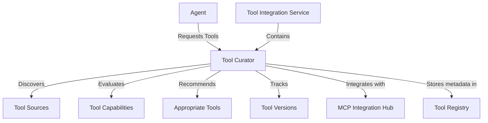

# Tool Curator Implementation

## Overview

The Tool Curator is a critical component of the Tool Integration service that enables agents to discover and utilize external tools effectively. It provides mechanisms for tool discovery, evaluation, recommendation, and versioning, allowing agents to find the most appropriate tools for their specific tasks.

## Architecture

The Tool Curator consists of several subcomponents:

1. **Tool Discovery Mechanism**: Identifies and catalogs available tools from various sources.
2. **Tool Evaluation**: Assesses tool capabilities and compatibility with agent requirements.
3. **Recommendation System**: Suggests appropriate tools for specific tasks based on requirements.
4. **Tool Versioning System**: Tracks tool updates and changes to ensure compatibility.

### Component Diagram



## Implementation Details

### Tool Discovery Mechanism

The Tool Discovery Mechanism identifies and catalogs available tools from various sources, including:

- MCP servers
- Public tool registries
- Internal tool repositories
- Custom tool implementations

The discovery process involves:

1. Scanning available sources for tools
2. Extracting tool metadata and capabilities
3. Cataloging tools in the Tool Registry
4. Indexing tools for efficient search and retrieval

### Tool Evaluation

The Tool Evaluation component assesses tools based on multiple criteria:

- **Capability Match**: How well the tool's capabilities match the requirements
- **Performance**: Tool's execution speed and resource usage
- **Reliability**: Tool's stability and error rate
- **Security**: Tool's security profile and potential risks
- **Compatibility**: Tool's compatibility with the agent's environment

Evaluation results are stored in the Tool Registry and used by the Recommendation System.

### Recommendation System

The Recommendation System suggests appropriate tools for specific tasks based on:

- Agent requirements
- Tool capabilities
- Evaluation results
- Usage patterns
- Agent preferences

The recommendation algorithm uses a weighted scoring approach that considers multiple factors to provide the most relevant tool suggestions.

### Tool Versioning System

The Tool Versioning System tracks tool updates and changes to ensure compatibility:

- Semantic versioning (MAJOR.MINOR.PATCH)
- Change tracking
- Compatibility assessment
- Upgrade path recommendations
- Deprecation management

## API Endpoints

The Tool Curator exposes the following API endpoints:

### Recommendations

- `POST /curator/recommendations`: Recommend tools for given requirements
- `POST /curator/curate`: Curate a set of tools for an agent based on requirements

### Versioning

- `POST /curator/tools/{tool_id}/versions`: Track a new version of a tool
- `POST /curator/tools/{tool_id}/compatibility`: Check compatibility between two versions of a tool

### Tool Analysis

- `GET /curator/tools/{tool_id}/usage`: Get usage statistics for a tool
- `POST /curator/tools/{tool_id}/capabilities`: Evaluate a tool's capabilities against requirements
- `POST /curator/tools/{tool_id}/operations`: Perform a curation operation on a tool

## Integration with Other Components

The Tool Curator integrates with several other components:

1. **Tool Registry**: Stores tool metadata, capabilities, and evaluation results
2. **MCP Integration Hub**: Connects to MCP servers to discover and utilize tools
3. **Agent Communication Hub**: Receives tool requests from agents
4. **Tool Integration Service**: Provides the infrastructure for tool integration

## Usage Examples

### Recommending Tools for an Agent

```python
# Request
POST /curator/recommendations
{
    "requirements": [
        {
            "id": "550e8400-e29b-41d4-a716-446655440000",
            "capability": "text-to-speech",
            "priority": "high",
            "constraints": {
                "latency": "low",
                "quality": "high"
            }
        }
    ],
    "context": {
        "agent_type": "assistant",
        "environment": "production"
    },
    "min_score": 0.7,
    "max_recommendations": 3
}

# Response
{
    "550e8400-e29b-41d4-a716-446655440000": [
        {
            "tool_id": "f47ac10b-58cc-4372-a567-0e02b2c3d479",
            "name": "Advanced TTS Engine",
            "capability": "text-to-speech",
            "score": 0.92,
            "match_reasons": ["high quality", "low latency", "production ready"]
        },
        {
            "tool_id": "6ba7b810-9dad-11d1-80b4-00c04fd430c8",
            "name": "Neural Voice Synthesizer",
            "capability": "text-to-speech",
            "score": 0.85,
            "match_reasons": ["high quality", "medium latency", "production ready"]
        }
    ]
}
```

### Tracking a New Tool Version

```python
# Request
POST /curator/tools/f47ac10b-58cc-4372-a567-0e02b2c3d479/versions
{
    "version_number": "2.1.0",
    "release_notes": "Improved voice quality and reduced latency",
    "changes": [
        "Enhanced neural network model",
        "Optimized audio processing pipeline",
        "Added support for 5 new languages"
    ],
    "compatibility": {
        "backward_compatible": true,
        "minimum_agent_version": "3.0.0",
        "breaking_changes": false
    },
    "created_by": "tool-team@example.com"
}

# Response
{
    "tool_id": "f47ac10b-58cc-4372-a567-0e02b2c3d479",
    "version_id": "9e107d9d-372b-4f66-bd0f-d17fbe8bda4e",
    "version_number": "2.1.0",
    "status": "CURRENT",
    "release_notes": "Improved voice quality and reduced latency",
    "changes": [
        "Enhanced neural network model",
        "Optimized audio processing pipeline",
        "Added support for 5 new languages"
    ],
    "compatibility": {
        "backward_compatible": true,
        "minimum_agent_version": "3.0.0",
        "breaking_changes": false
    },
    "created_by": "tool-team@example.com",
    "created_at": "2025-03-28T14:30:00Z"
}
```

## Future Enhancements

1. **Machine Learning-based Recommendations**: Implement ML models to improve tool recommendations based on usage patterns and feedback.
2. **Automated Tool Evaluation**: Develop automated testing frameworks to evaluate tools without manual intervention.
3. **Tool Composition**: Enable the composition of multiple tools to solve complex tasks.
4. **Feedback Loop**: Incorporate agent feedback to improve recommendations over time.
5. **Advanced Versioning**: Implement more sophisticated version compatibility analysis.

## Conclusion

The Tool Curator is a powerful component that enables agents to discover and utilize external tools effectively. By providing mechanisms for tool discovery, evaluation, recommendation, and versioning, it enhances the capabilities of agents and allows them to adapt to changing requirements and environments.
