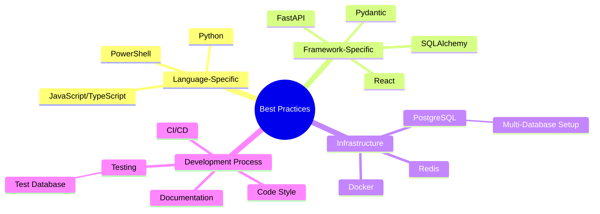

# Best Practices

This section provides comprehensive best practices for working with the Berrys_AgentsV2 system, including language-specific guidelines, tool-specific recommendations, and general development practices.

## Quick Navigation

- [PowerShell Guide](powershell-guide.md): Windows-specific guidance for PowerShell
- [SQLAlchemy Guide](sqlalchemy-guide.md): Database modeling and querying best practices
- [Pydantic Guide](pydantic-guide.md): Data validation and serialization
- [Docker Guide](docker-guide.md): Container best practices
- [Code Style Guide](code-style-guide.md): Coding conventions and standards
- [Multi-Database Setup Guide](multi-database-setup.md): Managing dev, test, and prod databases

## Overview

Following consistent best practices is essential for maintaining a high-quality, maintainable codebase. This section provides guidelines for various aspects of the system, from specific technologies to general development practices.

## General Principles

Regardless of the specific technology or component, these general principles apply throughout the Berrys_AgentsV2 system:

1. **Consistency**: Follow established patterns and conventions
2. **Simplicity**: Keep code simple and readable
3. **Testability**: Write code that can be easily tested
4. **Documentation**: Document code, APIs, and processes
5. **Separation of Concerns**: Each component should have a clear responsibility
6. **DRY (Don't Repeat Yourself)**: Avoid duplication
7. **SOLID Principles**: Follow SOLID principles for object-oriented design

## Technology-Specific Best Practices

Each technology used in the system has its own set of best practices:

### Python

- Follow [PEP 8](https://www.python.org/dev/peps/pep-0008/) style guide
- Use type hints
- Use virtual environments
- Prefer explicit imports over wildcard imports
- Use context managers for resource management

### FastAPI

- Use dependency injection
- Use Pydantic models for request/response validation
- Use path operations for clear API design
- Use appropriate status codes
- Document APIs with OpenAPI

### SQLAlchemy

- Use declarative models
- Avoid circular dependencies
- Use appropriate relationship types
- Use migrations for schema changes
- Optimize queries for performance
- Use the database connection utility for environment-specific connections
- Run tests against the test database

### Docker

- Use multi-stage builds
- Minimize image size
- Use appropriate base images
- Use environment variables for configuration
- Follow security best practices

## Cross-Platform Development

When developing for multiple platforms (Windows, Linux, macOS), follow these guidelines:

- Use path separators appropriately
- Be aware of case sensitivity differences
- Use cross-platform libraries when possible
- Test on all target platforms
- Document platform-specific requirements

## Continuous Improvement

Best practices evolve over time. The guidelines in this section should be regularly reviewed and updated based on:

- New technology versions
- Team feedback
- Performance metrics
- Industry standards
- Lessons learned from production

## Contributing to Best Practices

If you have suggestions for improving these best practices, please:

1. Discuss the proposed changes with the team
2. Provide evidence or reasoning for the change
3. Update the documentation
4. Share the changes with the team
