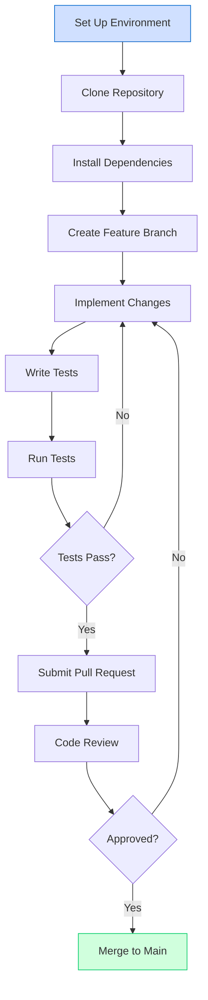
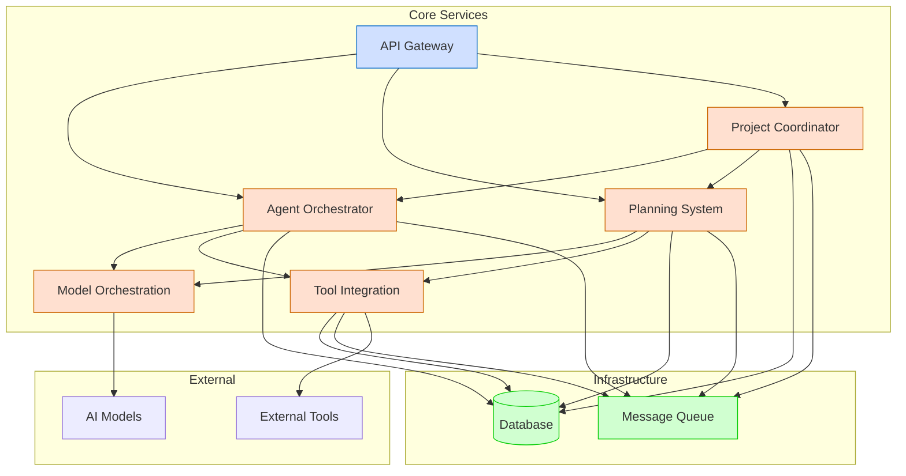

# Developer Guides

Welcome to the Berrys_AgentsV2 developer guides. This section provides comprehensive documentation for developers who want to extend, modify, or contribute to the system.

## Quick Navigation

- [Service Development](service-development/index.md): Guidelines for developing new services
  - [Service Structure](service-development/service-structure.md): Standard structure and organization
  - [Design Patterns](service-development/design-patterns.md): Polymorphism, facades, and other patterns
  - [API Contracts](service-development/api-contracts.md): Input/output requirements
  - [Service Integration](service-development/service-integration.md): Connecting to other services
  - [Service Integration Workflow Guide](service-development/service-integration-workflow-guide.md): Cross-service workflows
  - [Entity Representation Alignment](service-development/entity-representation-alignment.md): Cross-service data transformation
  - [Enum Standardization Guide](service-development/enum_standardization.md): Best practices for working with enums
  - [Troubleshooting Guide](service-development/troubleshooting-guide.md): Common issues and solutions
  - [Testing Strategy](service-development/testing-strategy.md): Effective testing approaches
- [Environment Setup](environment-setup.md): Setting up your development environment
- [Cross-Platform Development](cross-platform-development.md): Windows, Linux, and macOS considerations

## Development Workflow

The typical development workflow for Berrys_AgentsV2 is illustrated below:

## Service Development

When developing new services for Berrys_AgentsV2, it's important to follow the established patterns and practices to ensure consistency and maintainability. The service development guides provide detailed information on:

- Standard service structure and organization
- Design patterns for effective service implementation
- API contracts and input/output requirements
- Service integration and communication
- Testing strategies and best practices

## Architecture Overview

The system is built using a microservices architecture with the following key components:

## Development Principles

When developing for Berrys_AgentsV2, adhere to these core principles:

1. **Separation of Concerns**: Each service should have a clear, focused responsibility
2. **Microservice Architecture**: Services should be independent and loosely coupled
3. **API-First Design**: Define clear API contracts before implementation
4. **Test-Driven Development**: Write tests before or alongside code
5. **Documentation**: Document all public APIs and interfaces
6. **Consistency**: Follow established patterns and practices
7. **Modularity**: Design for extensibility and reusability

## Getting Started

To get started with development, follow these steps:

1. Set up your development environment by following the [Environment Setup](environment-setup.md) guide
2. Familiarize yourself with the [Service Structure](service-development/service-structure.md) and [Design Patterns](service-development/design-patterns.md)
3. Choose a service to work on or create a new one
4. Follow the development workflow outlined above

## Contributing

Contributions to Berrys_AgentsV2 are welcome! Please follow these guidelines:

1. Create a feature branch for your changes
2. Follow the coding standards and best practices
3. Write tests for your changes
4. Update documentation as needed
5. Submit a pull request for review
