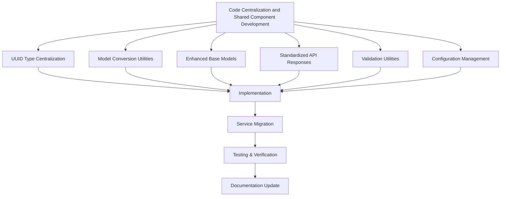

# Code Centralization and Shared Component Development

> **Draft-of-Thought Documentation**: This document provides a comprehensive guide to the code centralization and shared component development milestone. It serves as both implementation documentation and a guide for developers using these shared components.

## Overview

The Code Centralization and Shared Component Development milestone focuses on centralizing redundant code patterns across services to improve maintainability and consistency. This milestone builds on the successful completion of the Service Standardization Initiative, which standardized enum usage, table naming, and validation across all services.



## Implemented Shared Components

### 1. UUID Type Centralization

The UUID type implementation has been centralized in `shared/utils/src/database.py`. This provides a consistent way to handle UUIDs across services, with improved error handling and cross-database compatibility.

#### Key Features

- Platform-independent UUID type that works with PostgreSQL and other databases
- Automatic conversion between string and UUID objects
- Comprehensive error handling
- Helper functions for UUID generation and column creation

#### Usage Example

```python
from sqlalchemy import Column
from shared.utils.src.database import UUID, generate_uuid

class MyModel(Base):
    id = Column(UUID, primary_key=True, default=generate_uuid)
    parent_id = Column(UUID, nullable=True)
```

### 2. Model Conversion Utilities

Model conversion utilities have been implemented in `shared/utils/src/model_conversion.py`. These utilities provide a consistent way to convert between different model types, particularly between SQLAlchemy ORM models and Pydantic models.

#### Key Features

- Generic conversion between any object types
- Specialized conversion between SQLAlchemy and Pydantic models
- Automatic handling of enum values
- Support for nested objects and relationships
- Comprehensive error handling

#### Usage Example

```python
from shared.utils.src.model_conversion import sqlalchemy_to_pydantic, pydantic_to_sqlalchemy

# Convert SQLAlchemy model to Pydantic model
api_model = sqlalchemy_to_pydantic(db_model, ApiModel)

# Convert Pydantic model to SQLAlchemy model
db_model = pydantic_to_sqlalchemy(api_model, DbModel)

# Update existing SQLAlchemy model from Pydantic model
update_sqlalchemy_from_pydantic(db_model, api_model)
```

### 3. Enhanced Base Models

Enhanced base models have been implemented in `shared/models/src/base.py`. These provide improved base classes for SQLAlchemy and Pydantic models with additional functionality.

#### Key Features

- Timestamp mixins for created_at and updated_at columns
- Soft delete functionality
- UUID primary key generation
- Enum validation
- Metadata handling
- Consistent to_dict() implementation

#### Usage Example

```python
from shared.models.src.base import StandardModel, enum_column
from shared.models.src.enums import ProjectStatus

class Project(StandardModel):
    __tablename__ = "project"
    
    name = Column(String(100), nullable=False)
    description = Column(String(1000), nullable=True)
    status = enum_column(ProjectStatus, nullable=False, default=ProjectStatus.DRAFT)
    
    # Add enum validation
    __enum_columns__ = {
        "status": ProjectStatus
    }
```

For Pydantic models:

```python
from shared.models.src.base import StandardEntityModel
from shared.models.src.enums import ProjectStatus

class ProjectResponse(StandardEntityModel):
    name: str
    description: Optional[str] = None
    status: ProjectStatus
```

### 4. Standardized API Responses

Standardized API response models have been implemented in `shared/models/src/api/responses.py`. These provide consistent response structures for all API endpoints across services.

#### Key Features

- Standard success and error responses
- Pagination support
- Filtering and sorting utilities
- Error severity levels
- Detailed error information
- Factory functions for common error types

#### Usage Example

```python
from shared.models.src.api.responses import (
    create_data_response_model, create_list_response_model,
    not_found_error, validation_error
)

# Create response models
ProjectResponse = create_data_response_model(Project)
ProjectListResponse = create_list_response_model(Project)

# Return success response
return ProjectResponse(
    success=True,
    message="Project created successfully",
    data=project
)

# Return error response
return not_found_error("Project", project_id)
```

### 5. Validation Utilities

Validation utilities have been implemented in `shared/utils/src/validation.py`. These provide a consistent way to validate data across services.

#### Key Features

- Decorators for common validation patterns
- Input sanitization functions
- Validation error handling
- Type-specific validation functions
- Comprehensive error messages

#### Usage Example

```python
from shared.utils.src.validation import validate_input, validate_uuid, ValidationException

@validate_input
def get_project(project_id: str) -> Project:
    """
    Get a project by ID.
    
    Args:
        project_id: The project ID.
        
    Returns:
        The project.
        
    Raises:
        ValidationException: If the project ID is invalid.
        NotFoundException: If the project is not found.
    """
    # Validate UUID format
    project_id = validate_uuid(project_id, "project_id")
    
    # Get the project
    project = db.query(Project).filter(Project.id == project_id).first()
    
    if not project:
        raise NotFoundException(f"Project with ID {project_id} not found")
    
    return project
```

### 6. Configuration Management

Configuration management utilities have been implemented in `shared/utils/src/config.py`. These provide a consistent way to handle environment variables and configuration settings across services.

#### Key Features

- Environment variable handling
- Configuration file loading
- Hierarchical configuration with defaults
- Type-specific environment variable getters
- Comprehensive error handling

#### Usage Example

```python
from shared.utils.src.config import BaseServiceConfig, load_config

class MyServiceConfig(BaseServiceConfig):
    # Add service-specific configuration
    max_items_per_page: int = 100
    enable_feature_x: bool = False

# Load configuration
config = load_config(MyServiceConfig, "MY_SERVICE")

# Use configuration
db_args = config.get_database_args()
```

## Migration Guide

### Step 1: Update Imports

Replace local implementations with imports from shared components:

```python
# Before
from uuid import uuid4
from sqlalchemy import TypeDecorator, String

class UUID(TypeDecorator):
    impl = String
    # ...

# After
from shared.utils.src.database import UUID, generate_uuid
```

### Step 2: Update Base Classes

Replace local base classes with shared base classes:

```python
# Before
class Base:
    id = Column(UUID, primary_key=True, default=lambda: str(uuid4()))
    created_at = Column(DateTime, default=func.now())
    updated_at = Column(DateTime, default=func.now(), onupdate=func.now())

# After
from shared.models.src.base import StandardModel

class MyModel(StandardModel):
    # No need to define id, created_at, updated_at
    # They are inherited from StandardModel
```

### Step 3: Update Enum Handling

Replace direct enum usage with shared enum handling:

```python
# Before
status = Column(String(20), nullable=False)
# Manual validation in code

# After
from shared.models.src.base import enum_column
from shared.models.src.enums import ProjectStatus

status = enum_column(ProjectStatus, nullable=False, default=ProjectStatus.DRAFT)

# Add enum validation
__enum_columns__ = {
    "status": ProjectStatus
}
```

### Step 4: Update API Responses

Replace custom API responses with shared response models:

```python
# Before
class ProjectResponse:
    def __init__(self, success, data=None, message=None):
        self.success = success
        self.data = data
        self.message = message

# After
from shared.models.src.api.responses import create_data_response_model

ProjectResponse = create_data_response_model(Project)
```

### Step 5: Update Validation

Replace custom validation with shared validation utilities:

```python
# Before
def validate_project_id(project_id):
    try:
        uuid.UUID(project_id)
    except ValueError:
        raise ValueError("Invalid project ID")
    return project_id

# After
from shared.utils.src.validation import validate_uuid

project_id = validate_uuid(project_id, "project_id")
```

### Step 6: Update Configuration

Replace custom configuration with shared configuration management:

```python
# Before
class Config:
    def __init__(self):
        self.database_url = os.environ.get("DATABASE_URL", "default")
        # ...

# After
from shared.utils.src.config import BaseServiceConfig, load_config

class MyServiceConfig(BaseServiceConfig):
    # Add service-specific configuration
    pass

config = load_config(MyServiceConfig, "MY_SERVICE")
```

## Best Practices

### 1. Consistent Base Class Usage

- Use `StandardModel` for most models
- Use `SoftDeleteModel` for models that need soft delete functionality
- Use `MetadataModel` for models that need metadata
- Use `FullFeaturedModel` for models that need all features

### 2. Enum Handling

- Always use `enum_column()` for enum columns
- Always set `__enum_columns__` for enum validation
- Use shared enums from `shared/models/src/enums.py`

### 3. API Responses

- Use `create_data_response_model()` and `create_list_response_model()` for response models
- Use error factory functions for consistent error responses
- Include pagination metadata for list responses

### 4. Validation

- Use `validate_input` decorator for input validation
- Use type-specific validation functions for detailed validation
- Handle validation errors consistently

### 5. Configuration

- Extend `BaseServiceConfig` for service-specific configuration
- Use `load_config()` to load configuration
- Use type-specific environment variable getters for detailed configuration

## Lessons Learned

1. **Centralization Benefits**:
   - Reduced code duplication significantly
   - Improved consistency across services
   - Made future changes easier to implement
   - Reduced bugs and edge cases

2. **Migration Approach**:
   - Incremental migration worked well
   - Starting with a single service as proof of concept helped identify issues
   - Comprehensive testing was essential

3. **Documentation Importance**:
   - Clear documentation of shared components was critical
   - Usage examples helped developers understand how to use the components
   - Migration guides made the transition smoother

## Next Steps

1. **Service Migration**:
   - Migrate all services to use shared components
   - Update tests to verify functionality
   - Remove redundant code

2. **Additional Shared Components**:
   - Implement logging utilities
   - Implement error handling utilities
   - Implement messaging utilities

3. **Documentation Updates**:
   - Update service-specific documentation
   - Create comprehensive API documentation
   - Add more usage examples

## Related Documentation

- [Service Standardization Summary](service-standardization-summary.md) - Summary of the service standardization initiative
- [Model Standardization Progress](model-standardization-progress.md) - Progress report on model standardization
- [Enum Standardization Guide](enum_standardization.md) - Detailed guide on enum standardization
