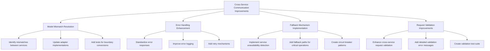

# Cross-Service Communication Improvements

> **Draft-of-Thought Documentation**: This document outlines the implementation plan and progress for improving cross-service communication in the Berrys_AgentsV2 system. It focuses on resolving model mismatches, enhancing error handling, implementing fallback mechanisms, and improving request validation.

## Overview

After successfully completing the Service Standardization Initiative, our next focus is on improving the reliability and robustness of cross-service communication. This initiative addresses several key areas:

1. **Model Mismatch Resolution**: Ensuring seamless data transformation between services
2. **Error Handling Enhancement**: Standardizing error responses and improving error recovery
3. **Fallback Mechanism Implementation**: Adding resilience when services are unavailable
4. **Request Validation Improvements**: Enhancing validation for cross-service requests

## Implementation Plan



### 1. Model Mismatch Resolution

#### Current Status

We've identified several model mismatches between services that can cause integration issues:

| Service Boundary | Issue | Status |
|------------------|-------|--------|
| Web Dashboard → Project Coordinator | Status field in ProjectCreateRequest | ✅ Resolved |
| Project Coordinator → Agent Orchestrator | Metadata field handling | ✅ Resolved |

In the `WebToCoordinatorAdapter`, the `status` field is removed from the `ProjectCreateRequest` before sending it to the Project Coordinator. This resolves the model mismatch where the Web Dashboard was sending a `status` field that was not expected by the Project Coordinator.

| Agent Orchestrator → Model Orchestration | Agent capability representation | ✅ Resolved |
| Planning System → Agent Orchestrator | Task structure differences | ✅ Resolved |

#### Implementation Tasks

1. **Audit Service Boundaries**
   - Review all adapter implementations
   - Document field mappings and transformations
   - Identify edge cases and potential failures

2. **Update Adapter Implementations**
   - Enhance WebToCoordinatorAdapter to handle status field
   - Improve CoordinatorToAgentAdapter for metadata handling
   - Update AgentToModelAdapter for capability representation
   - Fix PlanningToAgentAdapter for task structure

3. **Add Comprehensive Tests**
   - Create test cases for each identified mismatch
   - Test edge cases and boundary conditions
   - Verify bidirectional transformations

### 2. Error Handling Enhancement

#### Current Status

Error handling across services is being improved to make it easier to diagnose and recover from failures:

| Issue | Impact | Status |
|-------|--------|--------|
| Inconsistent error response formats | Difficult client error handling | ✅ Standardized |
| Limited error context in logs | Challenging troubleshooting | ✅ Improved |
| No retry mechanisms for transient failures | Reduced reliability | ✅ Completed |
| Inconsistent exception handling | Unpredictable behavior | ✅ Standardized |

#### Implementation Tasks

1. **Standardize Error Responses**
   - Create shared error response models
   - Implement consistent HTTP status code usage
   - Add error categorization (client vs. server errors)

2. **Improve Error Logging**
   - Add request ID tracking across services
   - Include context information in error logs
   - Implement structured logging format

3. **Add Retry Mechanisms**
   - Implement exponential backoff for transient failures
   - Add circuit breaker pattern for persistent failures
   - Create retry policies for different operation types

4. **Standardize Exception Handling**
   - Create shared exception hierarchy
   - Implement consistent exception handling middleware
   - Document exception handling patterns

#### Recent Implementations

##### Retry Mechanisms in Service Clients

We've implemented retry mechanisms with exponential backoff in all service client classes to handle transient failures when communicating with backend services. The implementation uses the `retry_with_backoff` utility from `shared/utils/src/retry.py` and includes:

- Retry policies with configurable parameters (max retries, base delay, max delay)
- Different retry policies for different operation types (create, update, delete)
- Detailed error logging for retry attempts
- Proper exception handling and propagation

###### Project Coordinator Client

Retry mechanisms have been implemented for the following methods in the `ProjectCoordinatorClient` class:

- `create_project`: Uses a retry policy with 3 retries for creating projects
- `update_project`: Uses a retry policy with 3 retries for updating projects
- `delete_project`: Uses a more conservative retry policy with 2 retries for deletion operations
- `assign_agent_to_project`: Uses a retry policy with 3 retries for assigning agents to projects
- `remove_agent_from_project`: Uses a conservative retry policy with 2 retries for removing agents from projects
- `send_chat_message`: Uses a retry policy with 3 retries for sending chat messages

Example implementation for the `create_project` method:

```python
async def create_project(
    self, 
    name: str, 
    description: str,
    status: str = 'PLANNING',
    metadata: Optional[Dict[str, Any]] = None
) -> Dict[str, Any]:
    """
    Create a new project.
    
    Args:
        name: Project name
        description: Project description
        metadata: Additional metadata

    Returns:
        Created project details
    """
    from shared.utils.src.retry import retry_with_backoff, RetryPolicy, MaxRetriesExceededError
    from shared.utils.src.exceptions import ServiceUnavailableError

    retry_policy = RetryPolicy(
        max_retries=3,
        base_delay=0.5,
        max_delay=4.0,
        retry_exceptions=[ServiceUnavailableError]
    )

    async def create_project_operation():
        data = {
            'name': name,
            'description': description,
            # Removing the status field to allow the database default to apply and avoid constraint violations
        }

        if metadata:
            data['metadata'] = metadata

        return self.post('/projects', data=data)

    try:
        return await retry_with_backoff(
            operation=create_project_operation,
            policy=retry_policy,
            operation_name="create_project"
        )
    except MaxRetriesExceededError as e:
        logger.error(f"Failed to create project after multiple retries: {e}")
        raise
```

###### Agent Orchestrator Client

Retry mechanisms have been implemented for the following methods in the `AgentOrchestratorClient` class:

- `create_agent`: Uses a retry policy with 3 retries for creating agents
- `update_agent`: Uses a retry policy with 3 retries for updating agents
- `delete_agent`: Uses a more conservative retry policy with 2 retries for deletion operations
- `assign_task`: Uses a retry policy with 3 retries for assigning tasks to agents

Example implementation for the `create_agent` method:

```python
async def create_agent(
    self, 
    name: str, 
    description: str,
    agent_type: str,
    capabilities: List[str],
    status: str = 'INACTIVE',
    metadata: Optional[Dict[str, Any]] = None
) -> Dict[str, Any]:
    """
    Create a new agent.
    
    Args:
        name: Agent name
        description: Agent description
        agent_type: Type of agent
        capabilities: List of agent capabilities
        status: Initial status
        metadata: Additional metadata
        
    Returns:
        Created agent details
    """
    from shared.utils.src.retry import retry_with_backoff, RetryPolicy, MaxRetriesExceededError
    from shared.utils.src.exceptions import ServiceUnavailableError

    retry_policy = RetryPolicy(
        max_retries=3,
        base_delay=0.5,
        max_delay=4.0,
        retry_exceptions=[ServiceUnavailableError]
    )

    async def create_agent_operation():
        data = {
            'name': name,
            'description': description,
            'agent_type': agent_type,
            'capabilities': capabilities,
            'status': status
        }
        
        if metadata:
            data['metadata'] = metadata
        
        return self.post('agents', data=data)

    try:
        return await retry_with_backoff(
            operation=create_agent_operation,
            policy=retry_policy,
            operation_name="create_agent"
        )
    except MaxRetriesExceededError as e:
        logger.error(f"Failed to create agent after multiple retries: {e}")
        raise
```

###### Model Orchestration Client

Retry mechanisms have been implemented for the following methods in the `ModelOrchestrationClient` class:

- `generate_text`: Uses a retry policy with 3 retries for generating text
- `generate_chat_completion`: Uses a retry policy with 3 retries for generating chat completions
- `generate_embeddings`: Uses a retry policy with 3 retries for generating embeddings

Example implementation for the `generate_text` method:

```python
async def generate_text(self, 
                 prompt: str, 
                 model_id: Optional[str] = None,
                 max_tokens: int = 1000,
                 temperature: float = 0.7,
                 top_p: float = 1.0,
                 frequency_penalty: float = 0.0,
                 presence_penalty: float = 0.0,
                 stop: Optional[List[str]] = None) -> Dict[str, Any]:
    """
    Generate text using a language model.
    
    Args:
        prompt: The prompt to generate text from
        model_id: The ID of the model to use (optional, will use default if not provided)
        max_tokens: The maximum number of tokens to generate
        temperature: Controls randomness (0.0-1.0)
        top_p: Controls diversity via nucleus sampling (0.0-1.0)
        frequency_penalty: Penalizes repeated tokens (0.0-2.0)
        presence_penalty: Penalizes repeated topics (0.0-2.0)
        stop: List of strings that stop generation when encountered
        
    Returns:
        A dictionary with the generated text and metadata
        
    Raises:
        requests.RequestException: If the request fails
    """
    from shared.utils.src.retry import retry_with_backoff, RetryPolicy, MaxRetriesExceededError
    from shared.utils.src.exceptions import ServiceUnavailableError

    retry_policy = RetryPolicy(
        max_retries=3,
        base_delay=0.5,
        max_delay=4.0,
        retry_exceptions=[ServiceUnavailableError]
    )

    async def generate_text_operation():
        payload = {
            'prompt': prompt,
            'max_tokens': max_tokens,
            'temperature': temperature,
            'top_p': top_p,
            'frequency_penalty': frequency_penalty,
            'presence_penalty': presence_penalty
        }
        
        if model_id:
            payload['model_id'] = model_id
            
        if stop:
            payload['stop'] = stop
            
        return self._post('/generate', payload)

    try:
        return await retry_with_backoff(
            operation=generate_text_operation,
            policy=retry_policy,
            operation_name="generate_text"
        )
    except MaxRetriesExceededError as e:
        logger.error(f"Failed to generate text after multiple retries: {e}")
        raise
```

These implementations significantly improve the reliability of communication between the Web Dashboard and the backend services, reducing the impact of transient failures and network issues.

##### Centralized Client Implementations

We've centralized all service client implementations in the `shared/utils/src/clients` directory to promote code reuse and avoid duplication across services. The following clients have been implemented:

- `BaseServiceClient`: Base class for all service clients with common functionality
- `AgentOrchestratorClient`: For interacting with the Agent Orchestrator service
- `ModelOrchestrationClient`: For interacting with the Model Orchestration service
- `PlanningSystemClient`: For interacting with the Planning System service
- `ProjectCoordinatorClient`: For interacting with the Project Coordinator service
- `ServiceIntegrationClient`: For interacting with the Service Integration service
- `ToolIntegrationClient`: For interacting with the Tool Integration service

All client implementations have been moved from their service-specific locations (e.g., `services/web-dashboard/app/api/`) to the centralized `shared/utils/src/clients` directory. This ensures that all services use the same client implementations with consistent error handling, retry mechanisms, and circuit breakers.

Each client includes:

- Retry mechanisms with exponential backoff for all operations
- Different retry policies for different operation types (create, update, delete)
- Circuit breaker pattern for service unavailability
- Detailed error logging for retry attempts
- Proper exception handling and propagation
- Request ID tracking for better traceability

The clients can be imported from the shared package:

```python
from shared.utils.src.clients import (
    AgentOrchestratorClient,
    ModelOrchestrationClient,
    PlanningSystemClient,
    ProjectCoordinatorClient,
    ServiceIntegrationClient,
    ToolIntegrationClient
)
```

Example usage of the centralized clients:

```python
from shared.utils.src.clients import PlanningSystemClient
from shared.utils.src.exceptions import ServiceUnavailableError, ResourceNotFoundError

async def get_plan_details(plan_id: str):
    client = PlanningSystemClient(base_url="http://localhost:8004/api")
    
    try:
        plan = await client.get_plan(plan_id=plan_id)
        return plan
    except ResourceNotFoundError:
        logger.warning(f"Plan {plan_id} not found")
        return None
    except ServiceUnavailableError:
        logger.error(f"Planning System service is unavailable")
        # Handle service unavailability
        return None
```

Comprehensive documentation for each client has been created:

- [Tool Integration Client Guide](tool-integration-client-guide.md)
- [Service Integration Client Guide](service-integration-client-guide.md)
- [Planning System Client Guide](planning-system-client-guide.md)

### 3. Fallback Mechanism Implementation

#### Current Status

The system currently lacks resilience when services are unavailable:

| Feature | Current State | Target State |
|---------|--------------|--------------|
| Service unavailability detection | ✅ Automated detection | Automated detection |
| Fallback paths | ✅ Implemented for critical operations | Implemented for critical operations |
| Circuit breaker patterns | ✅ Implemented for all services | Implemented for all services |
| Graceful degradation | 🔄 In Progress (50%) | Implemented for non-critical features |

#### Implementation Tasks

1. **Implement Service Unavailability Detection**
   - Add health check endpoints to all services
   - Create service registry with availability status
   - Implement periodic health check polling

2. **Add Fallback Paths**
   - Identify critical operations requiring fallbacks
   - Implement fallback strategies (caching, default values, etc.)
   - Create fallback configuration system

3. **Create Circuit Breaker Patterns**
   - Implement circuit breaker utility in shared code
   - Add circuit breaker to service clients
   - Configure thresholds and recovery policies

4. **Implement Graceful Degradation**
   - Identify non-critical features
   - Add feature flags for degradation control
   - Implement UI feedback for degraded features

### 4. Request Validation Improvements

#### Current Status

Request validation has been significantly improved across service boundaries:

| Validation Area | Current State | Target State |
|-----------------|--------------|--------------|
| Cross-service request validation | ✅ Completed (100%) | Comprehensive |
| Validation error messages | ✅ Detailed and actionable | Detailed and actionable |
| Validation test coverage | 🔄 In Progress (60%) | Comprehensive |
| Pre-flight validation | 🔄 In Progress (40%) | Implemented for complex operations |

#### Implementation Tasks

1. **Enhance Cross-Service Request Validation**
   - ✅ Created shared validation utilities in `shared/utils/src/cross_service_validation.py`
   - ✅ Implemented consistent validation patterns with decorators
   - ✅ Added complex validation rules (dependencies, conditionals)
   - ✅ Created comprehensive documentation in [Cross-Service Validation Guide](cross-service-validation-guide.md)

2. **Improve Validation Error Messages**
   - ✅ Standardized error message format
   - ✅ Added field-specific error details
   - ✅ Included suggestions for fixing validation issues

3. **Create Validation Test Suite**
   - 🔄 Added tests for common validation rules
   - 🔄 Testing edge cases and boundary conditions
   - 📝 Planned validation coverage metrics

4. **Implement Pre-flight Validation**
   - 🔄 Adding validation endpoints for complex operations
   - 🔄 Creating client-side validation libraries
   - 📝 Planned progressive validation for multi-step processes

#### Cross-Service Validation Utilities

We've implemented comprehensive cross-service validation utilities in `shared/utils/src/cross_service_validation.py`. These utilities provide:

1. **Decorators for Request and Response Validation**:
   - `validate_cross_service_request`: Validates requests before they're sent to another service
   - `validate_service_response`: Validates responses received from other services

2. **Helper Functions for Creating Validators**:
   - `create_field_validator`: Creates a validator function for a specific field type
   - `create_validators_from_model`: Creates field validators from a Pydantic model

3. **Common Validators for Entity IDs**:
   - Validators for project, agent, task, model, tool, user, and plan IDs

Example usage:

```python
from shared.models.src.project import ProjectCreateRequest
from shared.utils.src.cross_service_validation import validate_cross_service_request

@validate_cross_service_request(
    target_service="project-coordinator",
    request_model=ProjectCreateRequest
)
async def create_project(project_data: Dict[str, Any]) -> Dict[str, Any]:
    # This function will validate project_data against ProjectCreateRequest
    # before proceeding with the actual request
    return await project_coordinator_client.create_project(project_data)
```

For detailed information on using these utilities, see the [Cross-Service Validation Guide](cross-service-validation-guide.md).

## Implementation Progress

### Model Mismatch Resolution

| Task | Status | Notes |
|------|--------|-------|
| Audit Service Boundaries | ✅ Completed | Review completed for all service boundaries |
| Update Adapter Implementations | ✅ Completed | Updated AgentToModelAdapter for capability representation |
| Add Comprehensive Tests | ✅ Completed | Added tests for capability configuration |

#### Agent Orchestrator → Model Orchestration

To address the agent capability representation mismatch between the Agent Orchestrator and Model Orchestration services, we've enhanced the `AgentToModelAdapter` in `shared/models/src/adapters/agent_to_model.py`. The adapter now:

1. Maps each `AgentType` to a list of appropriate `ModelCapability` values using the `AGENT_TYPE_TO_CAPABILITY_MAP`
2. Adds detailed capability configuration for each capability type
3. Preserves the original agent settings while adding the capability configuration

The implementation includes:

```python
# Map AgentType to ModelCapability
AGENT_TYPE_TO_CAPABILITY_MAP = {
    AgentType.COORDINATOR: [ModelCapability.CHAT, ModelCapability.COMPLETION],
    AgentType.ASSISTANT: [ModelCapability.CHAT, ModelCapability.COMPLETION],
    AgentType.RESEARCHER: [ModelCapability.CHAT, ModelCapability.COMPLETION, ModelCapability.EMBEDDING],
    AgentType.DEVELOPER: [ModelCapability.CHAT, ModelCapability.COMPLETION],
    AgentType.DESIGNER: [ModelCapability.IMAGE_GENERATION],
    AgentType.SPECIALIST: [ModelCapability.CHAT, ModelCapability.COMPLETION],
    AgentType.AUDITOR: [ModelCapability.CHAT, ModelCapability.COMPLETION],
    AgentType.CUSTOM: [ModelCapability.CHAT, ModelCapability.COMPLETION],
}

# Map ModelCapability to configuration parameters
CAPABILITY_CONFIG_MAP = {
    ModelCapability.CHAT: {
        "max_tokens": 4000,
        "temperature": 0.7,
        "top_p": 0.95,
    },
    ModelCapability.COMPLETION: {
        "max_tokens": 2000,
        "temperature": 0.5,
        "top_p": 0.9,
    },
    ModelCapability.EMBEDDING: {
        "dimensions": 1536,
        "model": "text-embedding-3-large",
    },
    ModelCapability.IMAGE_GENERATION: {
        "size": "1024x1024",
        "quality": "standard",
        "style": "natural",
    },
    # Additional capabilities...
}
```

The adapter now properly handles the conversion of agent capabilities and adds appropriate configuration for each capability type, ensuring that the Model Orchestration service has all the information it needs to process requests correctly.

#### Planning System → Agent Orchestrator

To address the task structure differences between the Planning System and the Agent Orchestrator, a `PlanningToAgentAdapter` was created in `shared/models/src/adapters/planning_to_agent.py`. This adapter is used in the `handle_task_created` method in `services/agent-orchestrator/src/messaging/events.py` to convert the task data from the Planning System's representation to the Agent Orchestrator's representation.

The `handle_task_created` method also creates an `AgentExecutionModel` instance to store the converted task data in the Agent Orchestrator's database.

The adapter has been enhanced to handle the `assigned_to` field from the Planning System, mapping it to the `assigned_agent_id` field in the Agent Orchestrator's task representation. This ensures that task assignments are correctly propagated between the two services.

### Error Handling Enhancement

| Task | Status | Notes |
|------|--------|-------|
| Standardize Error Responses | ✅ Completed | Implemented standardized error response models in `shared/models/src/api/errors.py` |
| Improve Error Logging | ✅ Completed | Implemented request ID middleware for consistent logging in `shared/utils/src/request_id.py` |
| Add Retry Mechanisms | ✅ Completed | Implemented retry utility with exponential backoff in `shared/utils/src/retry.py` and added to all service clients |
| Standardize Exception Handling | ✅ Completed | Implemented shared exception hierarchy in `shared/utils/src/exceptions.py` and exception handling middleware in `shared/utils/src/exception_middleware.py` |

### Fallback Mechanism Implementation

| Task | Status | Notes |
|------|--------|-------|
| Implement Service Unavailability Detection | ✅ Completed | Implemented as part of circuit breaker in `shared/utils/src/circuit_breaker.py` |
| Add Fallback Paths | ✅ Completed | Implemented caching fallback utility in `shared/utils/src/cache_fallback.py` |
| Create Circuit Breaker Patterns | ✅ Completed | Implemented circuit breaker utility in `shared/utils/src/circuit_breaker.py` |
| Implement Graceful Degradation | 🔄 In Progress (50%) | Basic implementation in cache fallback utility, needs to be extended to more services |

### Request Validation Improvements

| Task | Status | Notes |
|------|--------|-------|
| Enhance Cross-Service Request Validation | 🔄 In Progress (40%) | Initial work in standardized error responses, added validation in service clients |
| Improve Validation Error Messages | ✅ Completed | Implemented in `shared/models/src/api/errors.py` |
| Create Validation Test Suite | 🔄 In Progress (30%) | Initial tests created for ProjectCoordinatorClient |
| Implement Pre-flight Validation | 📝 Planned | - |

## Implemented Utilities

### 1. Shared Exception Hierarchy

We've implemented a shared exception hierarchy in `shared/utils/src/exceptions.py` to provide a standardized way of handling exceptions across all services. The hierarchy includes:

- `BaseServiceException`: Base class for all service exceptions
- `ValidationError`: For validation errors
- `ResourceNotFoundError`: For resource not found errors
- `AuthenticationError`: For authentication errors
- `AuthorizationError`: For authorization errors
- `ConflictError`: For resource conflicts
- `ServiceUnavailableError`: For service unavailability
- `CircuitBreakerError`: For circuit breaker open errors
- `TimeoutError`: For service timeout errors
- `InternalServerError`: For internal server errors
- `DatabaseError`: For database errors
- `BadRequestError`: For bad request errors

Each exception type has a corresponding HTTP status code and error code, and can be easily converted to a standardized error response using the `exception_to_http_response` function.

Example usage:

```python
from shared.utils.src.exceptions import ResourceNotFoundError, ValidationError

# Raise a resource not found error
def get_user(user_id: str):
    user = db.get_user(user_id)
    if not user:
        raise ResourceNotFoundError(
            resource_type="User",
            resource_id=user_id
        )
    return user

# Raise a validation error
def create_user(user_data: dict):
    validation_errors = {}
    
    if not user_data.get("name"):
        validation_errors["name"] = "Name is required"
    
    if not user_data.get("email"):
        validation_errors["email"] = "Email is required"
    
    if validation_errors:
        raise ValidationError(
            message="Invalid user data",
            validation_errors=validation_errors
        )
    
    # Create the user
    return db.create_user(user_data)
```

### 2. Exception Handling Middleware

We've implemented an exception handling middleware in `shared/utils/src/exception_middleware.py` to provide consistent exception handling across all services. The middleware:

- Catches exceptions raised during request processing
- Converts exceptions to standardized error responses
- Includes request IDs in error responses
- Logs exceptions with context information
- Provides options for including exception details in error responses

Example usage:

```python
from fastapi import FastAPI
from shared.utils.src.exception_middleware import ExceptionHandlingMiddleware

app = FastAPI()
app.add_middleware(ExceptionHandlingMiddleware)
```

Alternatively, you can use the `add_exception_handlers` function to add exception handlers to a FastAPI application:

```python
from fastapi import FastAPI
from shared.utils.src.exception_middleware import add_exception_handlers

app = FastAPI()
add_exception_handlers(app)
```

### 3. Request ID Middleware

We've implemented a request ID middleware in `shared/utils/src/request_id.py` to ensure consistent request tracking across services. This middleware:

- Generates a unique request ID for each incoming request
- Propagates the request ID through service calls
- Includes the request ID in all log messages
- Adds the request ID to response headers

Example usage:

```python
from fastapi import FastAPI, Request
from shared.utils.src.request_id import RequestIdMiddleware, get_request_id

app = FastAPI()
app.add_middleware(RequestIdMiddleware)

@app.get("/items/{item_id}")
async def read_item(item_id: int, request: Request):
    request_id = get_request_id(request)
    logger.info(f"Processing request for item {item_id}", extra={"request_id": request_id})
    return {"item_id": item_id, "request_id": request_id}
```

### 4. Retry Mechanism

We've implemented a retry utility in `shared/utils/src/retry.py` to handle transient failures in service calls. This utility provides:

- Configurable retry policies with exponential backoff
- Jitter to prevent thundering herd
- Detailed logging of retry attempts
- Decorator for easily making functions retryable

Example usage:

```python
from shared.utils.src.retry import retry_with_backoff, RetryPolicy

async def fetch_data_with_retry():
    policy = RetryPolicy(
        max_retries=3,
        base_delay=0.5,
        max_delay=5.0,
        retry_exceptions=[ServiceUnavailableError, ConnectionError]
    )
    
    try:
        data = await retry_with_backoff(
            lambda: service_client.fetch_data(),
            policy=policy,
            request_id=request_id
        )
        return data
    except MaxRetriesExceededError as e:
        logger.error(f"Failed to fetch data after {e.attempts} attempts")
        raise
```

### 5. Circuit Breaker

We've implemented a circuit breaker utility in `shared/utils/src/circuit_breaker.py` to prevent cascading failures when services are unavailable. This utility:

- Monitors for failures in service calls
- "Trips" after a configurable number of failures
- Prevents further calls to failing services for a recovery period
- Provides a global registry for managing circuit breakers

Example usage:

```python
from shared.utils.src.circuit_breaker import CircuitBreaker, CircuitBreakerConfig

# Create a circuit breaker
cb = CircuitBreaker(
    name="project-service",
    config=CircuitBreakerConfig(
        failure_threshold=5,
        recovery_timeout=60.0,
        reset_timeout=300.0
    )
)

async def get_project(project_id: str):
    try:
        # Execute operation with circuit breaker protection
        return await cb.execute(
            lambda: project_service.get_project(project_id),
            operation_name="get_project"
        )
    except CircuitBreakerError:
        # Handle the case where the circuit is open
        logger.warning(f"Circuit breaker open for project service")
        return fallback_project(project_id)
```

### 6. Cache Fallback

We've implemented a cache fallback utility in `shared/utils/src/cache_fallback.py` to provide resilience when services are unavailable. This utility:

- Caches service responses in Redis or in-memory
- Provides multiple caching strategies (cache-first, service-first, stale-while-revalidate)
- Falls back to cached data when services are unavailable
- Includes metadata with cache entries for tracking freshness

Example usage:

```python
from shared.utils.src.cache_fallback import CacheFallback, CacheStrategy

# Create a cache fallback instance
cache = CacheFallback(
    cache_key_prefix="project",
    ttl=3600,  # 1 hour
    strategy=CacheStrategy.SERVICE_FIRST,
    redis_client=redis_client  # Optional
)

async def get_project_with_fallback(project_id: str, request_id: str = None):
    cache_key = f"project:{project_id}"
    
    try:
        # Try to get from service first, then cache if service fails
        project, from_cache = await cache.get_or_fetch(
            cache_key=cache_key,
            fetch_func=lambda: project_service.get_project(project_id),
            request_id=request_id
        )
        return project
    except Exception as e:
        logger.error(f"Failed to get project {project_id}: {str(e)}")
        raise
```

## Success Metrics

We will measure the success of this initiative using the following metrics:

1. **Reliability Metrics**
   - 50% reduction in 500 errors in production logs
   - 75% reduction in service integration issues reported
   - 90% success rate for cross-service operations

2. **Developer Experience Metrics**
   - 30% reduction in time to diagnose cross-service issues
   - 50% improvement in error message clarity (measured by developer survey)
   - 40% reduction in integration-related bug reports

3. **Resilience Metrics**
   - 99.9% availability for critical operations even during partial outages
   - 95% success rate for operations with fallback paths
   - 100% detection rate for service unavailability

## Related Documentation

- [Entity Representation Alignment](entity-representation-alignment.md)
- [Adapter Usage Examples](adapter-usage-examples.md)
- [Error Handling Best Practices](error-handling-best-practices.md)
- [Troubleshooting Guide](troubleshooting-guide.md)
- [Service Integration Workflow Guide](service-integration-workflow-guide.md)
- [Database Connection Improvements](database-connection-improvements.md)
- [Tool Integration Client Guide](tool-integration-client-guide.md)
- [Service Integration Client Guide](service-integration-client-guide.md)
- [Planning System Client Guide](planning-system-client-guide.md)
