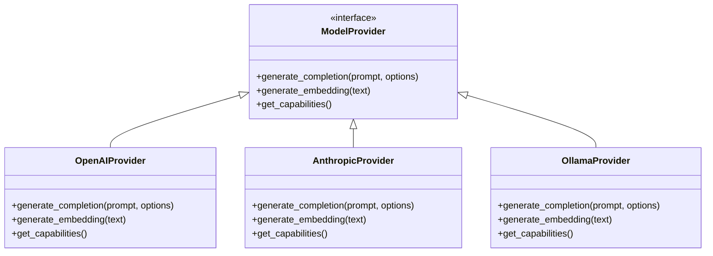
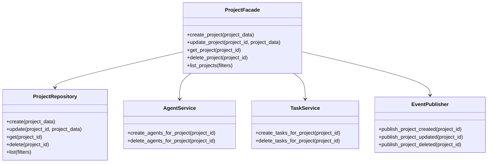
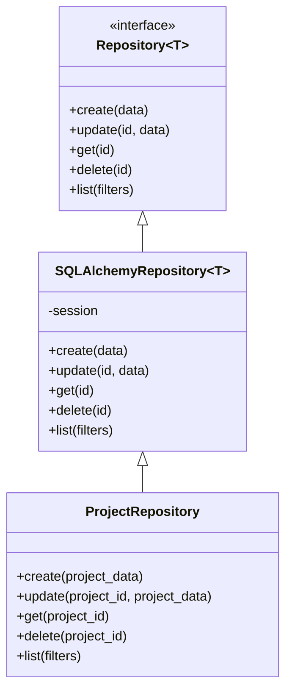
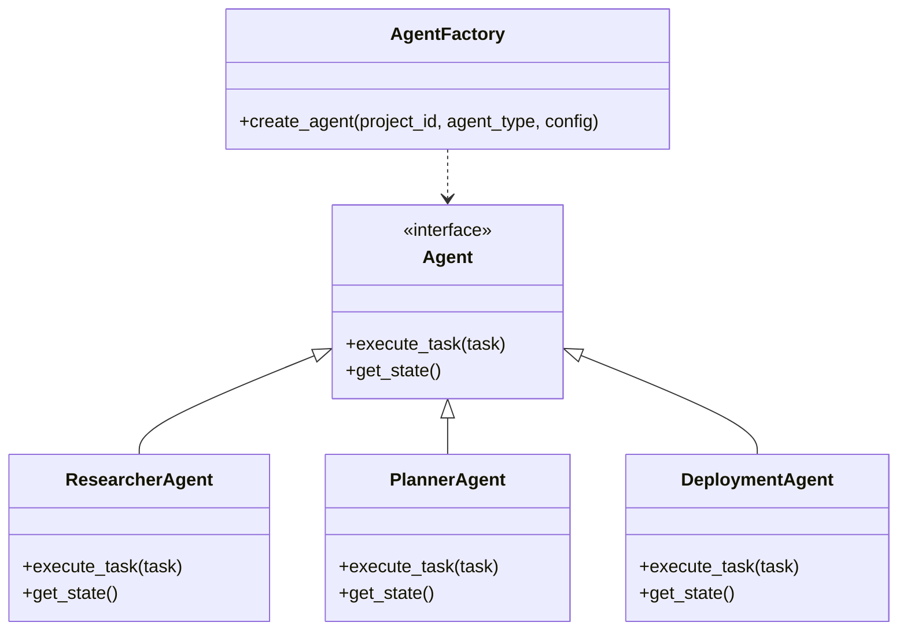
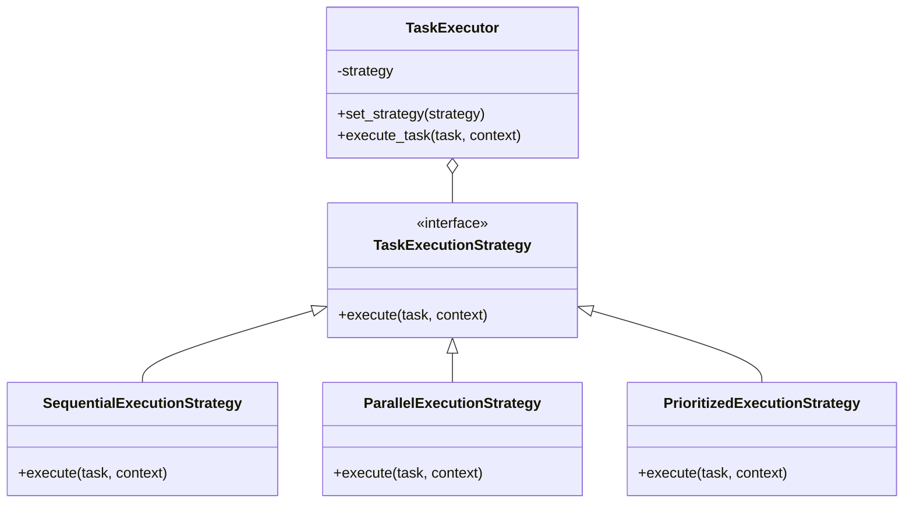
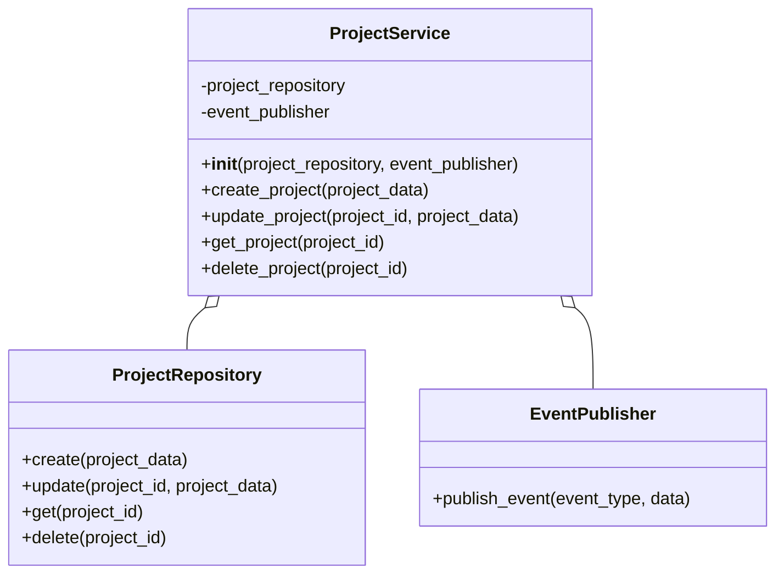

# Design Patterns Guide

This guide provides detailed information on the design patterns used in the Berrys_AgentsV2 system, with a focus on polymorphism, facades, and other advanced programming techniques that help create maintainable, extensible, and modular code.

## Quick Reference

- **Polymorphism**: Use interfaces and inheritance for flexible implementations
- **Facade Pattern**: Simplify complex subsystems with a unified interface
- **Repository Pattern**: Abstract data access logic
- **Factory Pattern**: Create objects without specifying exact classes
- **Strategy Pattern**: Define a family of algorithms for different scenarios
- **Dependency Injection**: Inject dependencies rather than creating them

## Polymorphism

Polymorphism allows objects of different classes to be treated as objects of a common superclass. In Berrys_AgentsV2, polymorphism is used extensively to allow for flexible and extensible implementations.

### Example: Model Providers

The Model Orchestration service uses polymorphism to support different AI model providers:



### Implementation

```python
from abc import ABC, abstractmethod
from typing import Dict, Any, List

class ModelProvider(ABC):
    """Abstract base class for model providers."""
    
    @abstractmethod
    def generate_completion(self, prompt: str, options: Dict[str, Any] = None) -> str:
        """Generate a completion for the given prompt."""
        pass
    
    @abstractmethod
    def generate_embedding(self, text: str) -> List[float]:
        """Generate an embedding for the given text."""
        pass
    
    @abstractmethod
    def get_capabilities(self) -> Dict[str, Any]:
        """Get the capabilities of this model provider."""
        pass

class OpenAIProvider(ModelProvider):
    """OpenAI model provider implementation."""
    
    def __init__(self, api_key: str, model: str = "gpt-4"):
        self.api_key = api_key
        self.model = model
        # Initialize OpenAI client
    
    def generate_completion(self, prompt: str, options: Dict[str, Any] = None) -> str:
        # Implementation for OpenAI
        pass
    
    def generate_embedding(self, text: str) -> List[float]:
        # Implementation for OpenAI
        pass
    
    def get_capabilities(self) -> Dict[str, Any]:
        return {
            "models": ["gpt-3.5-turbo", "gpt-4"],
            "max_tokens": 8192,
            "supports_streaming": True
        }

# Similar implementations for AnthropicProvider and OllamaProvider
```

### Usage

```python
def get_provider(provider_type: str, config: Dict[str, Any]) -> ModelProvider:
    """Factory function to get the appropriate provider."""
    if provider_type == "openai":
        return OpenAIProvider(api_key=config["api_key"], model=config.get("model", "gpt-4"))
    elif provider_type == "anthropic":
        return AnthropicProvider(api_key=config["api_key"], model=config.get("model", "claude-2"))
    elif provider_type == "ollama":
        return OllamaProvider(base_url=config["base_url"], model=config.get("model", "llama2"))
    else:
        raise ValueError(f"Unsupported provider type: {provider_type}")

# Client code doesn't need to know the specific provider type
provider = get_provider(provider_type, config)
completion = provider.generate_completion(prompt, options)
```

### Benefits of Polymorphism

1. **Extensibility**: New providers can be added without changing client code
2. **Encapsulation**: Provider-specific details are hidden from client code
3. **Testability**: Providers can be easily mocked for testing
4. **Flexibility**: Providers can be swapped at runtime

## Facade Pattern

The Facade pattern provides a simplified interface to a complex subsystem. It hides the complexities of the subsystem and provides a unified interface to the client.

### Example: Project Facade

The Project Coordinator service uses a facade to abstract the complexity of project management:



### Implementation

```python
from typing import Dict, Any, List, Optional
import uuid

class ProjectFacade:
    """Facade for project management operations."""
    
    def __init__(
        self,
        project_repository: ProjectRepository,
        agent_service: AgentService,
        task_service: TaskService,
        event_publisher: EventPublisher
    ):
        self.project_repository = project_repository
        self.agent_service = agent_service
        self.task_service = task_service
        self.event_publisher = event_publisher
    
    def create_project(self, project_data: Dict[str, Any]) -> Dict[str, Any]:
        """Create a new project and related entities."""
        # Create the project
        project = self.project_repository.create(project_data)
        
        # Create agents for the project
        self.agent_service.create_agents_for_project(project["id"])
        
        # Publish event
        self.event_publisher.publish_project_created(project["id"])
        
        return project
    
    def update_project(self, project_id: uuid.UUID, project_data: Dict[str, Any]) -> Dict[str, Any]:
        """Update an existing project."""
        # Update the project
        project = self.project_repository.update(project_id, project_data)
        
        # Publish event
        self.event_publisher.publish_project_updated(project_id)
        
        return project
    
    def get_project(self, project_id: uuid.UUID) -> Optional[Dict[str, Any]]:
        """Get a project by ID."""
        return self.project_repository.get(project_id)
    
    def delete_project(self, project_id: uuid.UUID) -> None:
        """Delete a project and related entities."""
        # Delete agents for the project
        self.agent_service.delete_agents_for_project(project_id)
        
        # Delete tasks for the project
        self.task_service.delete_tasks_for_project(project_id)
        
        # Delete the project
        self.project_repository.delete(project_id)
        
        # Publish event
        self.event_publisher.publish_project_deleted(project_id)
    
    def list_projects(self, filters: Dict[str, Any] = None) -> List[Dict[str, Any]]:
        """List projects with optional filtering."""
        return self.project_repository.list(filters)
```

### Usage

```python
# Client code only needs to interact with the facade
project_facade = ProjectFacade(
    project_repository=project_repository,
    agent_service=agent_service,
    task_service=task_service,
    event_publisher=event_publisher
)

# Create a project
project = project_facade.create_project({
    "name": "New Project",
    "description": {"key": "value"},
    "status": "DRAFT"
})

# Client doesn't need to know about the underlying complexity
```

### Benefits of Facade Pattern

1. **Simplicity**: Clients interact with a simple interface
2. **Decoupling**: Clients are decoupled from subsystem components
3. **Layering**: Provides a clear separation between layers
4. **Reduced Dependencies**: Clients depend on one facade instead of multiple components

## Repository Pattern

The Repository pattern abstracts data access logic and provides a collection-like interface for accessing domain objects.

### Example: Project Repository



### Implementation

```python
from abc import ABC, abstractmethod
from typing import Dict, Any, List, Optional, TypeVar, Generic
import uuid
from sqlalchemy.orm import Session

T = TypeVar('T')

class Repository(Generic[T], ABC):
    """Generic repository interface."""
    
    @abstractmethod
    def create(self, data: Dict[str, Any]) -> T:
        """Create a new entity."""
        pass
    
    @abstractmethod
    def update(self, id: uuid.UUID, data: Dict[str, Any]) -> T:
        """Update an existing entity."""
        pass
    
    @abstractmethod
    def get(self, id: uuid.UUID) -> Optional[T]:
        """Get an entity by ID."""
        pass
    
    @abstractmethod
    def delete(self, id: uuid.UUID) -> None:
        """Delete an entity by ID."""
        pass
    
    @abstractmethod
    def list(self, filters: Dict[str, Any] = None) -> List[T]:
        """List entities with optional filtering."""
        pass

class SQLAlchemyRepository(Repository[T], Generic[T]):
    """Base SQLAlchemy repository implementation."""
    
    def __init__(self, session: Session, model_class):
        self.session = session
        self.model_class = model_class
    
    def create(self, data: Dict[str, Any]) -> T:
        entity = self.model_class(**data)
        self.session.add(entity)
        self.session.commit()
        self.session.refresh(entity)
        return entity
    
    def update(self, id: uuid.UUID, data: Dict[str, Any]) -> T:
        entity = self.session.query(self.model_class).get(id)
        if entity is None:
            raise ValueError(f"Entity with ID {id} not found")
        
        for key, value in data.items():
            setattr(entity, key, value)
        
        self.session.commit()
        self.session.refresh(entity)
        return entity
    
    def get(self, id: uuid.UUID) -> Optional[T]:
        return self.session.query(self.model_class).get(id)
    
    def delete(self, id: uuid.UUID) -> None:
        entity = self.session.query(self.model_class).get(id)
        if entity is None:
            raise ValueError(f"Entity with ID {id} not found")
        
        self.session.delete(entity)
        self.session.commit()
    
    def list(self, filters: Dict[str, Any] = None) -> List[T]:
        query = self.session.query(self.model_class)
        
        if filters:
            for key, value in filters.items():
                if hasattr(self.model_class, key):
                    query = query.filter(getattr(self.model_class, key) == value)
        
        return query.all()

class ProjectRepository(SQLAlchemyRepository[ProjectModel]):
    """Repository for project entities."""
    
    def __init__(self, session: Session):
        super().__init__(session, ProjectModel)
    
    # Additional project-specific methods can be added here
```

### Usage

```python
# Create a repository instance
project_repository = ProjectRepository(session)

# Use the repository to access data
project = project_repository.get(project_id)
projects = project_repository.list({"status": "ACTIVE"})
```

### Benefits of Repository Pattern

1. **Abstraction**: Data access logic is abstracted from business logic
2. **Testability**: Repositories can be easily mocked for testing
3. **Maintainability**: Changes to data access logic are isolated
4. **Consistency**: Provides a consistent interface for data access

## Factory Pattern

The Factory pattern provides an interface for creating objects without specifying their concrete classes.

### Example: Agent Factory



### Implementation

```python
from abc import ABC, abstractmethod
from typing import Dict, Any
import uuid

class Agent(ABC):
    """Abstract base class for agents."""
    
    @abstractmethod
    def execute_task(self, task: Dict[str, Any]) -> Dict[str, Any]:
        """Execute a task."""
        pass
    
    @abstractmethod
    def get_state(self) -> Dict[str, Any]:
        """Get the agent's state."""
        pass

class ResearcherAgent(Agent):
    """Researcher agent implementation."""
    
    def __init__(self, project_id: uuid.UUID, config: Dict[str, Any]):
        self.project_id = project_id
        self.config = config
    
    def execute_task(self, task: Dict[str, Any]) -> Dict[str, Any]:
        # Implementation for researcher agent
        pass
    
    def get_state(self) -> Dict[str, Any]:
        return {
            "type": "RESEARCHER",
            "project_id": self.project_id,
            "config": self.config
        }

class PlannerAgent(Agent):
    """Planner agent implementation."""
    
    def __init__(self, project_id: uuid.UUID, config: Dict[str, Any]):
        self.project_id = project_id
        self.config = config
    
    def execute_task(self, task: Dict[str, Any]) -> Dict[str, Any]:
        # Implementation for planner agent
        pass
    
    def get_state(self) -> Dict[str, Any]:
        return {
            "type": "PLANNER",
            "project_id": self.project_id,
            "config": self.config
        }

class DeploymentAgent(Agent):
    """Deployment agent implementation."""
    
    def __init__(self, project_id: uuid.UUID, config: Dict[str, Any]):
        self.project_id = project_id
        self.config = config
    
    def execute_task(self, task: Dict[str, Any]) -> Dict[str, Any]:
        # Implementation for deployment agent
        pass
    
    def get_state(self) -> Dict[str, Any]:
        return {
            "type": "DEPLOYMENT",
            "project_id": self.project_id,
            "config": self.config
        }

class AgentFactory:
    """Factory for creating agents."""
    
    def create_agent(self, project_id: uuid.UUID, agent_type: str, config: Dict[str, Any] = None) -> Agent:
        """Create an agent of the specified type."""
        if config is None:
            config = {}
        
        if agent_type == "RESEARCHER":
            return ResearcherAgent(project_id, config)
        elif agent_type == "PLANNER":
            return PlannerAgent(project_id, config)
        elif agent_type == "DEPLOYMENT":
            return DeploymentAgent(project_id, config)
        else:
            raise ValueError(f"Unsupported agent type: {agent_type}")
```

### Usage

```python
# Create a factory instance
agent_factory = AgentFactory()

# Use the factory to create agents
researcher = agent_factory.create_agent(project_id, "RESEARCHER")
planner = agent_factory.create_agent(project_id, "PLANNER")
deployment = agent_factory.create_agent(project_id, "DEPLOYMENT")

# Client code doesn't need to know the concrete classes
result = researcher.execute_task(task)
```

### Benefits of Factory Pattern

1. **Encapsulation**: Object creation logic is encapsulated
2. **Flexibility**: New types can be added without changing client code
3. **Consistency**: Objects are created in a consistent way
4. **Testability**: Factories can be easily mocked for testing

## Strategy Pattern

The Strategy pattern defines a family of algorithms, encapsulates each one, and makes them interchangeable.

### Example: Task Execution Strategies



### Implementation

```python
from abc import ABC, abstractmethod
from typing import Dict, Any, List
import concurrent.futures

class TaskExecutionStrategy(ABC):
    """Abstract base class for task execution strategies."""
    
    @abstractmethod
    def execute(self, tasks: List[Dict[str, Any]], context: Dict[str, Any]) -> List[Dict[str, Any]]:
        """Execute tasks according to the strategy."""
        pass

class SequentialExecutionStrategy(TaskExecutionStrategy):
    """Execute tasks sequentially."""
    
    def execute(self, tasks: List[Dict[str, Any]], context: Dict[str, Any]) -> List[Dict[str, Any]]:
        results = []
        for task in tasks:
            result = self._execute_single_task(task, context)
            results.append(result)
        return results
    
    def _execute_single_task(self, task: Dict[str, Any], context: Dict[str, Any]) -> Dict[str, Any]:
        # Implementation for executing a single task
        pass

class ParallelExecutionStrategy(TaskExecutionStrategy):
    """Execute tasks in parallel."""
    
    def __init__(self, max_workers: int = 5):
        self.max_workers = max_workers
    
    def execute(self, tasks: List[Dict[str, Any]], context: Dict[str, Any]) -> List[Dict[str, Any]]:
        results = []
        with concurrent.futures.ThreadPoolExecutor(max_workers=self.max_workers) as executor:
            futures = {executor.submit(self._execute_single_task, task, context): task for task in tasks}
            for future in concurrent.futures.as_completed(futures):
                result = future.result()
                results.append(result)
        return results
    
    def _execute_single_task(self, task: Dict[str, Any], context: Dict[str, Any]) -> Dict[str, Any]:
        # Implementation for executing a single task
        pass

class PrioritizedExecutionStrategy(TaskExecutionStrategy):
    """Execute tasks based on priority."""
    
    def execute(self, tasks: List[Dict[str, Any]], context: Dict[str, Any]) -> List[Dict[str, Any]]:
        # Sort tasks by priority
        sorted_tasks = sorted(tasks, key=lambda t: t.get("priority", 0), reverse=True)
        
        # Execute tasks in priority order
        results = []
        for task in sorted_tasks:
            result = self._execute_single_task(task, context)
            results.append(result)
        return results
    
    def _execute_single_task(self, task: Dict[str, Any], context: Dict[str, Any]) -> Dict[str, Any]:
        # Implementation for executing a single task
        pass

class TaskExecutor:
    """Task executor that uses a strategy for execution."""
    
    def __init__(self, strategy: TaskExecutionStrategy = None):
        self.strategy = strategy or SequentialExecutionStrategy()
    
    def set_strategy(self, strategy: TaskExecutionStrategy) -> None:
        """Set the execution strategy."""
        self.strategy = strategy
    
    def execute_tasks(self, tasks: List[Dict[str, Any]], context: Dict[str, Any]) -> List[Dict[str, Any]]:
        """Execute tasks using the current strategy."""
        return self.strategy.execute(tasks, context)
```

### Usage

```python
# Create an executor with a default strategy
executor = TaskExecutor()

# Execute tasks with the default strategy
results = executor.execute_tasks(tasks, context)

# Change the strategy based on requirements
if len(tasks) > 10:
    executor.set_strategy(ParallelExecutionStrategy(max_workers=10))
elif any(task.get("priority", 0) > 0 for task in tasks):
    executor.set_strategy(PrioritizedExecutionStrategy())

# Execute tasks with the new strategy
results = executor.execute_tasks(tasks, context)
```

### Benefits of Strategy Pattern

1. **Flexibility**: Algorithms can be changed at runtime
2. **Encapsulation**: Each algorithm is encapsulated in its own class
3. **Extensibility**: New algorithms can be added without changing client code
4. **Testability**: Strategies can be easily mocked for testing

## Dependency Injection

Dependency Injection is a technique where the dependencies of a class are provided from the outside rather than created inside the class.

### Example: Service Dependencies



### Implementation

```python
from typing import Dict, Any, Optional
import uuid

class ProjectService:
    """Service for project operations."""
    
    def __init__(self, project_repository: ProjectRepository, event_publisher: EventPublisher):
        """Initialize the service with its dependencies."""
        self.project_repository = project_repository
        self.event_publisher = event_publisher
    
    def create_project(self, project_data: Dict[str, Any]) -> Dict[str, Any]:
        """Create a new project."""
        project = self.project_repository.create(project_data)
        self.event_publisher.publish_event("project_created", {"project_id": project["id"]})
        return project
    
    def update_project(self, project_id: uuid.UUID, project_data: Dict[str, Any]) -> Dict[str, Any]:
        """Update an existing project."""
        project = self.project_repository.update(project_id, project_data)
        self.event_publisher.publish_event("project_updated", {"project_id": project_id})
        return project
    
    def get_project(self, project_id: uuid.UUID) -> Optional[Dict[str, Any]]:
        """Get a project by ID."""
        return self.project_repository.get(project_id)
    
    def delete_project(self, project_id: uuid.UUID) -> None:
        """Delete a project by ID."""
        self.project_repository.delete(project_id)
        self.event_publisher.publish_event("project_deleted", {"project_id": project_id})
```

### Usage with FastAPI Dependency Injection

```python
from fastapi import Depends, FastAPI, HTTPException
from sqlalchemy.orm import Session

app = FastAPI()

# Database dependency
def get_db():
    db = SessionLocal()
    try:
        yield db
    finally:
        db.close()

# Repository dependency
def get_project_repository(db: Session = Depends(get_db)):
    return ProjectRepository(db)

# Event publisher dependency
def get_event_publisher():
    return EventPublisher()

# Service dependency
def get_project_service(
    project_repository: ProjectRepository = Depends(get_project_repository),
    event_publisher: EventPublisher = Depends(get_event_publisher)
):
    return ProjectService(project_repository, event_publisher)

# API endpoint
@app.post("/projects/")
def create_project(
    project: ProjectCreate,
    project_service: ProjectService = Depends(get_project_service)
):
    return project_service.create_project(project.model_dump())
```

### Benefits of Dependency Injection

1. **Testability**: Dependencies can be easily mocked for testing
2. **Flexibility**: Dependencies can be changed without changing the class
3. **Decoupling**: Classes are decoupled from their dependencies
4. **Reusability**: Classes can be reused with different dependencies

## Conclusion

Using these design patterns in your service implementations will help create maintainable, extensible, and modular code. Each pattern has its own strengths and use cases, so choose the appropriate pattern based on your specific requirements.

Remember that patterns are guidelines, not rules. Adapt them to your specific needs and combine them as necessary to create elegant solutions.
