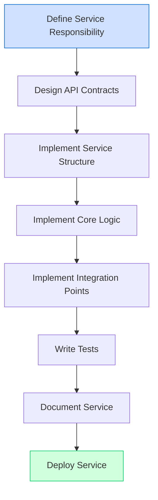
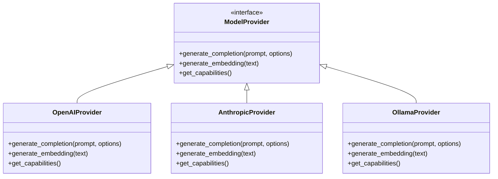
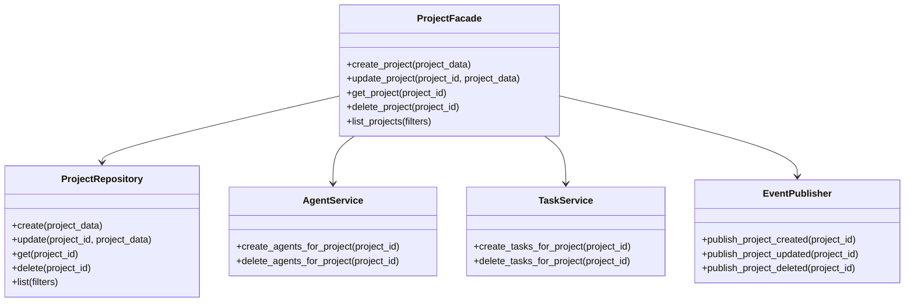
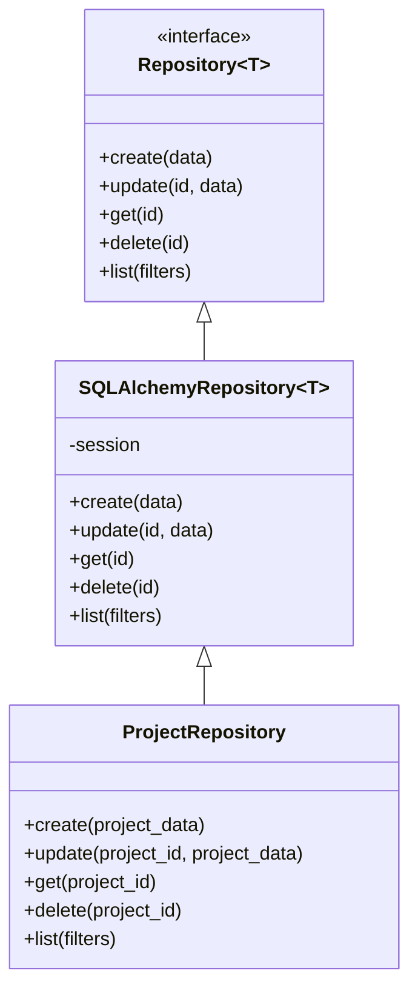
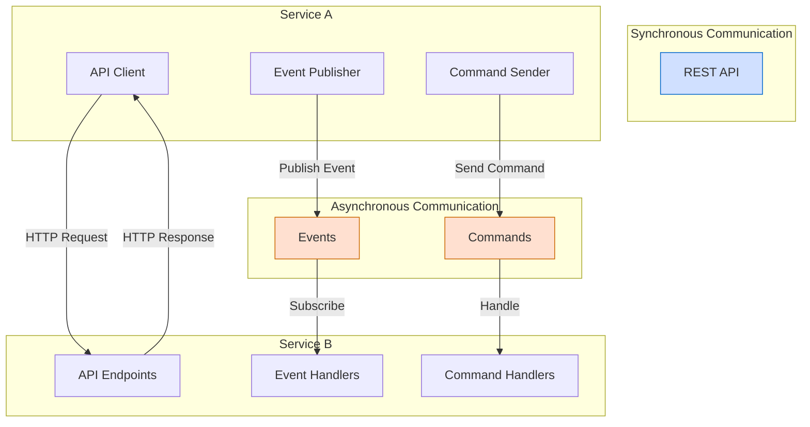

# Service Development Guide

This guide provides comprehensive information on developing new services for the Berrys_AgentsV2 system, including best practices, design patterns, and implementation guidelines.

## Quick Navigation

- [Service Structure](service-structure.md): Standard structure and organization
- [Design Patterns](design-patterns.md): Polymorphism, facades, and other patterns
- [API Contracts](api-contracts.md): Input/output requirements
- [Service Integration](service-integration.md): Connecting to other services
- [Testing Strategy](testing-strategy.md): Effective testing approaches
- [Troubleshooting Guide](troubleshooting-guide.md): Comprehensive guide for debugging and resolving common issues
- [Chat Implementation](chat-implementation.md): Berry's chat functionality implementation details
- [Berry Agent Configuration](berry-agent-configuration.md): Database-driven configuration for Berry
- [Service Standardization Plan](service-standardization-plan.md): Plan for standardizing services and centralizing redundant code
- [Service Standardization Summary](service-standardization-summary.md): Concise summary of standardization status and priorities
- [Service Standardization Templates](templates/README.md): Templates and examples for implementing standardization
- [Agent Orchestrator Standardization Plan](agent-orchestrator-standardization-plan.md): Detailed implementation plan for Agent Orchestrator
- [Agent Orchestrator Standardization Implementation](agent-orchestrator-standardization-implementation.md): Implementation details and results for Agent Orchestrator standardization
- [Database Connection Improvements](database-connection-improvements.md): Improvements to database connection handling

## Service Development Overview

Berrys_AgentsV2 follows a microservices architecture, with each service responsible for a specific domain or functionality. When developing a new service, it's important to follow the established patterns and practices to ensure consistency and maintainability.



## Service Template

The project includes a service template that provides a starting point for new services. The template follows the standard structure and includes placeholder implementations for common components.

The service template can be found in the `docs/service-template` directory. To create a new service, copy this template and customize it according to your service's requirements.

## Standard Service Structure

Each service follows a standard structure:

```
service-name/
├── Dockerfile                # Docker configuration
├── requirements.txt          # Python dependencies
├── src/
│   ├── __init__.py           # Package initialization
│   ├── main.py               # FastAPI application entry point
│   ├── config.py             # Service configuration
│   ├── dependencies.py       # Dependency injection
│   ├── exceptions.py         # Custom exceptions
│   ├── models/               # Data models
│   │   ├── __init__.py
│   │   ├── api.py            # API request/response models
│   │   └── internal.py       # Internal data models
│   ├── routers/
│   │   ├── __init__.py
│   │   └── resource.py       # API endpoints for resources
│   ├── services/
│   │   ├── __init__.py
│   │   └── resource_service.py # Core business logic
│   ├── messaging/
│   │   ├── __init__.py
│   │   ├── events.py         # Event definitions and handlers
│   │   └── commands.py       # Command definitions and handlers
│   └── utils/
│       ├── __init__.py
│       └── helpers.py        # Utility functions
└── tests/                    # Unit and integration tests
    ├── __init__.py
    ├── conftest.py           # Test fixtures
    ├── test_main.py          # API tests
    └── test_services/        # Service tests
        ├── __init__.py
        └── test_resource_service.py
```

## Advanced Design Patterns

Berrys_AgentsV2 uses several advanced design patterns to ensure code quality, maintainability, and extensibility:

### Polymorphism

Polymorphism is used extensively in the system to allow for flexible and extensible implementations. For example, the Model Orchestration service uses polymorphism to support different AI model providers:



### Facade Pattern

The Facade pattern is used to provide a simplified interface to complex subsystems. For example, the Project Coordinator service uses a facade to abstract the complexity of project management:



### Repository Pattern

The Repository pattern is used to abstract data access logic. Each service that needs to interact with the database implements repositories for its domain entities:



## Service Integration

Services in Berrys_AgentsV2 communicate with each other using a combination of synchronous API calls and asynchronous messaging:



## Getting Started

To create a new service:

1. Copy the service template from `docs/service-template`
2. Rename the directory to your service name
3. Update the `README.md` file with your service's information
4. Implement your service's functionality following the guidelines in this documentation
5. Write tests for your service
6. Update the Docker configuration
7. Deploy your service

For more detailed information on specific aspects of service development, please refer to the links in the Quick Navigation section above.
