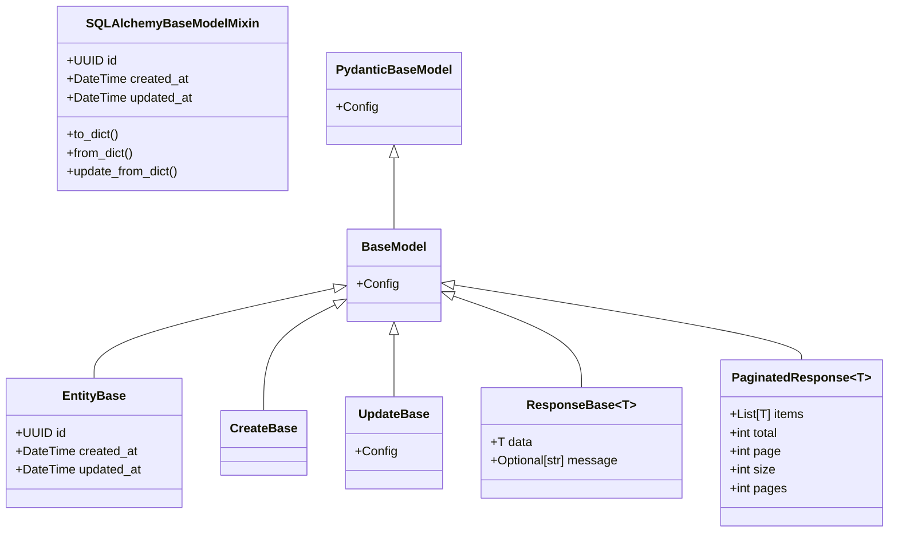
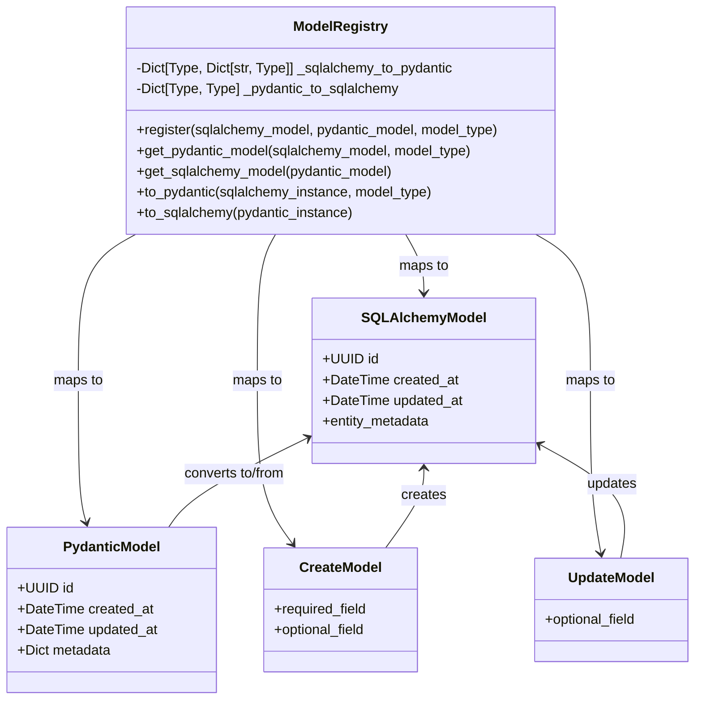
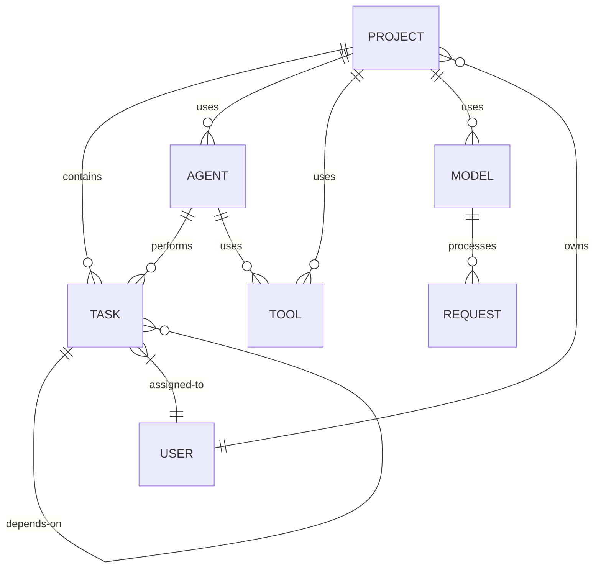
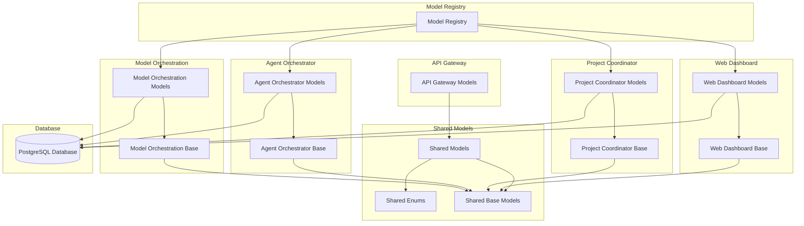
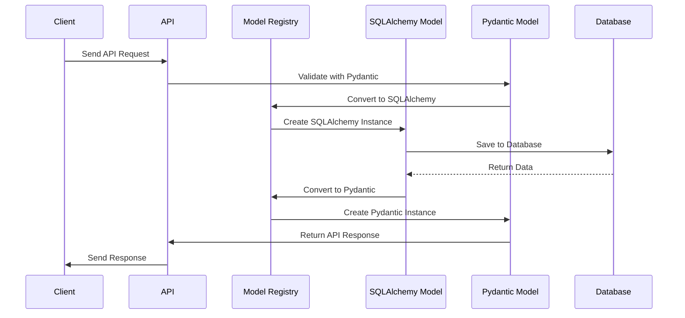

# Model Mapping System

This document provides a comprehensive overview of the model mapping system in the Berrys_AgentsV2 project, including diagrams and implementation details.

## Overview

The model mapping system provides a standardized way to convert between SQLAlchemy ORM models and Pydantic API models. This ensures consistency across services and simplifies data transformation.

Key components:
- Base model classes for SQLAlchemy and Pydantic models
- Model registry for mapping between model types
- Conversion utilities for transforming instances
- Standardized metadata handling

## Implementation

The model mapping system is implemented in the following files:

- `shared/models/src/base.py` - Base model classes and utilities
- `shared/models/src/model_registry.py` - Model registration and conversion
- `scripts/generate_model_diagram.py` - Diagram generation tool

## Model Hierarchy

The following diagram shows the inheritance hierarchy of the base models:



## Model Registry

The model registry is responsible for mapping between SQLAlchemy and Pydantic models. It provides methods for registering models and converting instances.



### Registration Example

```python
# Register a model mapping
from shared.models.src.base import register_models
from app.models.project import Project  # SQLAlchemy model
from shared.models.src.project import Project as ProjectPydantic  # Pydantic model

register_models(Project, ProjectPydantic, "default")
```

### Conversion Example

```python
# Convert between SQLAlchemy and Pydantic models
from shared.models.src.base import to_pydantic, to_sqlalchemy

# SQLAlchemy to Pydantic
project_db = session.query(Project).first()
project_api = to_pydantic(project_db, "default")

# Pydantic to SQLAlchemy
project_api = ProjectPydantic(name="New Project", description="A new project")
project_db = to_sqlalchemy(project_api)
```

## Entity Relationships

The following diagram shows the relationships between the main entities in the system:



## Service Model Interactions

The following diagram shows how models are used across different services:



## Model Conversion Flow

The following diagram shows the flow of data during model conversion:



## Metadata Handling

The model mapping system provides standardized handling of metadata fields:

```python
# In SQLAlchemy models
from shared.models.src.base import metadata_column

class Project(Base):
    __tablename__ = "project"
    
    name = Column(String(255), nullable=False)
    description = Column(Text, nullable=True)
    project_metadata = metadata_column("project")  # Creates a JSONB column with standard naming
```

```python
# In Pydantic models
from pydantic import BaseModel, Field
from typing import Dict, Any, Optional

class Project(BaseModel):
    name: str
    description: Optional[str] = None
    metadata: Dict[str, Any] = Field(default_factory=dict)  # Standard metadata field
```

The model registry automatically converts between `project_metadata` in SQLAlchemy and `metadata` in Pydantic.

## Related Documentation

- [Model Standardization Progress](./model-standardization-progress.md) - Overall progress on model standardization
- [Model Standardization History](./model-standardization-history.md) - Historical context and lessons learned
- [Entity Representation Alignment](./entity-representation-alignment.md) - Documentation of entity differences and adapters
- [Adapter Usage Examples](./adapter-usage-examples.md) - Examples of how to use the adapters
- [SQLAlchemy Guide](../../best-practices/sqlalchemy-guide.md) - Best practices for SQLAlchemy models
- [Pydantic Guide](../../best-practices/pydantic-guide.md) - Best practices for Pydantic models
