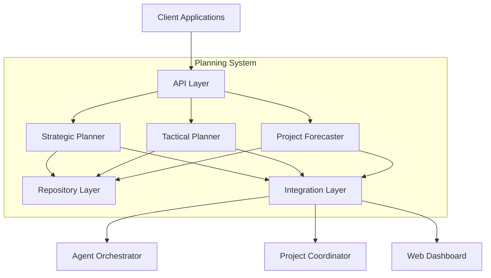

# Planning System High-Level Capabilities Implementation

**Status**: Planned  
**Last Updated**: March 27, 2025  
**Categories**: development, planning  
**Services**: planning-system, agent-orchestrator, project-coordinator  
**Priority**: High  

> **Navigation**: [Root](/docs) > [Developer Guides](/docs/developer-guides) > [Service Development](/docs/developer-guides/service-development) > Planning System High-Level Capabilities Implementation

This document outlines the implementation plan for enhancing the Planning System with high-level planning capabilities, improving task breakdown functionality, and implementing project forecasting features. This implementation is based on the [Planning System Enhancement Plan](planning-system-enhancement-plan.md).

## Table of Contents

- [Overview](#overview)
- [Implementation Phases](#implementation-phases)
  - [Phase 1: Planning Strategist Enhancement](#phase-1-planning-strategist-enhancement)
  - [Phase 2: Planning Tactician Enhancement](#phase-2-planning-tactician-enhancement)
  - [Phase 3: Project Forecaster Implementation](#phase-3-project-forecaster-implementation)
- [Technical Architecture](#technical-architecture)
- [Data Models](#data-models)
- [API Endpoints](#api-endpoints)
- [Integration Details](#integration-details)
- [Testing Plan](#testing-plan)
- [Deployment Strategy](#deployment-strategy)
- [Risk Assessment and Mitigation](#risk-assessment-and-mitigation)
- [Success Metrics](#success-metrics)
- [Related Documents](#related-documents)

## Overview

The Planning System is a critical component of the Berrys_AgentsV2 framework, responsible for generating strategic plans, breaking down plans into executable tasks, and forecasting project timelines. This implementation plan focuses on enhancing the Planning System with high-level planning capabilities to support the full range of planning requirements for complex multi-agent projects.

## Implementation Phases

### Phase 1: Planning Strategist Enhancement

**Duration**: 2 weeks  
**Goal**: Improve high-level planning capabilities to generate comprehensive strategic plans

#### Week 1: Multi-Phase Plan Generation

##### Task 1.1: Plan Template System (3 days)
- Implement a flexible plan template system for different project types
- Create base templates for common project types (software development, research, content creation)
- Implement template customization capabilities
- Add template versioning and management

**Technical Details**:
- Create a `PlanTemplate` model with fields for template metadata, structure, and customization options
- Implement a template repository with CRUD operations
- Add template selection logic based on project requirements
- Implement template instantiation with project-specific parameters

##### Task 1.2: Phase Definition System (2 days)
- Implement a system for defining phase objectives and deliverables
- Add support for phase dependencies and constraints
- Create a phase validation system to ensure completeness and consistency
- Implement phase visualization capabilities

**Technical Details**:
- Enhance the `PlanPhase` model with fields for objectives, deliverables, dependencies, and constraints
- Implement phase generation algorithms based on project requirements
- Add phase validation logic to ensure phases are complete and consistent
- Implement phase visualization using a directed graph representation

#### Week 2: Resource Allocation and Methodology Support

##### Task 1.3: Resource Allocation Planning (3 days)
- Implement resource modeling (skills, availability, etc.)
- Add resource allocation algorithms
- Create resource utilization visualization
- Implement resource constraint handling

**Technical Details**:
- Create a `Resource` model with fields for skills, availability, and constraints
- Implement resource allocation algorithms using constraint satisfaction techniques
- Add resource utilization visualization using Gantt charts
- Implement resource constraint handling with fallback mechanisms

##### Task 1.4: Planning Methodology Support (2 days)
- Implement support for Agile methodology
- Implement support for Waterfall methodology
- Create methodology selection logic
- Add configuration options for methodology parameters

**Technical Details**:
- Create a `PlanningMethodology` model with fields for methodology type, parameters, and constraints
- Implement methodology-specific planning algorithms
- Add methodology selection logic based on project requirements
- Implement configuration options for methodology parameters

### Phase 2: Planning Tactician Enhancement

**Duration**: 2 weeks  
**Goal**: Improve task breakdown functionality to generate executable tasks from strategic plans

#### Week 3: Task Breakdown and Dependency Management

##### Task 2.1: Task Generation Enhancement (3 days)
- Enhance task generation algorithms
- Implement acceptance criteria generation
- Add support for task templates
- Create task validation system

**Technical Details**:
- Enhance the `Task` model with fields for acceptance criteria, dependencies, and constraints
- Implement task generation algorithms using natural language processing techniques
- Add task template system with customization options
- Implement task validation logic to ensure tasks are complete and executable

##### Task 2.2: Task Dependency Management (2 days)
- Implement dependency identification algorithms
- Add support for different dependency types
- Create dependency visualization
- Implement dependency validation

**Technical Details**:
- Create a `TaskDependency` model with fields for dependency type, source task, target task, and constraints
- Implement dependency identification algorithms using semantic analysis
- Add support for different dependency types (finish-to-start, start-to-start, etc.)
- Implement dependency visualization using a directed graph representation

#### Week 4: Task Assignment and Optimization

##### Task 2.3: Task Assignment Enhancement (3 days)
- Improve task assignment algorithms
- Implement load balancing for agent assignments
- Add support for skill-based assignment
- Create assignment visualization

**Technical Details**:
- Enhance the task assignment algorithms using constraint satisfaction techniques
- Implement load balancing algorithms to distribute tasks evenly
- Add skill-based assignment logic to match tasks with agent capabilities
- Implement assignment visualization using a bipartite graph representation

##### Task 2.4: Task Sequence Optimization (2 days)
- Implement task sequence optimization
- Add support for parallel execution
- Create sequence visualization
- Implement sequence validation

**Technical Details**:
- Implement task sequence optimization algorithms using critical path analysis
- Add support for identifying tasks that can be executed in parallel
- Implement sequence visualization using a directed acyclic graph representation
- Add sequence validation logic to ensure the sequence is valid and optimal

### Phase 3: Project Forecaster Implementation

**Duration**: 2 weeks  
**Goal**: Implement project forecasting features to predict timelines and identify bottlenecks

#### Week 5: Timeline Prediction and Bottleneck Identification

##### Task 3.1: Timeline Prediction Implementation (3 days)
- Implement critical path analysis
- Add support for task duration estimation
- Create timeline visualization
- Implement timeline validation

**Technical Details**:
- Implement critical path analysis algorithms using graph theory
- Add task duration estimation using historical data and machine learning
- Implement timeline visualization using Gantt charts
- Add timeline validation logic to ensure the timeline is realistic and achievable

##### Task 3.2: Bottleneck Identification Implementation (2 days)
- Implement bottleneck detection algorithms
- Add support for resource constraint analysis
- Create bottleneck visualization
- Implement bottleneck notification system

**Technical Details**:
- Implement bottleneck detection algorithms using network flow analysis
- Add resource constraint analysis to identify resource bottlenecks
- Implement bottleneck visualization using heat maps
- Add bottleneck notification system to alert users of potential bottlenecks

#### Week 6: What-If Analysis and Reporting

##### Task 3.3: What-If Analysis Implementation (3 days)
- Implement scenario modeling
- Add support for parameter adjustment
- Create scenario comparison visualization
- Implement scenario recommendation system

**Technical Details**:
- Implement scenario modeling using simulation techniques
- Add parameter adjustment capabilities for different scenarios
- Implement scenario comparison visualization using radar charts
- Add scenario recommendation system to suggest optimal scenarios

##### Task 3.4: Reporting and Dashboard Integration (2 days)
- Implement reporting system for forecasting results
- Create dashboard widgets for timeline and bottleneck visualization
- Add export capabilities for reports
- Implement notification system for forecast updates

**Technical Details**:
- Create report templates for different forecasting aspects
- Implement dashboard widgets using visualization libraries
- Add export functionality for various formats (PDF, Excel, etc.)
- Implement notification system using the event bus

## Technical Architecture

The enhanced Planning System will follow a layered architecture:

1. **API Layer**: FastAPI endpoints for client interaction
2. **Service Layer**: Core business logic components
   - Strategic Planner: High-level planning capabilities
   - Tactical Planner: Task breakdown functionality
   - Project Forecaster: Timeline prediction and bottleneck identification
3. **Repository Layer**: Data access and persistence
4. **Integration Layer**: Communication with other services

### Component Diagram

## Data Models

The implementation will require the following key data models:

1. **Plan Template**: Template for creating strategic plans
   - Metadata (name, description, version)
   - Structure (phases, milestones)
   - Customization options

2. **Plan Phase**: Phase within a strategic plan
   - Objectives and deliverables
   - Dependencies and constraints
   - Completion criteria

3. **Planning Methodology**: Methodology configuration
   - Type (Agile, Waterfall, etc.)
   - Parameters and constraints
   - Customization options

4. **Resource**: Resource for task execution
   - Skills and proficiency levels
   - Availability and constraints
   - Cost and capacity

5. **Task Template**: Template for creating tasks
   - Metadata (name, description, category)
   - Acceptance criteria template
   - Effort estimation guidelines

6. **Task Dependency**: Dependency between tasks
   - Type (finish-to-start, start-to-start, etc.)
   - Lag time and constraints
   - Critical path indicator

7. **Timeline Forecast**: Forecast of project timeline
   - Timeline points with confidence intervals
   - Completion date predictions
   - Risk factors

8. **Bottleneck Analysis**: Analysis of project bottlenecks
   - Identified bottlenecks with severity
   - Recommendations for resolution
   - Impact analysis

## API Endpoints

The implementation will add the following key API endpoints:

### Strategic Planner Endpoints

- `POST /templates`: Create a plan template
- `GET /templates/{template_id}`: Get a plan template
- `PUT /templates/{template_id}`: Update a plan template
- `DELETE /templates/{template_id}`: Delete a plan template
- `POST /templates/{template_id}/instantiate`: Instantiate a template
- `POST /phases`: Create a plan phase
- `GET /phases/{phase_id}`: Get a plan phase
- `PUT /phases/{phase_id}`: Update a plan phase
- `DELETE /phases/{phase_id}`: Delete a plan phase
- `GET /phases/{plan_id}/schedule`: Generate phase schedule
- `GET /phases/{plan_id}/dependencies`: Visualize phase dependencies
- `POST /methodologies`: Create a planning methodology
- `GET /methodologies/{methodology_id}`: Get a planning methodology
- `PUT /methodologies/{methodology_id}`: Update a planning methodology
- `DELETE /methodologies/{methodology_id}`: Delete a planning methodology

### Tactical Planner Endpoints

- `POST /task-templates`: Create a task template
- `GET /task-templates/{template_id}`: Get a task template
- `PUT /task-templates/{template_id}`: Update a task template
- `DELETE /task-templates/{template_id}`: Delete a task template
- `POST /task-templates/{template_id}/instantiate`: Instantiate a task template
- `POST /dependencies`: Create a task dependency
- `GET /dependencies/{from_task_id}/{to_task_id}`: Get a task dependency
- `PUT /dependencies/{from_task_id}/{to_task_id}`: Update a task dependency
- `DELETE /dependencies/{from_task_id}/{to_task_id}`: Delete a task dependency
- `GET /dependencies/{task_id}/visualization`: Visualize task dependencies
- `POST /tasks/bulk-create`: Create multiple tasks
- `PUT /tasks/bulk-update`: Update multiple tasks
- `GET /tasks/{plan_id}/critical-path`: Get critical path tasks

### Project Forecaster Endpoints

- `POST /forecasts/timeline`: Generate timeline forecast
- `GET /forecasts/timeline/{plan_id}`: Get latest timeline forecast
- `GET /forecasts/timeline/{plan_id}/history`: Get forecast history
- `POST /forecasts/bottlenecks`: Analyze bottlenecks
- `GET /forecasts/critical-path/{plan_id}`: Get critical path
- `GET /forecasts/slack-analysis/{plan_id}`: Get slack analysis
- `POST /forecasts/what-if`: Run what-if analysis
- `GET /forecasts/resource-utilization/{plan_id}`: Get resource utilization
- `POST /forecasts/reports`: Generate forecast report

## Integration Details

### Agent Orchestrator Integration

- **Task Assignment**: Planning System assigns tasks to agents through the Agent Orchestrator
- **Agent Capabilities**: Agent Orchestrator provides agent capability information to the Planning System
- **Task Status Updates**: Agent Orchestrator sends task status updates to the Planning System

### Project Coordinator Integration

- **Project Status**: Planning System sends project status updates to the Project Coordinator
- **Project Configuration**: Project Coordinator provides project configuration to the Planning System
- **Resource Allocation**: Planning System sends resource allocation information to the Project Coordinator

### Web Dashboard Integration

- **Plan Visualization**: Web Dashboard displays plans generated by the Planning System
- **Task Visualization**: Web Dashboard displays tasks generated by the Planning System
- **Timeline Visualization**: Web Dashboard displays timelines predicted by the Planning System

## Testing Plan

### Unit Testing

- Test plan generation algorithms
- Test task breakdown algorithms
- Test timeline prediction algorithms
- Test bottleneck identification algorithms

### Integration Testing

- Test integration with Agent Orchestrator
- Test integration with Project Coordinator
- Test integration with Web Dashboard

### End-to-End Testing

- Test complete planning workflow
- Test plan adaptation based on project changes
- Test forecasting accuracy

## Deployment Strategy

1. **Development Environment Deployment**
   - Deploy to development environment for initial testing
   - Validate functionality with test data
   - Identify and fix issues

2. **Staging Environment Deployment**
   - Deploy to staging environment for integration testing
   - Validate integration with other services
   - Perform load testing and performance optimization

3. **Production Environment Deployment**
   - Deploy to production environment
   - Monitor performance and stability
   - Collect feedback for improvements

## Risk Assessment and Mitigation

| Risk | Impact | Probability | Mitigation |
|------|--------|------------|------------|
| Integration issues with Agent Orchestrator | High | Medium | Implement comprehensive integration tests and fallback mechanisms |
| Performance issues with complex plans | High | Medium | Implement caching, optimization, and pagination for large plans |
| Accuracy issues with forecasting | Medium | High | Implement confidence intervals and continuous improvement based on actual outcomes |
| Data consistency issues | High | Low | Implement transactions and validation across service boundaries |
| User adoption challenges | Medium | Medium | Provide comprehensive documentation and training materials |

## Success Metrics

### Performance Metrics

- Plan generation time < 2 seconds
- Task breakdown time < 1 second
- Timeline prediction time < 3 seconds
- API response times < 500ms

### Quality Metrics

- Plan completeness > 95%
- Task clarity > 90%
- Forecast accuracy > 80%
- User satisfaction > 85%

### Operational Metrics

- API request success rate > 99.9%
- Error rate < 0.1%
- Resource utilization < 70%
- Availability > 99.9%

## Related Documents

### Prerequisites
- [Planning System Standardization Implementation](planning-system-standardization-implementation.md)
- [Entity Representation Alignment](entity-representation-alignment.md)
- [Cross-Service Communication Improvements](cross-service-communication-improvements.md)

### Next Steps
- [Planning System Client Guide](planning-system-client-guide.md)
- [Agent Generation Engine Enhancement Plan](agent-generation-engine-enhancement-plan.md)

### Reference
- [Service Development Guide](index.md)
- [Model Standardization Progress](model-standardization-progress.md)
