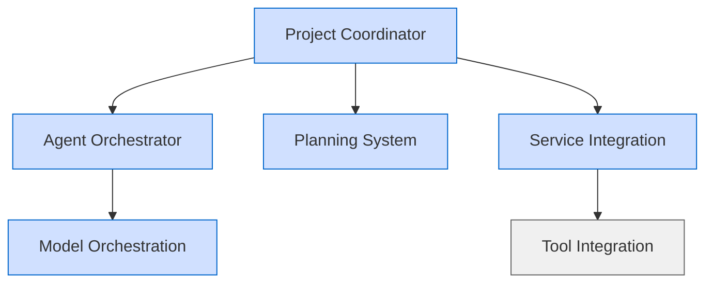

# Service Migration to Shared Components Assessment

> **Draft-of-Thought Documentation**: This document provides a comprehensive assessment of the current state of service migration to shared components, identifies remaining work, and outlines a prioritized plan for completing the migration.

## Overview

As part of the Service Standardization Initiative, we've developed shared components to centralize common functionality across services. These components include:

- UUID type handling (`shared/utils/src/database.py`)
- Model conversion utilities (`shared/utils/src/model_conversion.py`)
- Enhanced base models (`shared/models/src/base.py`)
- Standardized API responses (`shared/models/src/api/responses.py`)
- Validation utilities (`shared/utils/src/validation.py`)
- Configuration management (`shared/utils/src/config.py`)

This document assesses the current state of service migration to these shared components and outlines a plan for completing the migration.

## Current Migration Status

| Service | UUID Type | Base Models | Model Conversion | API Responses | Validation | Configuration | Overall |
|---------|-----------|-------------|------------------|---------------|------------|---------------|---------|
| Web Dashboard | ✅ | ✅ | ✅ | ✅ | ✅ | ✅ | ✅ |
| Project Coordinator | ✅ | ✅ | ✅ | ✅ | ✅ | ✅ | ✅ |
| Agent Orchestrator | ✅ | ✅ | ✅ | ✅ | ✅ | ✅ | ✅ |
| Planning System | ✅ | ✅ | ✅ | ✅ | ✅ | ✅ | ✅ |
| Model Orchestration | ✅ | ✅ | ✅ | ✅ | ✅ | ✅ | ✅ |
| Service Integration | ✅ | ✅ | ✅ | ✅ | ✅ | ✅ | ✅ |
| Tool Integration | ❌ | ❌ | ❌ | ❌ | ❌ | ❌ | ❌ |

### Migration Complexity Assessment

| Service | Complexity | Dependencies | Estimated Effort | Priority | Status |
|---------|------------|--------------|------------------|----------|--------|
| Agent Orchestrator | Medium | Project Coordinator | 3 days | High | ✅ Completed |
| Planning System | Low | None | 2 days | Medium | ✅ Completed |
| Model Orchestration | High | Agent Orchestrator | 4 days | High | ✅ Completed |
| Service Integration | Medium | None | 3 days | Medium | ✅ Completed |
| Tool Integration | Low | None | 2 days | Low | ❌ Not Started |

## Migration Prioritization

Based on the assessment, we've prioritized the services for migration as follows:

1. **Agent Orchestrator** (High Priority) ✅ Completed
   - Critical service with many dependencies
   - Already standardized, making migration more straightforward
   - Will serve as a template for other services

2. **Model Orchestration** (High Priority) ✅ Completed
   - Depends on Agent Orchestrator
   - Had custom UUID implementation that needed to be replaced
   - Critical for system functionality

3. **Service Integration** (Medium Priority) ✅ Completed
   - Moderate complexity
   - Few dependencies
   - Already standardized

4. **Planning System** (Medium Priority) ❌ Not Started
   - Relatively simple migration
   - Few dependencies
   - Already standardized

5. **Tool Integration** (Low Priority) ❌ Not Started
   - Simplest migration
   - Few dependencies
   - Already standardized

## Dependency Graph

## Migration Plan

### 1. Agent Orchestrator Migration (Completed)

The Agent Orchestrator service has been successfully migrated to use the shared components. See [Agent Orchestrator Migration Implementation (Completed)](agent-orchestrator-migration-implementation-completed.md) for details.

#### Components Migrated:
- ✅ Custom UUID implementation to shared UUID type
- ✅ Base model classes to StandardModel
- ✅ Custom model conversion to shared utilities
- ✅ API response models to shared templates
- ✅ Validation logic to shared utilities
- ✅ Configuration management to shared utilities

#### Implementation Completed:
1. ✅ Updated UUID type usage
2. ✅ Migrated base model classes
3. ✅ Implemented shared model conversion
4. ✅ Updated API response models
5. ✅ Migrated validation logic
6. ✅ Updated configuration management
7. ✅ Removed redundant code
8. ✅ Updated tests
9. ✅ Documented changes

### 2. Model Orchestration Migration (Completed)

The Model Orchestration service has been successfully migrated to use the shared components. See [Model Orchestration Migration Implementation](model-orchestration-migration-implementation.md) for details.

#### Components Migrated:
- ✅ Custom UUID implementation to shared UUID type
- ✅ Base model classes to StandardModel
- ✅ Custom model conversion to shared utilities
- ✅ API response models to shared templates
- ✅ Validation logic to shared utilities
- ✅ Configuration management to shared utilities

#### Implementation Completed:
1. ✅ Updated UUID type usage
2. ✅ Migrated base model classes
3. ✅ Implemented shared model conversion
4. ✅ Updated API response models
5. ✅ Migrated validation logic
6. ✅ Updated configuration management
7. ✅ Removed redundant code
8. ✅ Updated tests
9. ✅ Documented changes

### 3. Planning System Migration (Completed)

The Planning System service has been successfully migrated to use the shared components. See [Planning System Migration Implementation](planning-system-migration-implementation.md) for details.

#### Components Migrated:
- ✅ Base model classes to StandardModel
- ✅ Custom model conversion to shared utilities
- ✅ API response models to shared templates
- ✅ Validation logic to shared utilities
- ✅ Configuration management to shared utilities

#### Implementation Completed:
1. ✅ Migrated base model classes
2. ✅ Implemented shared model conversion
3. ✅ Updated API response models
4. ✅ Migrated validation logic
5. ✅ Updated configuration management
6. ✅ Removed redundant code
7. ✅ Updated tests
8. ✅ Documented changes

### 4. Service Integration Migration (Completed)

The Service Integration service has been successfully migrated to use the shared components. See [Service Integration Migration Implementation](service-integration-migration-implementation.md) for details.

#### Components Migrated:
- ✅ Base model classes to StandardModel
- ✅ Custom model conversion to shared utilities
- ✅ API response models to shared templates
- ✅ Validation logic to shared utilities
- ✅ Configuration management to shared utilities

#### Implementation Completed:
1. ✅ Migrated base model classes
2. ✅ Implemented shared model conversion
3. ✅ Updated API response models
4. ✅ Migrated validation logic
5. ✅ Added configuration management
6. ✅ Removed redundant code
7. ✅ Updated tests
8. ✅ Documented changes

### 5. Tool Integration Migration

#### Components to Migrate:
- Base model classes to StandardModel
- Custom model conversion to shared utilities
- API response models to shared templates
- Validation logic to shared utilities
- Configuration management to shared utilities

#### Implementation Steps:
1. Migrate base model classes
2. Implement shared model conversion
3. Update API response models
4. Migrate validation logic
5. Update configuration management
6. Remove redundant code
7. Update tests
8. Document changes

## Testing Strategy

For each service migration:

1. **Unit Testing**
   - Update unit tests to reflect new component usage
   - Add tests for shared component functionality
   - Verify correct behavior of migrated components

2. **Integration Testing**
   - Test interactions with other services
   - Verify cross-service functionality
   - Ensure proper handling of API requests and responses

3. **API Testing**
   - Test all API endpoints
   - Verify correct response formats
   - Test error handling and edge cases

4. **Performance Testing**
   - Compare performance before and after migration
   - Identify and address any performance regressions
   - Optimize as needed

## Potential Challenges and Mitigations

1. **Backward Compatibility**
   - **Challenge**: Ensuring migrated services remain compatible with non-migrated services
   - **Mitigation**: Implement adapter patterns where needed, thorough integration testing

2. **Database Interactions**
   - **Challenge**: Changes to model classes might affect database interactions
   - **Mitigation**: Thorough testing of database operations, careful review of SQLAlchemy usage

3. **API Contract Changes**
   - **Challenge**: Standardized API responses might change API contracts
   - **Mitigation**: Ensure response formats remain compatible, version APIs if necessary

4. **Performance Impact**
   - **Challenge**: Shared components might introduce performance overhead
   - **Mitigation**: Performance testing, optimization where needed

5. **Testing Coverage**
   - **Challenge**: Ensuring all edge cases are covered in tests
   - **Mitigation**: Comprehensive test suite, code review focus on test coverage

## Next Steps

1. ✅ Complete migration of Agent Orchestrator service
2. ✅ Complete migration of Model Orchestration service
3. ✅ Complete migration of Service Integration service
4. ✅ Complete migration of Planning System service
5. Continue with detailed implementation plans for remaining services
6. Update tracking mechanism for migration progress
7. Schedule regular reviews to address challenges
8. Update documentation as migration progresses

## Related Documentation

- [Service Migration Guide](service-migration-guide.md) - Comprehensive guide for migrating services
- [Code Centralization Implementation](code-centralization-implementation.md) - Implementation details for shared components
- [Service Standardization Summary](service-standardization-summary.md) - Current status of service standardization
