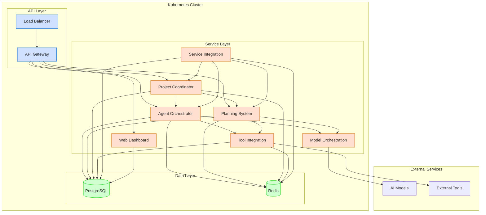

# Production Deployment Guide

**Last Modified:** 2025-03-29  
**Completion Date:** 2025-03-29  
**Doc Type:** Guide  

---

## Overview

This guide provides comprehensive instructions for deploying the Berrys_AgentsV2 platform to a production environment. It covers infrastructure setup, deployment procedures, configuration, monitoring, and maintenance.

## Production Architecture

The production deployment uses a Kubernetes-based architecture:



## Prerequisites

Before deploying to production, ensure you have:

- AWS account with appropriate permissions
- Terraform installed (v1.0+)
- kubectl installed and configured
- Docker installed
- Access to container registry (ECR)
- Domain name for the platform

## Infrastructure Provisioning

The infrastructure is provisioned using Terraform:

```hcl
# main.tf
provider "aws" {
  region = var.aws_region
}

module "vpc" {
  source = "./modules/vpc"
  project_name = var.project_name
  environment = "production"
  vpc_cidr = "10.0.0.0/16"
}

module "eks" {
  source = "./modules/eks"
  project_name = var.project_name
  environment = "production"
  vpc_id = module.vpc.vpc_id
  subnet_ids = module.vpc.private_subnet_ids
  cluster_version = "1.22"
}

module "rds" {
  source = "./modules/rds"
  project_name = var.project_name
  environment = "production"
  vpc_id = module.vpc.vpc_id
  subnet_ids = module.vpc.database_subnet_ids
  instance_class = "db.t3.large"
  allocated_storage = 100
}

module "elasticache" {
  source = "./modules/elasticache"
  project_name = var.project_name
  environment = "production"
  vpc_id = module.vpc.vpc_id
  subnet_ids = module.vpc.database_subnet_ids
  node_type = "cache.t3.medium"
}
```

### Infrastructure Components

1. **VPC and Networking**
   - Dedicated VPC with public and private subnets
   - NAT gateways for outbound traffic
   - Security groups for service isolation

2. **Kubernetes Cluster (EKS)**
   - Production-grade cluster with multiple worker nodes
   - Autoscaling node groups
   - Managed control plane

3. **Database (RDS)**
   - PostgreSQL RDS instance with read replicas
   - Multi-AZ deployment for high availability
   - Automated backups and point-in-time recovery

4. **Cache Layer (ElastiCache)**
   - Redis cluster for message queue and caching
   - Multi-AZ deployment for high availability
   - Automatic failover

5. **Object Storage (S3)**
   - Buckets for static content and backups
   - Lifecycle policies for cost optimization
   - Versioning for data protection

## Deployment Process

### CI/CD Pipeline

The deployment is orchestrated through a CI/CD pipeline:

```yaml
# .github/workflows/prod-deploy.yml
name: Production Deployment

on:
  push:
    branches: [ main ]
  workflow_dispatch:

jobs:
  deploy:
    runs-on: ubuntu-latest
    environment: production
    steps:
      - uses: actions/checkout@v2
      
      - name: Configure AWS credentials
        uses: aws-actions/configure-aws-credentials@v1
        with:
          aws-access-key-id: ${{ secrets.AWS_ACCESS_KEY_ID }}
          aws-secret-access-key: ${{ secrets.AWS_SECRET_ACCESS_KEY }}
          aws-region: us-west-2
          
      - name: Login to Amazon ECR
        id: login-ecr
        uses: aws-actions/amazon-ecr-login@v1
        
      - name: Build, tag, and push images to Amazon ECR
        run: |
          # Build and push Docker images
          
      - name: Apply Terraform
        run: |
          cd terraform/production
          terraform init
          terraform apply -auto-approve
          
      - name: Update Kubernetes deployments
        run: |
          aws eks update-kubeconfig --name berrys-agents-v2-prod
          kubectl apply -f kubernetes/production/
```

### Deployment Strategies

The production deployment uses a blue-green deployment strategy:

1. **Prepare Green Environment**
   - Deploy new version to parallel environment
   - Run smoke tests against green environment
   - Verify functionality and performance

2. **Switch Traffic**
   - Gradually shift traffic from blue to green
   - Monitor for errors and performance issues
   - Roll back immediately if problems detected

3. **Decommission Blue**
   - After successful migration, scale down blue environment
   - Maintain blue as backup for quick rollback if needed
   - Eventually remove blue when green is stable

### Database Migrations

Database migrations are handled carefully:

1. **Create Migration Scripts**
   - Use Alembic to create migration scripts
   - Test migrations in staging environment
   - Ensure backward compatibility

2. **Backup Before Migration**
   - Create complete database backup
   - Store backup in secure location
   - Verify backup integrity

3. **Apply Migrations**
   - Run migrations during maintenance window
   - Execute with appropriate locks
   - Verify data integrity after migration

## Configuration Management

### Environment Variables

Environment-specific configuration is managed through environment variables:

```yaml
# kubernetes/production/agent-orchestrator.yaml
apiVersion: apps/v1
kind: Deployment
metadata:
  name: agent-orchestrator
spec:
  replicas: 3
  selector:
    matchLabels:
      app: agent-orchestrator
  template:
    metadata:
      labels:
        app: agent-orchestrator
    spec:
      containers:
      - name: agent-orchestrator
        image: ${ECR_REPOSITORY}/agent-orchestrator:${VERSION}
        env:
        - name: DATABASE_URL
          valueFrom:
            secretKeyRef:
              name: database-credentials
              key: url
        - name: REDIS_URL
          valueFrom:
            secretKeyRef:
              name: redis-credentials
              key: url
        - name: LOG_LEVEL
          value: "INFO"
        - name: MODEL_ORCHESTRATION_URL
          value: "http://model-orchestration.default.svc.cluster.local:8080"
```

### Secrets Management

Sensitive configuration is stored securely:

```yaml
# kubernetes/production/secrets.yaml
apiVersion: v1
kind: Secret
metadata:
  name: database-credentials
type: Opaque
data:
  url: <base64-encoded-url>
---
apiVersion: v1
kind: Secret
metadata:
  name: redis-credentials
type: Opaque
data:
  url: <base64-encoded-url>
```

## Scaling Configuration

Services are configured to scale automatically:

```yaml
# kubernetes/production/agent-orchestrator-hpa.yaml
apiVersion: autoscaling/v2
kind: HorizontalPodAutoscaler
metadata:
  name: agent-orchestrator
spec:
  scaleTargetRef:
    apiVersion: apps/v1
    kind: Deployment
    name: agent-orchestrator
  minReplicas: 3
  maxReplicas: 10
  metrics:
  - type: Resource
    resource:
      name: cpu
      target:
        type: Utilization
        averageUtilization: 70
  - type: Resource
    resource:
      name: memory
      target:
        type: Utilization
        averageUtilization: 80
```

## Monitoring and Alerting

### Monitoring Stack

The production environment is monitored using:

- **Prometheus**: Metrics collection
- **Grafana**: Visualization and dashboards
- **Loki**: Log aggregation
- **Alertmanager**: Alert management

```yaml
# kubernetes/production/monitoring.yaml
apiVersion: monitoring.coreos.com/v1
kind: ServiceMonitor
metadata:
  name: agent-orchestrator
spec:
  selector:
    matchLabels:
      app: agent-orchestrator
  endpoints:
  - port: http
    path: /metrics
```

### Key Metrics

Monitor these key metrics:

1. **Service Health**
   - Service availability and uptime
   - Response time (p50, p95, p99)
   - Error rate

2. **Resource Utilization**
   - CPU usage
   - Memory usage
   - Disk I/O
   - Network I/O

3. **Database Performance**
   - Query execution time
   - Connection count
   - Cache hit ratio
   - Slow queries

4. **Message Queue**
   - Queue depth
   - Message processing rate
   - Message age
   - Dead letter queue size

### Alert Configuration

```yaml
# kubernetes/production/alerts.yaml
apiVersion: monitoring.coreos.com/v1
kind: PrometheusRule
metadata:
  name: berrys-agents-v2-alerts
spec:
  groups:
  - name: service-alerts
    rules:
    - alert: HighErrorRate
      expr: sum(rate(http_requests_total{status=~"5.."}[5m])) / sum(rate(http_requests_total[5m])) > 0.05
      for: 5m
      labels:
        severity: critical
      annotations:
        summary: "High error rate detected"
        description: "Error rate is above 5% for the last 5 minutes"
    
    - alert: ServiceDown
      expr: up == 0
      for: 2m
      labels:
        severity: critical
      annotations:
        summary: "Service is down"
        description: "{{ $labels.service }} service is down"
```

## Backup and Recovery

### Database Backups

Automated database backup strategy:

- **Daily full backups**: Stored in S3 with 30-day retention
- **Point-in-time recovery**: Transaction logs for 7-day recovery window
- **Cross-region replication**: Backups copied to secondary region

### Disaster Recovery

The disaster recovery plan includes:

1. **Infrastructure as Code**
   - Complete environment can be recreated from Terraform code
   - Regular verification of IaC through disaster recovery drills

2. **Data Recovery**
   - Database restoration from backups
   - Verification procedures for data integrity

3. **Service Restoration**
   - Prioritized service restoration order
   - Dependency mapping for coordinated recovery

## Security Configuration

### Network Security

```yaml
# kubernetes/production/network-policies.yaml
apiVersion: networking.k8s.io/v1
kind: NetworkPolicy
metadata:
  name: agent-orchestrator-policy
spec:
  podSelector:
    matchLabels:
      app: agent-orchestrator
  policyTypes:
  - Ingress
  - Egress
  ingress:
  - from:
    - podSelector:
        matchLabels:
          app: api-gateway
    ports:
    - protocol: TCP
      port: 8080
  egress:
  - to:
    - podSelector:
        matchLabels:
          app: model-orchestration
    ports:
    - protocol: TCP
      port: 8080
  - to:
    - podSelector:
        matchLabels:
          app: tool-integration
    ports:
    - protocol: TCP
      port: 8080
```

### Secret Management

- **AWS Secrets Manager**: For database credentials and API keys
- **AWS KMS**: For encryption of sensitive data
- **Pod Security Policies**: To enforce security best practices

## Post-Deployment Verification

After deployment, verify:

1. **Service Health**
   - All services report healthy status
   - Readiness and liveness probes pass
   - No unexpected restarts

2. **Functionality**
   - Key workflows function as expected
   - API endpoints return correct responses
   - Cross-service communication works

3. **Performance**
   - Response times are within acceptable ranges
   - Resource utilization is reasonable
   - No bottlenecks identified

## Rollback Procedure

If issues are detected:

1. **Immediate Rollback**
   - For blue-green: Redirect traffic back to blue environment
   - For other strategies: Deploy previous version

2. **Investigation**
   - Identify root cause of issues
   - Collect logs and metrics for analysis
   - Document findings for future prevention

3. **Resolution and Retry**
   - Fix issues in the problematic version
   - Test thoroughly in staging
   - Plan new deployment with additional verification

## Maintenance Procedures

### Regular Maintenance

- **Security Updates**: Apply monthly security patches
- **Dependency Updates**: Update dependencies quarterly
- **Cluster Updates**: Update Kubernetes version biannually

### Scheduled Downtime

If maintenance requires downtime:

1. **Announce Maintenance Window**
   - Notify users at least 48 hours in advance
   - Provide expected duration and impact

2. **Perform Maintenance**
   - Execute during low-traffic periods
   - Minimize downtime through rolling updates when possible
   - Have rollback plan ready

3. **Verify and Communicate**
   - Verify system functionality after maintenance
   - Communicate completion to users

## References

- [Deployment Workflow](../process-flows/deployment-workflow.md)
- [Monitoring and Alerting Guide](../deployment/monitoring-and-alerting-guide.md)
- [CI/CD Guide](../developer-guides/ci-cd.md)
- [Infrastructure as Code Reference](../../reference/deployment/infrastructure-as-code.md)
