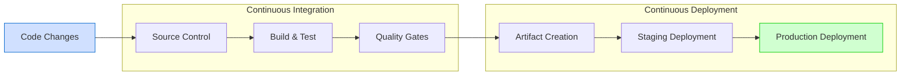
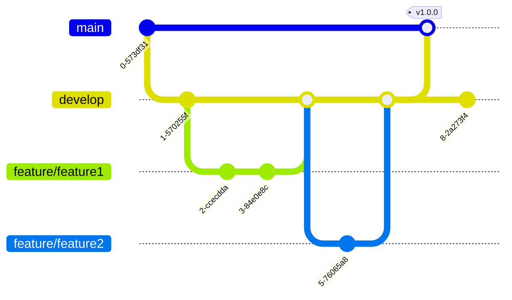
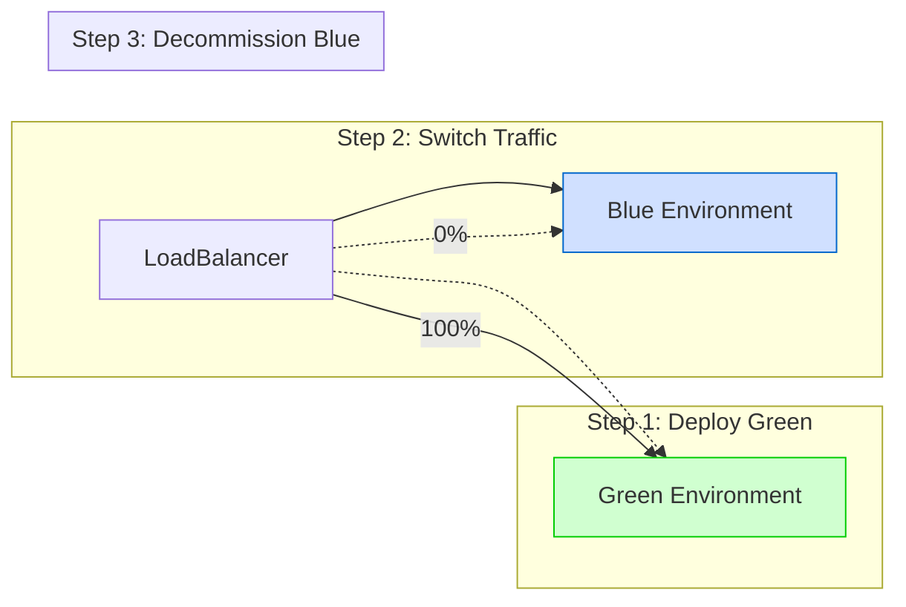
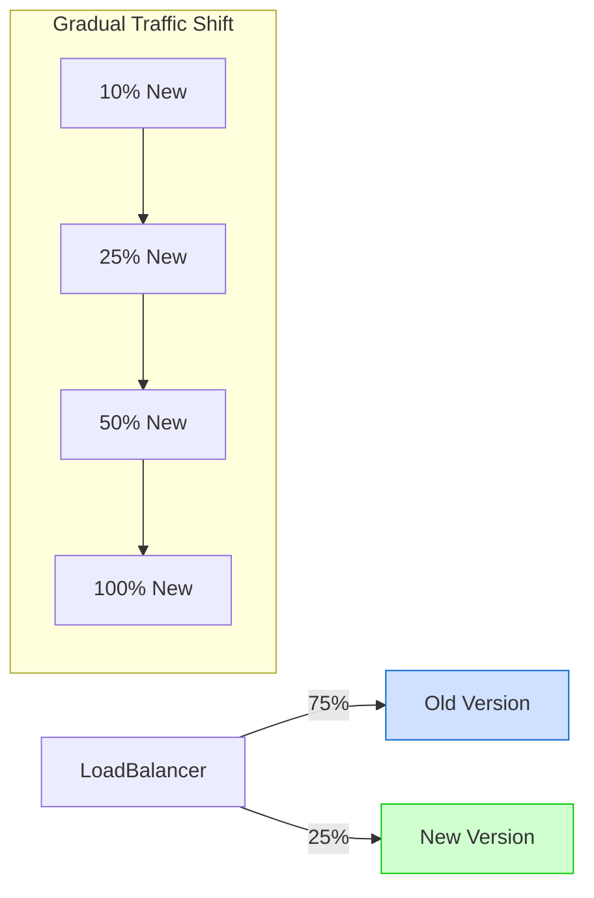
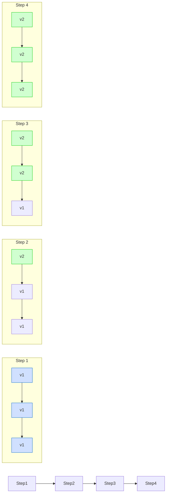

# CI/CD Guide

**Last Modified:** 2025-03-29  
**Completion Date:** 2025-03-29  
**Doc Type:** Guide  

---

## Overview

This guide describes the Continuous Integration and Continuous Deployment (CI/CD) pipeline for the Berrys_AgentsV2 platform. It covers the tools, workflows, configuration, and best practices for automated building, testing, and deployment.

## CI/CD Architecture

The CI/CD pipeline is implemented using GitHub Actions and follows a multi-stage pipeline architecture:



## Workflow Configuration

The CI/CD workflow is defined in `.github/workflows/main.yml` and includes the following stages:

```yaml
name: CI/CD Pipeline

on:
  push:
    branches: [ main, develop ]
  pull_request:
    branches: [ main, develop ]

jobs:
  build-and-test:
    runs-on: ubuntu-latest
    steps:
      - uses: actions/checkout@v2
      
      - name: Set up Python
        uses: actions/setup-python@v2
        with:
          python-version: '3.10'
          
      - name: Install dependencies
        run: |
          python -m pip install --upgrade pip
          pip install -r requirements-dev.txt
          
      - name: Run linting
        run: flake8 services shared
        
      - name: Run unit tests
        run: pytest services/*/tests/unit shared/*/tests/unit
        
      - name: Build Docker images
        run: docker-compose build
        
      - name: Run integration tests
        run: docker-compose run --rm test

  security-scan:
    needs: build-and-test
    runs-on: ubuntu-latest
    steps:
      - uses: actions/checkout@v2
      
      - name: Run dependency vulnerability scan
        uses: snyk/actions/python@master
        with:
          args: --severity-threshold=high
          
      - name: Run container image scan
        uses: aquasecurity/trivy-action@master
        with:
          image-ref: 'berrys_agents_v2/api-gateway:latest'
          format: 'table'
          exit-code: '1'
          severity: 'CRITICAL,HIGH'

  deploy-staging:
    if: github.ref == 'refs/heads/develop'
    needs: security-scan
    runs-on: ubuntu-latest
    environment: staging
    steps:
      - uses: actions/checkout@v2
      
      - name: Configure AWS credentials
        uses: aws-actions/configure-aws-credentials@v1
        with:
          aws-access-key-id: ${{ secrets.AWS_ACCESS_KEY_ID }}
          aws-secret-access-key: ${{ secrets.AWS_SECRET_ACCESS_KEY }}
          aws-region: us-west-2
          
      - name: Login to Amazon ECR
        id: login-ecr
        uses: aws-actions/amazon-ecr-login@v1
        
      - name: Build, tag, and push images to Amazon ECR
        run: |
          # Build and push Docker images
          
      - name: Deploy to staging
        run: |
          # Apply Terraform configuration
          # Deploy services to staging environment

  deploy-production:
    if: github.ref == 'refs/heads/main'
    needs: security-scan
    runs-on: ubuntu-latest
    environment: production
    steps:
      - uses: actions/checkout@v2
      
      - name: Configure AWS credentials
        uses: aws-actions/configure-aws-credentials@v1
        with:
          aws-access-key-id: ${{ secrets.AWS_ACCESS_KEY_ID }}
          aws-secret-access-key: ${{ secrets.AWS_SECRET_ACCESS_KEY }}
          aws-region: us-west-2
          
      - name: Login to Amazon ECR
        id: login-ecr
        uses: aws-actions/amazon-ecr-login@v1
        
      - name: Build, tag, and push images to Amazon ECR
        run: |
          # Build and push Docker images
          
      - name: Deploy to production
        run: |
          # Apply Terraform configuration
          # Deploy services to production environment
```

## CI/CD Pipeline Stages

### 1. Code Changes

The pipeline begins when code changes are pushed to the repository:

- **Feature branches**: CI pipeline runs to verify changes
- **Develop branch**: CI pipeline runs and deploys to staging
- **Main branch**: CI pipeline runs and deploys to production

### 2. Build and Test

The build and test stage includes:

- **Dependency installation**: Installing required packages
- **Linting**: Running static code analysis to ensure code quality
- **Unit tests**: Running unit tests for individual components
- **Docker builds**: Building Docker images for services
- **Integration tests**: Running tests that verify service interactions

### 3. Security Scanning

Security scanning ensures code and dependencies are free from vulnerabilities:

- **Dependency scanning**: Checking for vulnerabilities in dependencies
- **Container scanning**: Scanning container images for security issues
- **Static code analysis**: Identifying potential security issues in code
- **Secret detection**: Ensuring no secrets are committed to the repository

### 4. Artifact Creation

After successful testing and security scanning, artifacts are created:

- **Docker images**: Building and tagging service images
- **Versioning**: Applying version tags to artifacts
- **Publishing**: Pushing artifacts to container registry

### 5. Staging Deployment

Artifacts are deployed to the staging environment for validation:

- **Infrastructure provisioning**: Using Terraform to provision infrastructure
- **Service deployment**: Deploying services to staging environment
- **Database migrations**: Applying database migrations
- **Smoke tests**: Verifying basic functionality
- **Integration tests**: Running end-to-end tests in staging

### 6. Production Deployment

After successful staging validation, deployment proceeds to production:

- **Approval gates**: Requiring manual approval for production deployment
- **Infrastructure provisioning**: Using Terraform to provision production infrastructure
- **Deployment strategies**: Using blue-green, canary, or rolling deployment
- **Validation**: Verifying deployment success
- **Monitoring**: Setting up monitoring and alerting for the new deployment

## Branching Strategy

The project uses a Git Flow branching strategy:



### Branch Types

- **main**: Production-ready code, deployed to production
- **develop**: Integration branch for features, deployed to staging
- **feature/***: Feature development branches
- **hotfix/***: Emergency fixes for production issues
- **release/***: Release preparation branches

### Branch Protection Rules

- **main**: Requires pull request and approvals, no direct pushes
- **develop**: Requires pull request and approvals, no direct pushes
- **All branches**: Must pass CI checks before merging

## Environment Configuration

Each environment has its own configuration, managed securely:

### Environment Variables

- **Development**: Local `.env` files
- **Staging**: GitHub Secrets for staging environment
- **Production**: GitHub Secrets for production environment

### Secret Management

- **Application secrets**: Stored in GitHub Secrets
- **Infrastructure secrets**: Stored in HashiCorp Vault
- **Database credentials**: Managed through AWS Secrets Manager

## Deployment Strategies

The pipeline supports multiple deployment strategies:

### Blue-Green Deployment

For major releases with significant changes:



### Canary Deployment

For controlled rollout of changes:



### Rolling Deployment

For minor updates with minimal risk:



## Monitoring and Metrics

The CI/CD pipeline includes monitoring at all stages:

- **Build metrics**: Build time, success/failure rate
- **Test metrics**: Test coverage, test duration, test success rate
- **Deployment metrics**: Deployment time, success/failure rate
- **Application metrics**: Response time, error rate, resource usage

## Pipeline Extensions

### Custom Actions

The pipeline uses custom GitHub Actions for specialized tasks:

```yaml
name: Custom Database Migration Action
description: Applies database migrations safely with validation and rollback capability

inputs:
  environment:
    description: 'Target environment (staging, production)'
    required: true
  migration-dir:
    description: 'Directory containing migration scripts'
    required: true
    
runs:
  using: 'composite'
  steps:
    - name: Backup Database
      run: ${{ github.action_path }}/scripts/backup-db.sh
      shell: bash
      
    - name: Apply Migrations
      run: ${{ github.action_path }}/scripts/apply-migrations.sh ${{ inputs.migration-dir }}
      shell: bash
      
    - name: Validate Migrations
      run: ${{ github.action_path }}/scripts/validate-migrations.sh
      shell: bash
```

### Reusable Workflows

Common workflow patterns are defined as reusable workflows:

```yaml
name: Reusable Build Workflow

on:
  workflow_call:
    inputs:
      service-name:
        required: true
        type: string

jobs:
  build:
    runs-on: ubuntu-latest
    steps:
      - uses: actions/checkout@v2
      
      - name: Set up Docker Buildx
        uses: docker/setup-buildx-action@v1
        
      - name: Build service
        uses: docker/build-push-action@v2
        with:
          context: ./services/${{ inputs.service-name }}
          push: false
          load: true
          tags: ${{ inputs.service-name }}:${{ github.sha }}
```

## Best Practices

### Pipeline Performance

- **Caching**: Cache dependencies and build artifacts
- **Parallel execution**: Run independent jobs in parallel
- **Efficient builds**: Use multi-stage Dockerfiles and .dockerignore

### Security

- **Least privilege principle**: Use minimal permissions for service accounts
- **Scan all artifacts**: Security scan every artifact before deployment
- **Secret rotation**: Regularly rotate secrets and credentials

### Reliability

- **Idempotent deployments**: Ensure deployments can be run multiple times
- **Automatic rollbacks**: Roll back failed deployments automatically
- **Health checks**: Verify service health before completing deployment

## Troubleshooting

### Common Issues

1. **Failed builds**: Check dependency issues and build logs
2. **Test failures**: Examine test outputs for cause of failure
3. **Deployment failures**: Check infrastructure state and logs
4. **Security scan failures**: Review vulnerability report and address issues

### Debugging Steps

1. **Check workflow logs**: Review GitHub Actions logs for errors
2. **Run locally**: Execute the failing step locally for debugging
3. **Check environment**: Verify environment variables and secrets
4. **Review dependencies**: Check for compatibility issues or missing dependencies

## References

- [GitHub Actions Documentation](https://docs.github.com/en/actions)
- [Terraform Documentation](https://www.terraform.io/docs)
- [Docker Documentation](https://docs.docker.com)
- [Deployment Workflow](../process-flows/deployment-workflow.md)
- [Production Deployment Guide](../deployment/production.md)
