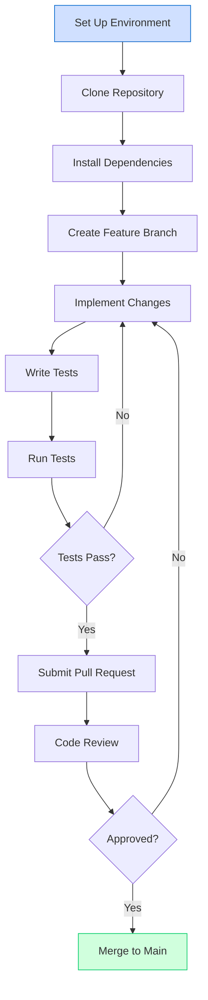
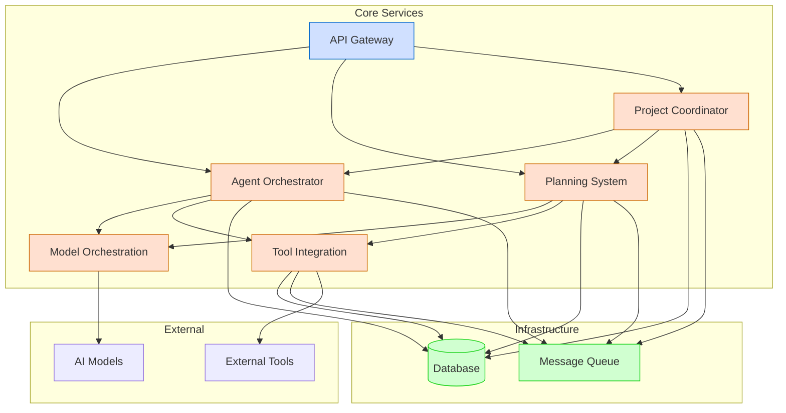

# Developer Guides

**Last Modified:** 2025-03-29  
**Completion Date:** 2025-03-29  
**Doc Type:** Guide  

---

Welcome to the Berrys_AgentsV2 developer guides. This section provides comprehensive documentation for developers who want to extend, modify, or contribute to the system.

## Documentation Structure

The Berrys_AgentsV2 documentation is organized into the following categories:

### Core Documentation
- [Project README](../../README.md) - Project overview and main entry point
- [AI Agent Guide](../../AI_AGENT_GUIDE.md) - Guide specifically for AI agents
- [Onboarding Guide](../../onboarding/README.md) - Quick start guide for new team members
- [Next Milestone](../../next-milestone-prompt.md) - Current and upcoming milestones
- [Documentation Standards](../../best-practices/documentation-maintenance-plan.md) - Documentation standards

### Architecture & Diagrams
- [System Overview](../../reference/architecture/system-overview.md) - High-level architecture with diagrams
- [Communication Patterns](../../reference/architecture/communication-patterns.md) - Service communication patterns
- [Data Flow](../../reference/architecture/data-flow.md) - Data flow across the system
- [Deployment Architecture](../../reference/architecture/deployment-architecture.md) - Deployment architecture
- [Security Model](../../reference/architecture/security-model.md) - Security architecture

### Service Documentation
- [Agent Orchestrator](../../reference/services/agent-orchestrator.md) - Agent Orchestrator service
- [Model Orchestration](../../reference/services/model-orchestration.md) - Model Orchestration service
- [Planning System](../../reference/services/planning-system.md) - Planning System service
- [Project Coordinator](../../reference/services/project-coordinator.md) - Project Coordinator service
- [Service Integration](../../reference/services/service-integration.md) - Service Integration service
- [Tool Integration](../../reference/services/tool-integration.md) - Tool Integration service
- [Web Dashboard](../../reference/services/web-dashboard.md) - Web Dashboard service
- [API Gateway](../../reference/services/api-gateway.md) - API Gateway service

### Reference Documentation
- [Database Schema](../../reference/database-schema.md) - Database schema reference
- [Message Contracts](../../reference/message-contracts.md) - Message format specifications
- [Service Template](../../reference/service-template.md) - Template for new services

### Developer Guides
- [Service Development](service-development.md) - Service development guide
- [Troubleshooting](troubleshooting.md) - Troubleshooting guide
- [Testing](testing.md) - Testing strategies and frameworks
- [CI/CD](ci-cd.md) - CI/CD pipeline guide

### Process Flows
- [Agent Lifecycle](../process-flows/agent-lifecycle.md) - Agent creation and lifecycle flows
- [Project Execution](../process-flows/project-execution.md) - Project execution workflow
- [Deployment Workflow](../process-flows/deployment-workflow.md) - Deployment process workflow

### Deployment & Operations
- [Production Deployment](../deployment/production.md) - Production deployment guide

## Development Workflow

The typical development workflow for Berrys_AgentsV2 is illustrated below:

## Service Development

When developing new services for Berrys_AgentsV2, it's important to follow the established patterns and practices to ensure consistency and maintainability. The service development guides provide detailed information on:

- Standard service structure and organization
- Design patterns for effective service implementation
- API contracts and input/output requirements
- Service integration and communication
- Testing strategies and best practices

## Architecture Overview

The system is built using a microservices architecture with the following key components:

## Development Principles

When developing for Berrys_AgentsV2, adhere to these core principles:

1. **Separation of Concerns**: Each service should have a clear, focused responsibility
2. **Microservice Architecture**: Services should be independent and loosely coupled
3. **API-First Design**: Define clear API contracts before implementation
4. **Test-Driven Development**: Write tests before or alongside code
5. **Documentation**: Document all public APIs and interfaces
6. **Consistency**: Follow established patterns and practices
7. **Modularity**: Design for extensibility and reusability

## Getting Started

To get started with development, follow these steps:

1. Set up your development environment by following the [Environment Setup](environment-setup.md) guide
2. Familiarize yourself with the [Service Structure](service-development/service-structure.md) and [Design Patterns](service-development/design-patterns.md)
3. Choose a service to work on or create a new one
4. Follow the development workflow outlined above

## Contributing

Contributions to Berrys_AgentsV2 are welcome! Please follow these guidelines:

1. Create a feature branch for your changes
2. Follow the coding standards and best practices
3. Write tests for your changes
4. Update documentation as needed
5. Submit a pull request for review
