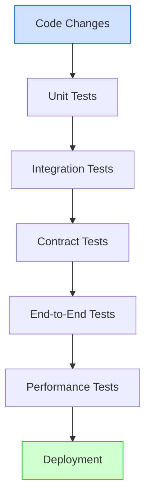
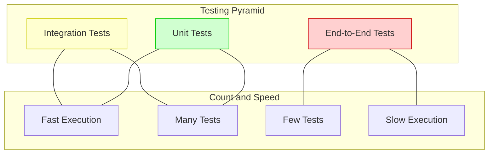

# Testing Guide

**Last Modified:** 2025-03-29  
**Completion Date:** 2025-03-29  
**Doc Type:** Guide  

---

## Overview

This guide outlines the testing approach for the Berrys_AgentsV2 platform. It covers testing strategies, frameworks, test types, and best practices to ensure code quality and reliability.

## Testing Strategy

The platform uses a comprehensive testing strategy that includes multiple test types:



### Testing Pyramid

The testing approach follows the testing pyramid principle:



## Test Types

### Unit Tests

Tests for individual components in isolation:

```python
def test_agent_state_transition():
    # Arrange
    agent = Agent(state="initializing")
    
    # Act
    agent.transition_to("ready")
    
    # Assert
    assert agent.state == "ready"
    assert agent.state_history[-1].new_state == "ready"
    assert agent.state_history[-1].previous_state == "initializing"
```

Unit tests should:
- Test a single unit of code (function, method, class)
- Mock external dependencies
- Run quickly and independently
- Focus on a specific behavior

### Integration Tests

Tests for interactions between components:

```python
@pytest.mark.asyncio
async def test_agent_creation_with_template():
    # Arrange
    template_id = "550e8400-e29b-41d4-a716-446655440000"
    agent_data = {"name": "Test Agent", "template_id": template_id}
    
    # Act
    async with AsyncClient(app=app, base_url="http://test") as client:
        response = await client.post("/agents", json=agent_data)
    
    # Assert
    assert response.status_code == 201
    data = response.json()
    assert data["name"] == "Test Agent"
    assert data["template_id"] == template_id
    
    # Verify database state
    async with async_session() as session:
        agent = await session.query(Agent).filter(Agent.id == data["id"]).first()
        assert agent is not None
        assert agent.template_id == template_id
```

Integration tests should:
- Test interactions between components
- Use real dependencies when possible
- Verify state changes
- Focus on component interactions

### Contract Tests

Tests for service API contracts:

```python
def test_agent_api_contract():
    # Arrange
    schema = AgentSchema.schema()
    
    # Act & Assert
    assert "id" in schema["properties"]
    assert schema["properties"]["id"]["type"] == "string"
    assert schema["properties"]["id"]["format"] == "uuid"
    
    assert "name" in schema["properties"]
    assert schema["properties"]["name"]["type"] == "string"
    
    assert "state" in schema["properties"]
    assert schema["properties"]["state"]["type"] == "string"
    assert "enum" in schema["properties"]["state"]
    assert "initializing" in schema["properties"]["state"]["enum"]
    assert "ready" in schema["properties"]["state"]["enum"]
    assert "active" in schema["properties"]["state"]["enum"]
```

Contract tests should:
- Verify API schemas and contracts
- Ensure backward compatibility
- Test both producers and consumers
- Focus on interface definitions

### End-to-End Tests

Tests for complete workflows:

```python
@pytest.mark.asyncio
async def test_project_creation_to_execution():
    # Arrange
    project_data = {
        "name": "Test Project",
        "description": "Test project description",
        "requirements": ["requirement1", "requirement2"]
    }
    
    # Act - Create project
    project_id = await create_project(project_data)
    
    # Assert - Project created
    project = await get_project(project_id)
    assert project["name"] == "Test Project"
    
    # Act - Generate plan
    plan_id = await generate_plan(project_id)
    
    # Assert - Plan created
    plan = await get_plan(plan_id)
    assert plan["project_id"] == project_id
    assert len(plan["tasks"]) > 0
    
    # Act - Execute plan
    execution_id = await execute_plan(plan_id)
    
    # Assert - Execution started
    execution = await get_execution(execution_id)
    assert execution["plan_id"] == plan_id
    assert execution["status"] == "in_progress"
```

End-to-end tests should:
- Test complete workflows
- Verify system behavior
- Use realistic data
- Cover critical paths

### Performance Tests

Tests for system performance:

```python
@pytest.mark.performance
def test_agent_creation_performance():
    # Arrange
    agent_data = {"name": "Test Agent"}
    client = Client(app=app, base_url="http://test")
    
    # Act
    start_time = time.time()
    for _ in range(100):
        response = client.post("/agents", json=agent_data)
        assert response.status_code == 201
    end_time = time.time()
    
    # Assert
    total_time = end_time - start_time
    avg_time = total_time / 100
    assert avg_time < 0.1  # Average response time should be under 100ms
```

Performance tests should:
- Measure response times
- Test under various loads
- Identify bottlenecks
- Set performance baselines

## Testing Frameworks

The platform uses the following testing frameworks:

### Python Testing Frameworks

- **pytest**: Main testing framework
- **pytest-asyncio**: For testing async code
- **pytest-cov**: For code coverage
- **pytest-mock**: For mocking dependencies
- **pytest-benchmark**: For performance testing

### Test Fixtures

Fixtures provide test setup and teardown:

```python
@pytest.fixture
def test_db():
    # Set up test database
    engine = create_engine("sqlite:///:memory:")
    Base.metadata.create_all(engine)
    
    # Create session
    Session = sessionmaker(bind=engine)
    session = Session()
    
    # Provide session to test
    yield session
    
    # Clean up
    session.close()
    Base.metadata.drop_all(engine)
```

### Test Configuration

Tests are configured through `conftest.py` and `pytest.ini`:

```python
# conftest.py
import pytest
import asyncio
from sqlalchemy.ext.asyncio import create_async_engine, AsyncSession
from sqlalchemy.orm import sessionmaker

@pytest.fixture(scope="session")
def event_loop():
    loop = asyncio.get_event_loop_policy().new_event_loop()
    yield loop
    loop.close()

@pytest.fixture(scope="session")
async def async_engine():
    engine = create_async_engine("sqlite+aiosqlite:///:memory:")
    async with engine.begin() as conn:
        await conn.run_sync(Base.metadata.create_all)
    yield engine
    async with engine.begin() as conn:
        await conn.run_sync(Base.metadata.drop_all)

@pytest.fixture
async def async_session(async_engine):
    session_factory = sessionmaker(
        async_engine, class_=AsyncSession, expire_on_commit=False
    )
    async with session_factory() as session:
        yield session
```

## Test Organization

Tests are organized by type and service:

```
services/
└── service-name/
    └── tests/
        ├── unit/              # Unit tests
        │   ├── test_models.py
        │   ├── test_services.py
        │   └── test_utils.py
        ├── integration/       # Integration tests
        │   ├── test_api.py
        │   └── test_database.py
        ├── contract/          # Contract tests
        │   ├── test_schemas.py
        │   └── test_api_contracts.py
        ├── e2e/               # End-to-end tests
        │   └── test_workflows.py
        └── performance/       # Performance tests
            └── test_api_performance.py
```

## Test Execution

Tests are executed through CLI commands and CI/CD pipeline:

### Local Execution

```bash
# Run all tests
python -m pytest

# Run unit tests only
python -m pytest services/*/tests/unit

# Run tests with coverage
python -m pytest --cov=services

# Run tests for a specific service
python -m pytest services/agent-orchestrator/
```

### CI/CD Integration

Tests are integrated into the CI/CD pipeline:

```yaml
# GitHub Actions workflow
jobs:
  test:
    runs-on: ubuntu-latest
    steps:
      - uses: actions/checkout@v2
      - uses: actions/setup-python@v2
        with:
          python-version: '3.10'
      - name: Install dependencies
        run: pip install -r requirements-dev.txt
      - name: Run tests
        run: pytest --cov=services --cov-report=xml
      - name: Upload coverage
        uses: codecov/codecov-action@v2
        with:
          file: ./coverage.xml
```

## Test Strategies

### Database Testing

For testing database interactions:

```python
@pytest.mark.asyncio
async def test_agent_repository(async_session):
    # Arrange
    repository = AgentRepository(async_session)
    agent = Agent(name="Test Agent", state="initializing")
    
    # Act
    await repository.create(agent)
    
    # Assert
    result = await repository.get_by_id(agent.id)
    assert result.id == agent.id
    assert result.name == "Test Agent"
    assert result.state == "initializing"
```

### API Testing

For testing API endpoints:

```python
@pytest.mark.asyncio
async def test_agent_api():
    # Arrange
    agent_data = {"name": "Test Agent"}
    
    # Act
    async with AsyncClient(app=app, base_url="http://test") as client:
        response = await client.post("/agents", json=agent_data)
    
    # Assert
    assert response.status_code == 201
    data = response.json()
    assert data["name"] == "Test Agent"
    assert "id" in data
    assert data["state"] == "initializing"
```

### Mocking and Patching

For testing with dependencies:

```python
def test_agent_service_with_mocks(mocker):
    # Arrange
    mock_repository = mocker.Mock()
    mock_repository.get_by_id.return_value = Agent(id="123", name="Test Agent", state="ready")
    
    service = AgentService(repository=mock_repository)
    
    # Act
    agent = service.get_agent("123")
    
    # Assert
    assert agent.id == "123"
    assert agent.name == "Test Agent"
    assert agent.state == "ready"
    mock_repository.get_by_id.assert_called_once_with("123")
```

### Parameterized Testing

For testing multiple scenarios:

```python
@pytest.mark.parametrize("initial_state,target_state,expected_result", [
    ("initializing", "ready", True),
    ("ready", "active", True),
    ("active", "paused", True),
    ("active", "initializing", False),  # Invalid transition
    ("paused", "terminated", True),
])
def test_agent_state_transitions(initial_state, target_state, expected_result):
    # Arrange
    agent = Agent(state=initial_state)
    
    # Act
    if expected_result:
        agent.transition_to(target_state)
        result = agent.state == target_state
    else:
        with pytest.raises(InvalidStateTransitionError):
            agent.transition_to(target_state)
        result = expected_result
        
    # Assert
    assert result == expected_result
```

## Code Coverage

The project aims for high code coverage:

- **Unit tests**: 90%+ coverage
- **Integration tests**: 80%+ coverage
- **Overall**: 85%+ coverage

Coverage reports are generated using pytest-cov:

```bash
# Generate HTML coverage report
pytest --cov=services --cov-report=html

# Generate XML coverage report for CI/CD
pytest --cov=services --cov-report=xml
```

## Test Data Management

### Test Factories

For generating test data:

```python
class AgentFactory:
    @staticmethod
    def create_agent(**kwargs):
        defaults = {
            "id": str(uuid.uuid4()),
            "name": f"Test Agent {random.randint(1, 1000)}",
            "state": "initializing",
            "created_at": datetime.utcnow(),
            "updated_at": datetime.utcnow()
        }
        defaults.update(kwargs)
        return Agent(**defaults)
    
    @staticmethod
    async def create_in_db(session, **kwargs):
        agent = AgentFactory.create_agent(**kwargs)
        session.add(agent)
        await session.commit()
        return agent
```

### Fixtures and Seeds

For consistent test data:

```python
@pytest.fixture
async def seed_data(async_session):
    # Create templates
    template1 = AgentTemplate(name="Template 1")
    template2 = AgentTemplate(name="Template 2")
    async_session.add_all([template1, template2])
    await async_session.commit()
    
    # Create specializations
    spec1 = AgentSpecialization(name="Spec 1")
    spec2 = AgentSpecialization(name="Spec 2")
    async_session.add_all([spec1, spec2])
    await async_session.commit()
    
    # Create agents
    agent1 = Agent(name="Agent 1", template_id=template1.id, state="ready")
    agent2 = Agent(name="Agent 2", template_id=template2.id, state="active")
    async_session.add_all([agent1, agent2])
    await async_session.commit()
    
    return {
        "templates": [template1, template2],
        "specializations": [spec1, spec2],
        "agents": [agent1, agent2]
    }
```

## Best Practices

### Test Design

- **FIRST principles**: Fast, Isolated, Repeatable, Self-verifying, Timely
- **AAA pattern**: Arrange, Act, Assert
- **One assertion per test**: Focus on a single behavior
- **Meaningful names**: Describe what is being tested

### Test Implementation

- **Avoid test interdependence**: Each test should be independent
- **Minimize setup code**: Use fixtures and factories
- **Clean up after tests**: Reset state between tests
- **Avoid testing implementation details**: Focus on behavior

### Test Maintenance

- **Update tests with code changes**: Keep tests in sync with implementation
- **Refactor tests regularly**: Eliminate duplication and improve clarity
- **Mock at the right level**: Mock external dependencies, not internal methods
- **Review test failures**: Understand why tests fail and fix root causes

## Debugging Tests

When tests fail, use these debugging techniques:

- **Print statements**: Add temporary prints for debugging
- **Pytest verbose mode**: Use `pytest -v` for detailed output
- **Pytest debug mode**: Use `pytest --pdb` to enter debugger on failure
- **Log inspection**: Check logs for error messages

## References

- [pytest Documentation](https://docs.pytest.org/)
- [Testing Best Practices](../../best-practices/testing-best-practices.md)
- [Service Development Guide](service-development.md)
- [CI/CD Guide](ci-cd.md)
