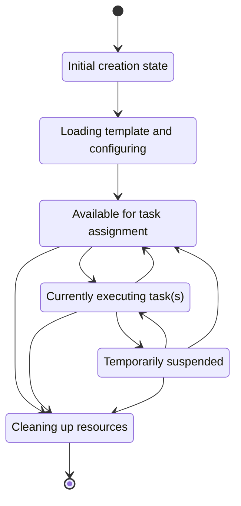
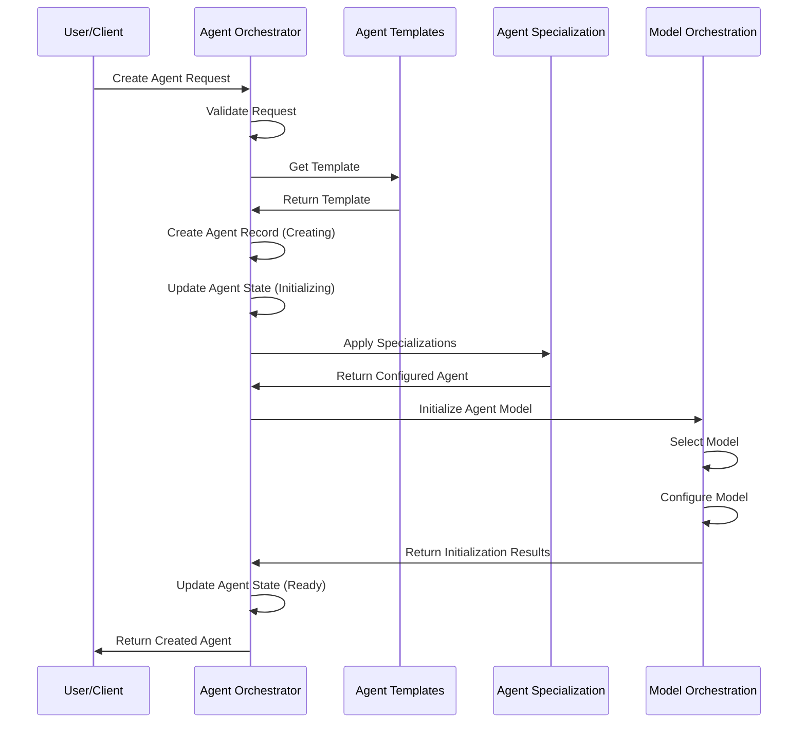
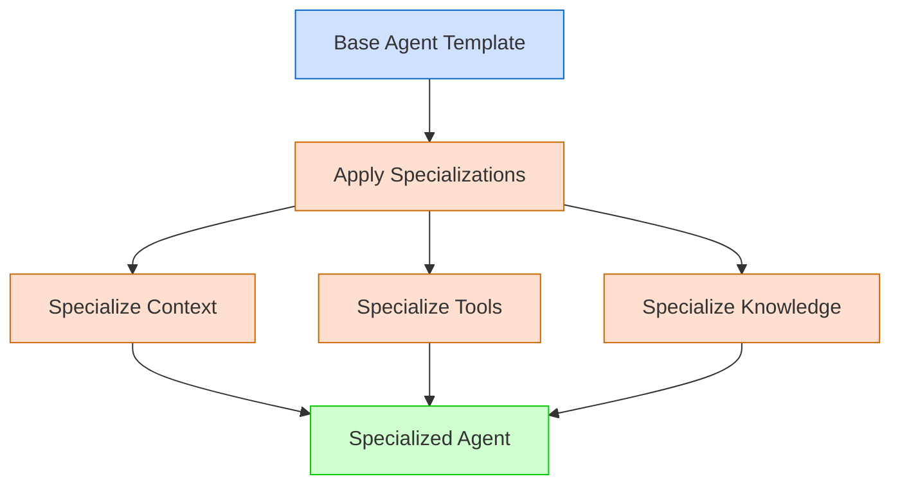
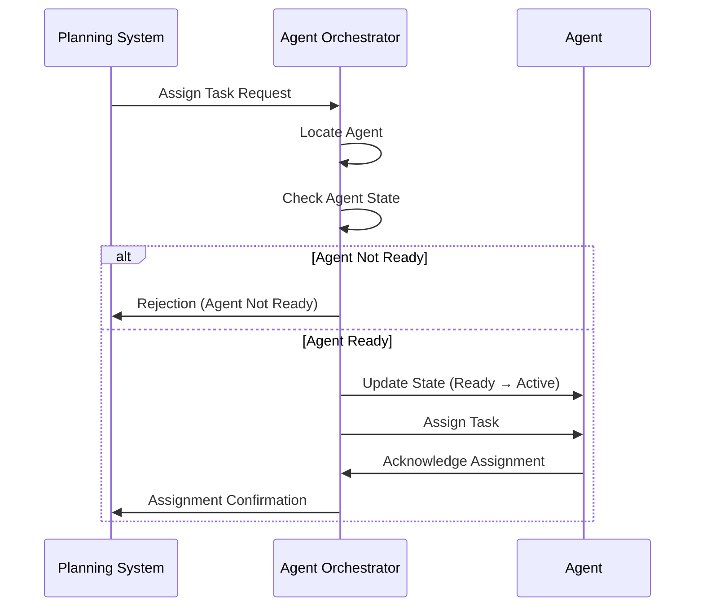
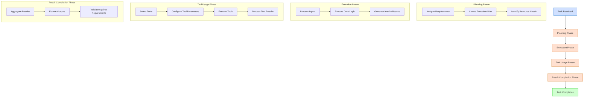
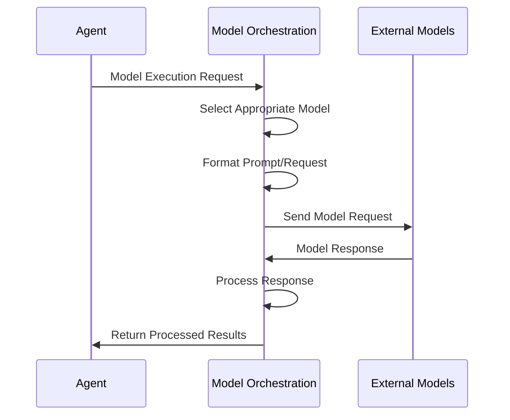
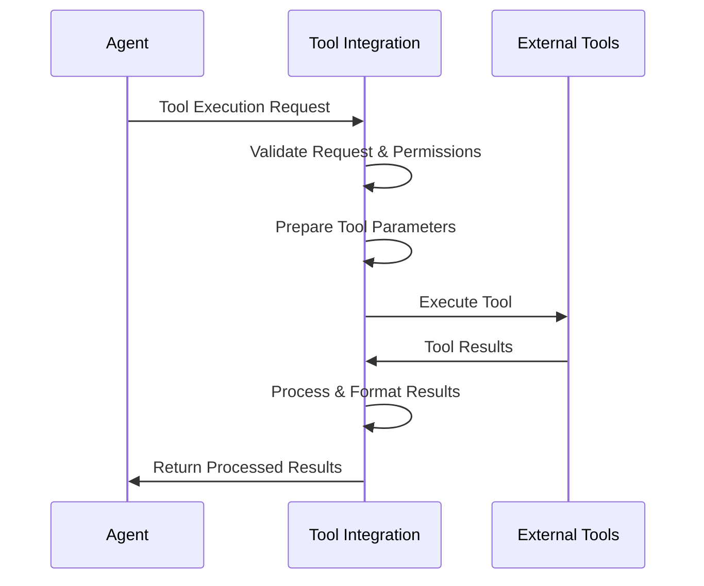
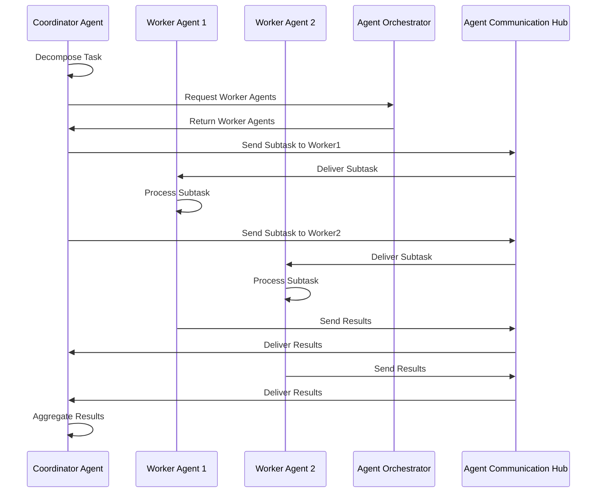
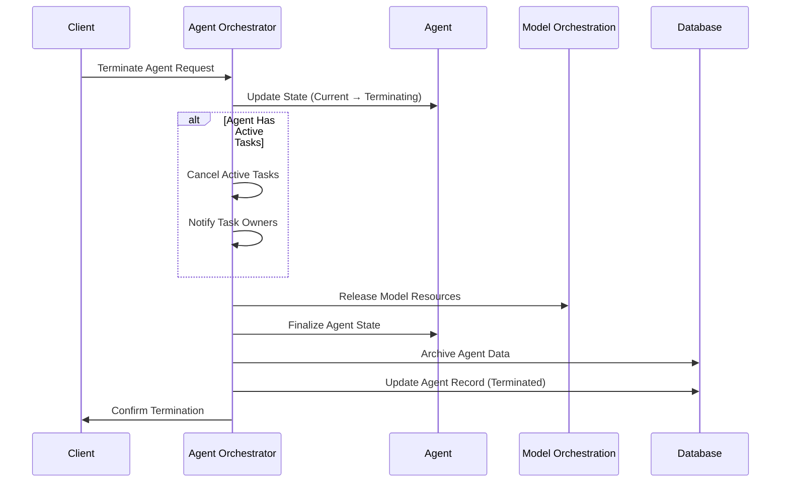

# Agent Lifecycle

**Last Modified:** 2025-03-29  
**Completion Date:** 2025-03-29  
**Doc Type:** Guide  

---

## Overview

This document describes the lifecycle of agents in the Berrys_AgentsV2 platform. It covers the creation, initialization, specialization, operation, and termination of agents, including state transitions and interaction patterns.

## Agent Lifecycle States

Agents in the Berrys_AgentsV2 platform go through several defined states:



### State Definitions

| State | Description | Allowed Transitions |
|-------|-------------|---------------------|
| Creating | Agent record is being created | Initializing |
| Initializing | Agent is loading template, configuring capabilities | Ready |
| Ready | Agent is available for task assignment | Active, Terminating |
| Active | Agent is executing one or more tasks | Ready, Paused, Terminating |
| Paused | Agent execution is temporarily suspended | Active, Ready, Terminating |
| Terminating | Agent is cleaning up resources and preparing to terminate | (Terminal state) |

## Agent Creation and Initialization

The process of creating and initializing an agent:



### Creation Parameters

Agents are created with several key parameters:

```json
{
  "name": "Data Analysis Agent",
  "template_id": "550e8400-e29b-41d4-a716-446655440000",
  "description": "Agent specialized for data analysis tasks",
  "specializations": ["data_analysis", "visualization"],
  "configuration": {
    "max_concurrent_tasks": 3,
    "preferred_model": "deepseek-r1:8b"
  }
}
```

### Agent Templates

Templates provide base capabilities for agents:

| Template | Purpose | Base Capabilities |
|----------|---------|-------------------|
| General Purpose | Multi-domain tasks | Text processing, basic reasoning |
| Data Specialist | Data-focused tasks | Data analysis, visualization, ETL |
| Research Assistant | Information gathering | Web search, document analysis, summarization |
| Task Coordinator | Manage other agents | Task breakdown, delegation, monitoring |
| Code Assistant | Software development | Code generation, review, testing |

### Agent Specialization

Once created from a template, agents can be specialized with additional capabilities:



Specialization approaches:
- **Context specialization**: Providing domain-specific instructions
- **Tool specialization**: Granting access to specific tools
- **Knowledge specialization**: Loading domain-specific knowledge
- **Behavior specialization**: Configuring response patterns and preferences

## Agent Task Assignment

The process of assigning a task to an agent:



### Task Context

When assigned a task, agents receive context:

```json
{
  "task_id": "a8b7c6d5-e4f3-4a2b-8c7d-6e5f4a3b2c1d",
  "title": "Analyze Customer Data",
  "description": "Analyze the customer dataset for purchasing patterns and create visualizations",
  "priority": "high",
  "deadline": "2025-03-29T08:00:00Z",
  "inputs": [
    {
      "name": "customer_data.csv",
      "location": "s3://data-bucket/customer_data.csv",
      "type": "dataset"
    }
  ],
  "expected_outputs": [
    {
      "name": "analysis_report.md",
      "description": "Markdown report with findings",
      "required": true
    },
    {
      "name": "visualizations.pdf",
      "description": "PDF with key visualizations",
      "required": true
    }
  ],
  "constraints": {
    "max_execution_time_minutes": 30
  }
}
```

## Agent Task Execution

During task execution, agents progress through several phases:



### Model Interactions

During task execution, agents interact with models:



### Tool Usage

Agents use external tools through the Tool Integration service:



## Agent Collaboration

Agents can collaborate to accomplish complex tasks:



### Collaboration Patterns

The platform supports several collaboration patterns:

| Pattern | Description | Use Cases |
|---------|-------------|-----------|
| Hierarchical | Manager-worker hierarchy | Complex task decomposition, specialized subtasks |
| Peer-to-Peer | Equal agents working together | Collaborative problem-solving, consensus building |
| Assembly Line | Sequential task processing | Multi-stage workflows, data processing pipelines |
| Specialist Network | Agents with specific domains | Multidisciplinary projects, diverse expertise needs |

## Agent State Transitions

Agents maintain a detailed state history:

```sql
-- Example state history record
INSERT INTO agent_state_history (
    agent_id, 
    previous_state, 
    new_state, 
    transition_reason,
    created_at
) VALUES (
    'f47ac10b-58cc-4372-a567-0e02b2c3d479',
    'ready',
    'active',
    'Task assignment: a8b7c6d5-e4f3-4a2b-8c7d-6e5f4a3b2c1d',
    '2025-03-29T05:45:10.123456Z'
);
```

### State Transition Rules

State transitions follow specific rules:

| Current State | Valid Next States | Transition Triggers |
|---------------|-------------------|---------------------|
| Creating | Initializing | Initial record creation complete |
| Initializing | Ready | Template loaded, specializations applied |
| Ready | Active | Task assignment |
| Ready | Terminating | Manual termination, resource reclamation |
| Active | Ready | Task completion |
| Active | Paused | Manual pause, resource constraints |
| Active | Terminating | Manual termination, critical error |
| Paused | Active | Manual resume |
| Paused | Ready | Task cancellation |
| Paused | Terminating | Manual termination, timeout |

## Agent Termination

The process of terminating an agent:



### Termination Reasons

Agents may be terminated for several reasons:

- **Task completion**: Agent is no longer needed
- **Resource optimization**: Freeing up system resources
- **Agent replacement**: Being replaced by a more appropriate agent
- **Error condition**: Unrecoverable errors in agent operation
- **Security concerns**: Detected anomalous behavior
- **Project completion**: End of the project

## Performance Metrics

Agents are monitored using several key metrics:

| Metric | Description | Target |
|--------|-------------|--------|
| Task Completion Rate | Percentage of successfully completed tasks | >95% |
| Response Time | Time to start processing a task | <1 second |
| Execution Time | Average time to complete tasks | Task-dependent |
| Model Token Usage | Number of tokens consumed | Optimized for task |
| Tool Usage Efficiency | Appropriate selection and use of tools | >90% appropriate use |
| Collaboration Success | Successful interactions with other agents | >95% |

## References

- [Agent Orchestrator Service](../../reference/services/agent-orchestrator.md)
- [Model Orchestration Service](../../reference/services/model-orchestration.md)
- [Tool Integration Service](../../reference/services/tool-integration.md)
- [Project Execution](project-execution.md)
- [Service Development Guide](../developer-guides/service-development.md)
