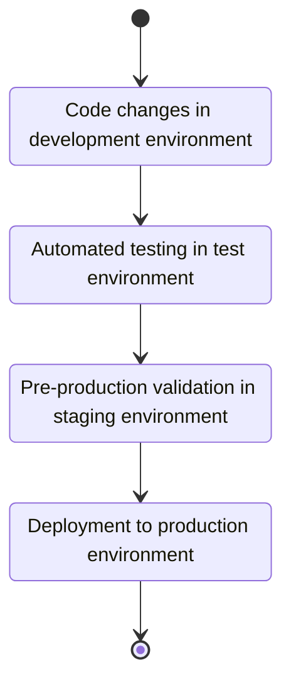
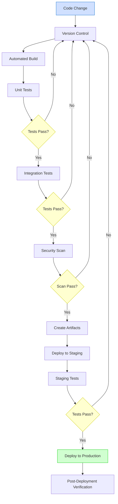
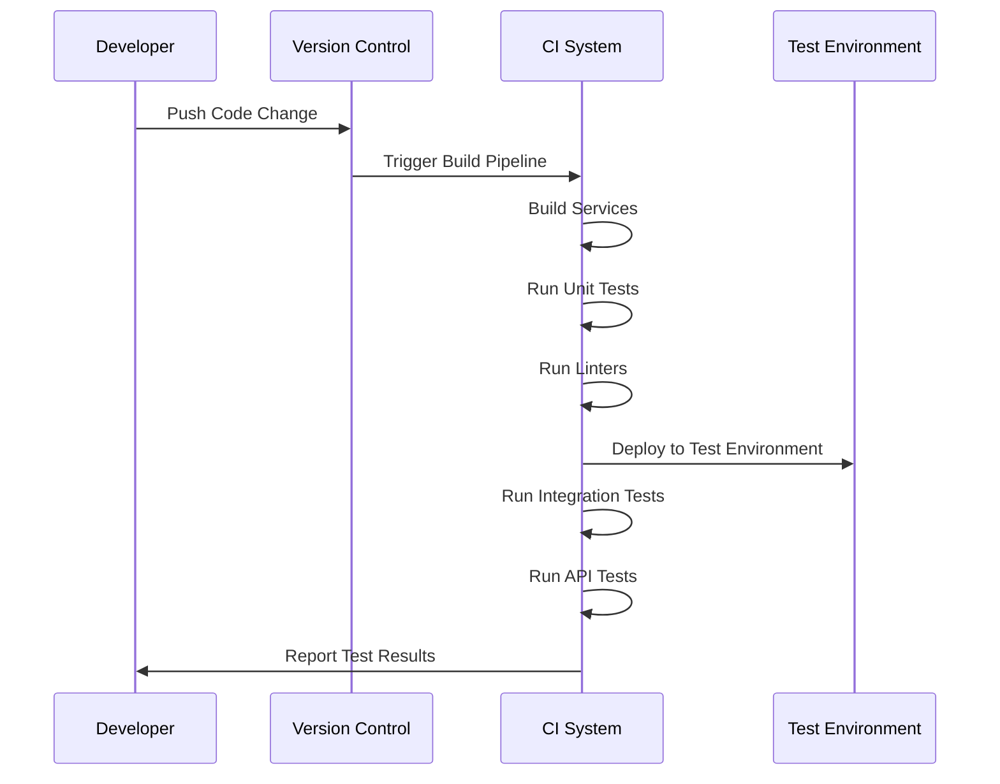
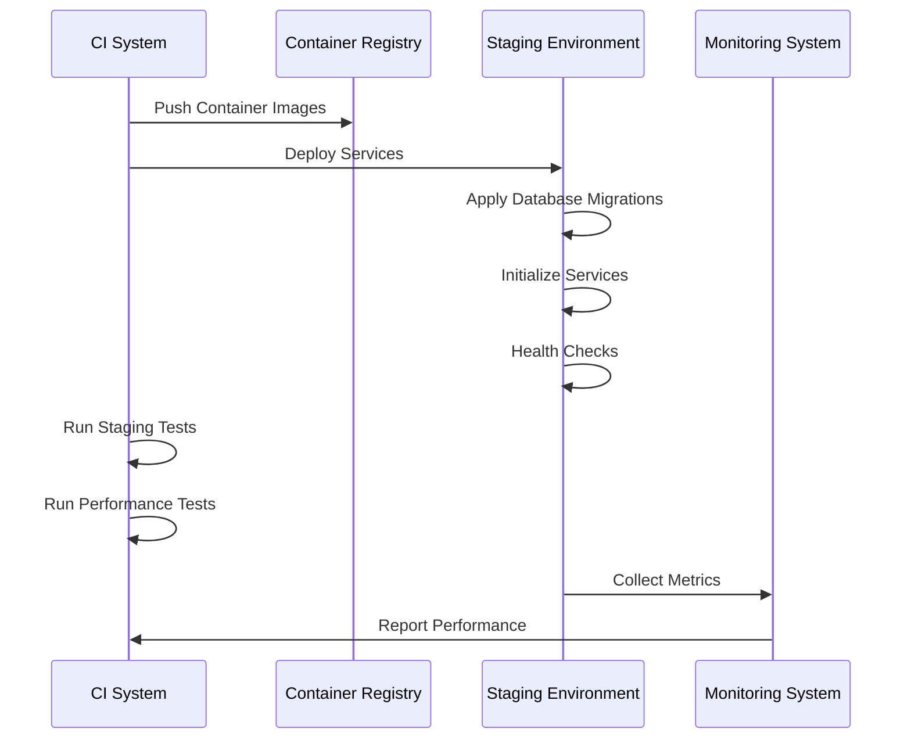
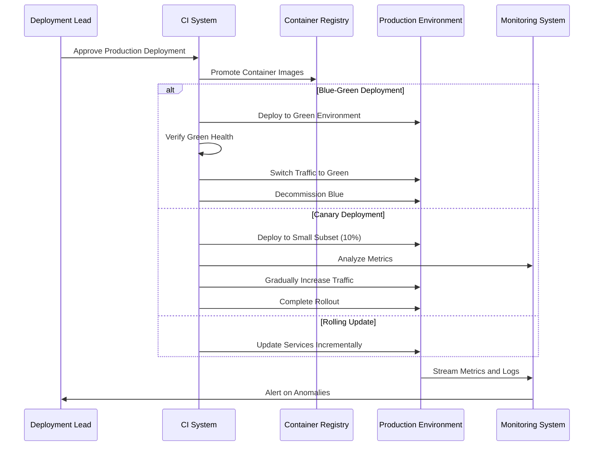
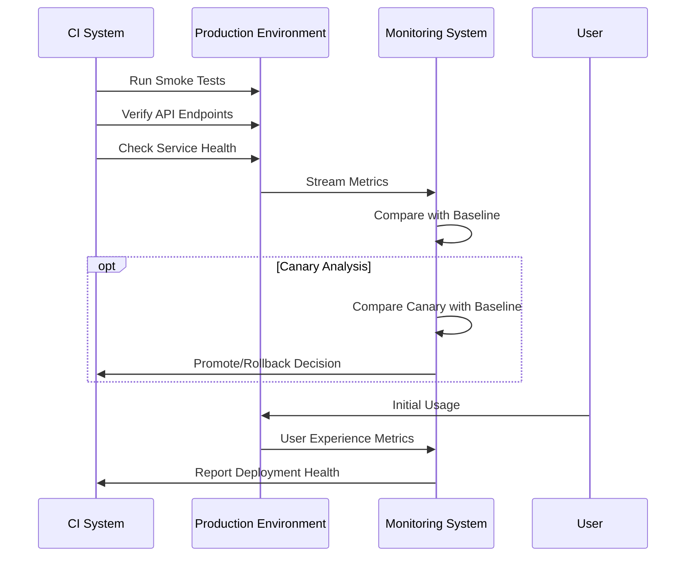
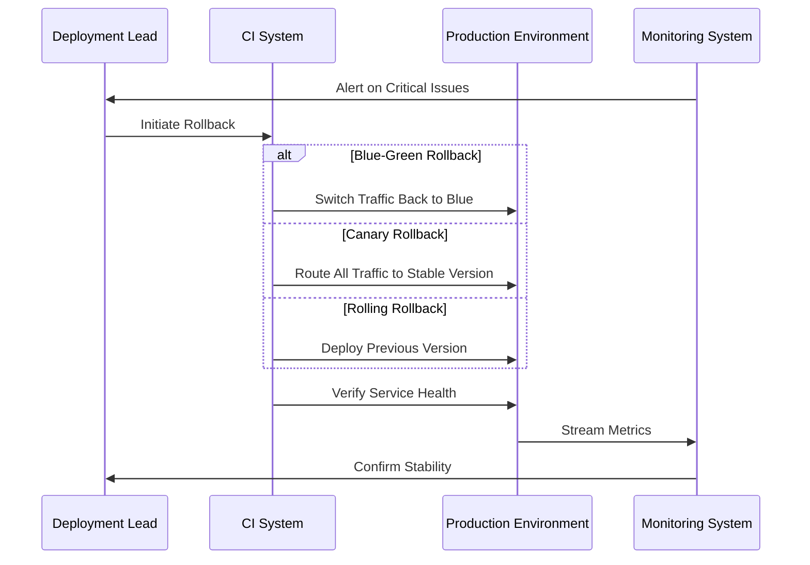
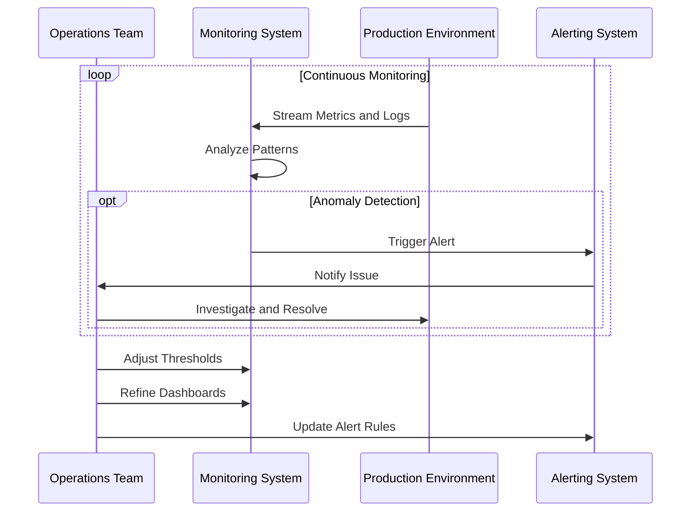

# Deployment Workflow

**Last Modified:** 2025-03-29  
**Completion Date:** 2025-03-29  
**Doc Type:** Guide  

---

## Overview

This document describes the workflow for deploying the Berrys_AgentsV2 platform, from development to production. It covers the CI/CD pipeline, deployment strategies, verification, and monitoring processes.

## Deployment Lifecycle

The deployment process follows a well-defined lifecycle:



## CI/CD Pipeline

The CI/CD pipeline automates the build, test, and deployment process:



## Development to Testing

The process begins with development and initial testing:



### Development Steps

1. **Code Development**
   - Developer creates/modifies code
   - Changes are tested locally
   - Code review is performed
   - Changes are pushed to version control

2. **Automated Build**
   - CI system triggers build pipeline
   - Services are built as Docker containers
   - Unit tests are executed
   - Code quality checks are performed
   - Security vulnerabilities are scanned

3. **Test Deployment**
   - Built artifacts are deployed to test environment
   - Database migrations are applied
   - Integration tests are executed
   - API tests verify service interfaces
   - Cross-service communication is validated

## Staging Environment Deployment

After successful testing, changes proceed to the staging environment:



### Staging Steps

1. **Artifact Registration**
   - Container images are tagged with version
   - Images are pushed to container registry
   - Deployment manifests are prepared

2. **Staging Deployment**
   - Services are deployed to staging environment
   - Database migrations are carefully applied
   - Configuration is updated for staging
   - Service health is verified

3. **Pre-Production Testing**
   - End-to-end tests validate complete workflows
   - Performance tests measure resource usage and response times
   - Load tests simulate expected traffic patterns
   - Security tests validate access controls and data protection

## Production Deployment

After staging validation, deployment proceeds to production:



### Production Deployment Strategies

1. **Blue-Green Deployment**
   - New version (Green) is deployed alongside current version (Blue)
   - Green environment is validated for health and functionality
   - Traffic is switched from Blue to Green
   - Blue environment is kept as fallback
   - After stability period, Blue is decommissioned

2. **Canary Deployment**
   - New version is deployed to a small subset of infrastructure (10%)
   - Small percentage of traffic is directed to new version
   - Performance and errors are closely monitored
   - Traffic percentage is gradually increased (25%, 50%, 75%, 100%)
   - Rollback is initiated if issues are detected

3. **Rolling Update**
   - Services are updated incrementally in batches
   - Each batch is verified before moving to next
   - Ensures minimum downtime and resource usage
   - Progressive deployment reduces risk

## Deployment Verification

Post-deployment verification ensures successful deployment:



### Verification Steps

1. **Immediate Verification**
   - Smoke tests validate basic functionality
   - Health checks confirm service availability
   - API endpoints are verified
   - Database migrations are confirmed successful

2. **Metric Analysis**
   - Performance metrics are compared with baseline
   - Error rates are monitored
   - Resource utilization is checked
   - Response times are measured

3. **User Experience Monitoring**
   - User interactions are tracked
   - Error rates during user sessions are monitored
   - Page load times and API response times are measured
   - User feedback is collected and analyzed

## Rollback Procedure

If issues are detected, a rollback procedure is initiated:



### Rollback Steps

1. **Issue Detection**
   - Monitoring system detects anomalies
   - Deployment lead evaluates severity
   - Rollback decision is made

2. **Rollback Execution**
   - For Blue-Green: Traffic is switched back to Blue environment
   - For Canary: All traffic is routed to stable version
   - For Rolling: Previous version is deployed through rolling update

3. **Post-Rollback Verification**
   - Service health is verified
   - Metrics are analyzed for stability
   - Root cause analysis is initiated

## Post-Deployment Operations

After successful deployment, ongoing operations are critical:



### Operational Aspects

1. **Continuous Monitoring**
   - Service health is monitored 24/7
   - Performance metrics are tracked
   - Resource utilization is measured
   - User experience is monitored

2. **Alerting and Incident Response**
   - Alerting thresholds are defined
   - On-call rotation handles alerts
   - Incidents are managed through defined process
   - Post-incident reviews improve procedures

3. **Performance Optimization**
   - Performance bottlenecks are identified
   - Resource allocation is optimized
   - Caching strategies are refined
   - Database queries are tuned

## CI/CD Pipeline Implementation

The CI/CD pipeline is implemented using GitHub Actions:

```yaml
name: CI/CD Pipeline

on:
  push:
    branches: [ main, develop ]
  pull_request:
    branches: [ main, develop ]

jobs:
  build:
    runs-on: ubuntu-latest
    steps:
      - uses: actions/checkout@v2
      - name: Build and test
        run: |
          docker-compose build
          docker-compose run --rm test

  security-scan:
    needs: build
    runs-on: ubuntu-latest
    steps:
      - uses: actions/checkout@v2
      - name: Run security scan
        run: |
          # Security scanning steps

  deploy-staging:
    if: github.ref == 'refs/heads/develop'
    needs: security-scan
    runs-on: ubuntu-latest
    steps:
      - uses: actions/checkout@v2
      - name: Deploy to staging
        run: |
          # Staging deployment steps

  deploy-production:
    if: github.ref == 'refs/heads/main'
    needs: security-scan
    runs-on: ubuntu-latest
    environment: production
    steps:
      - uses: actions/checkout@v2
      - name: Deploy to production
        run: |
          # Production deployment steps
```

## Key Considerations

### Security

- Secrets and credentials are managed securely
- Infrastructure access is tightly controlled
- Deployment processes follow principle of least privilege
- Security scanning is integrated in the pipeline

### Database Migrations

- Migrations are tested thoroughly before production
- Backward compatibility is maintained when possible
- Rollback plans include database state restoration
- Critical data is backed up before migrations

### Configuration Management

- Environment-specific configurations are managed separately
- Configuration is versioned alongside code
- Sensitive configuration is stored securely
- Configuration validation is part of deployment

## References

- [Production Deployment Runbook](../deployment/production.md)
- [Monitoring and Alerting Guide](../deployment/monitoring-and-alerting-guide.md)
- [CI/CD Pipeline Guide](../developer-guides/ci-cd.md)
- [Database Migration Guide](../../reference/database-schema.md)
