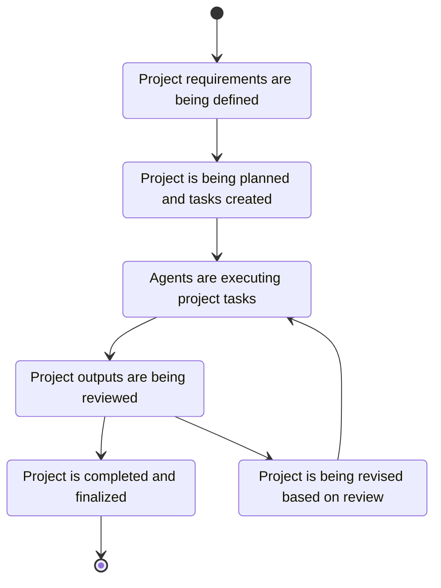
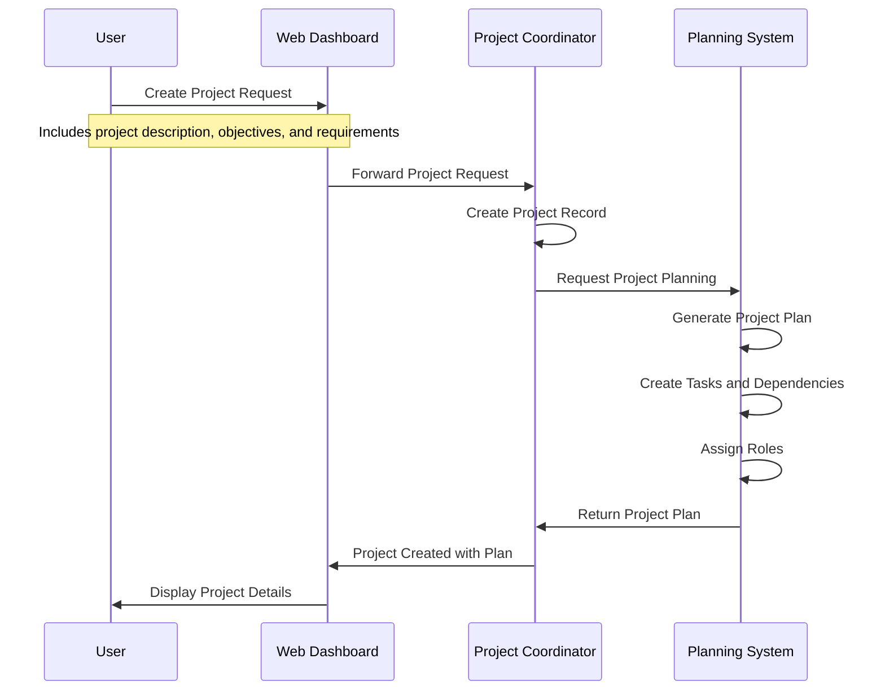
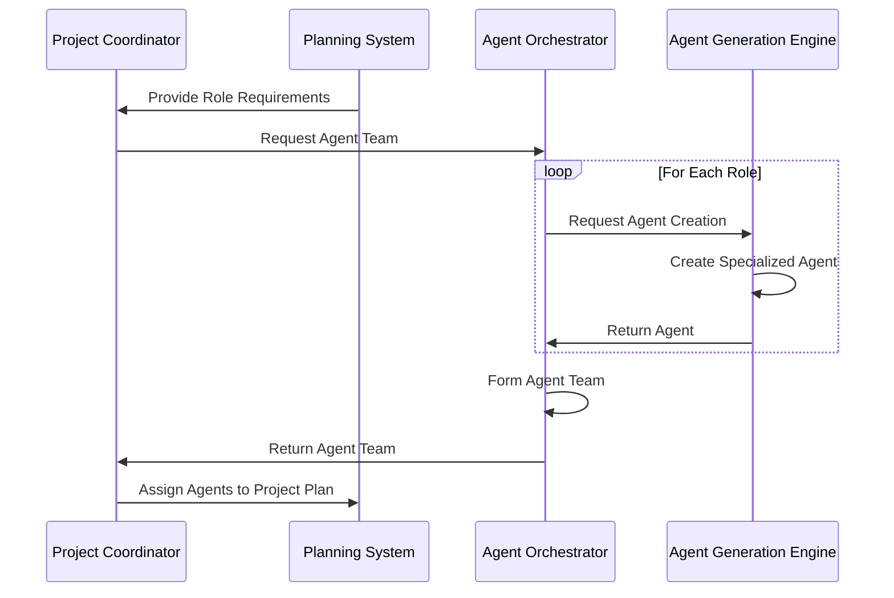
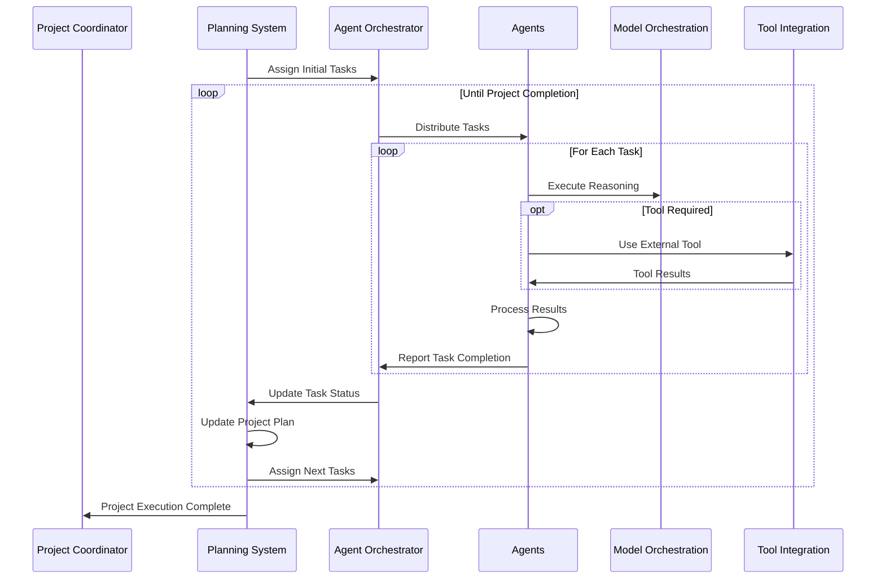
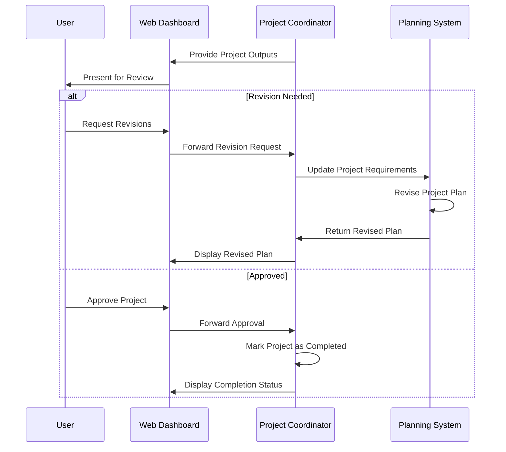
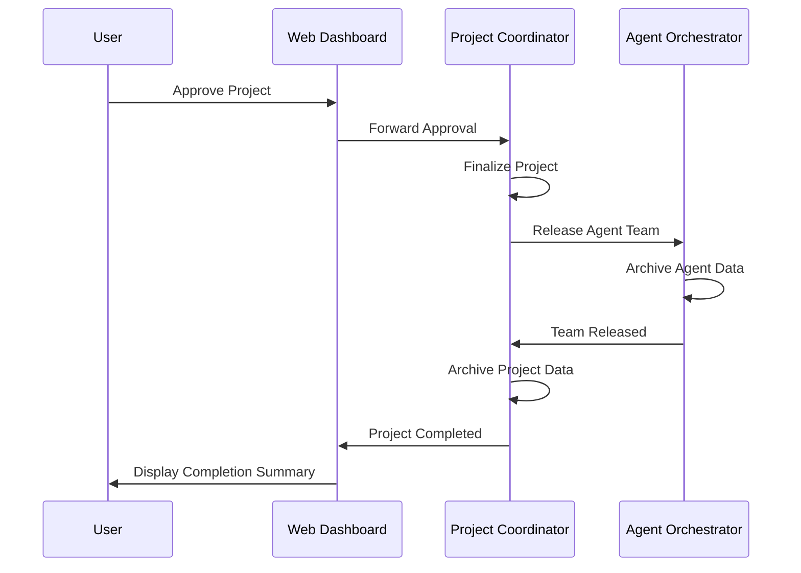
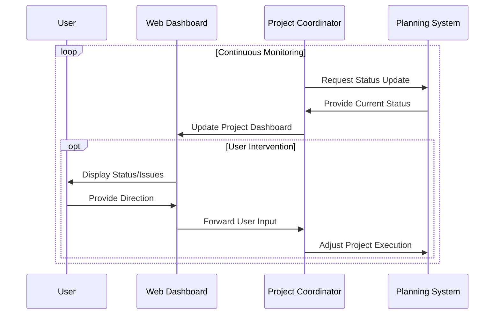

# Project Execution Process Flow

**Last Modified:** 2025-03-29  
**Completion Date:** 2025-03-29  
**Doc Type:** Guide  

---

## Overview

This document describes the end-to-end process flow for project execution in the Berrys_AgentsV2 system. It covers the journey from project creation to completion, including planning, agent assignment, task execution, and monitoring.

## Project Lifecycle

Projects in the Berrys_AgentsV2 system go through several defined stages:

## Project Creation and Planning

The project creation and planning process establishes the foundation for execution:

### Planning Process Details

1. **Project Definition**
   - User provides project description, objectives, and requirements
   - Web Dashboard formats and validates the input
   - Project Coordinator creates a new project record

2. **Strategic Planning**
   - Planning System analyzes project requirements
   - High-level goals and milestones are established
   - Project methodology is selected based on requirements

3. **Tactical Planning**
   - Project is broken down into tasks
   - Task dependencies are identified
   - Resource requirements are estimated
   - Timeline is projected

4. **Role Definition**
   - Required agent roles are identified
   - Skills and capabilities for each role are defined
   - Planning System determines specializations needed

## Agent Team Assembly

Once planning is complete, a team of agents is assembled:

### Team Assembly Steps

1. **Role Analysis**
   - Planning System defines required roles based on project plan
   - Each role has specific skill requirements and specializations

2. **Agent Creation**
   - Agent Orchestrator requests agent creation from Agent Generation Engine
   - Agent templates are selected based on role requirements
   - Agents are specialized for their specific roles
   - Agents are initialized with project context

3. **Team Formation**
   - Agents are organized into a team structure
   - Team hierarchy is established if needed
   - Communication channels are set up
   - Collaboration patterns are configured

## Task Assignment and Execution

With the team assembled, task execution begins:

### Task Execution Details

1. **Task Distribution**
   - Planning System assigns initial tasks based on dependencies
   - Agent Orchestrator distributes tasks to appropriate agents
   - Agents receive task context and requirements

2. **Task Execution**
   - Agents process their assigned tasks
   - Model Orchestration provides reasoning capabilities
   - Tool Integration supplies access to external tools
   - Agents collaborate when needed through Agent Communication Hub

3. **Progress Tracking**
   - Agents report task completion to Agent Orchestrator
   - Planning System updates project plan based on progress
   - New tasks are assigned as dependencies are satisfied

## Review and Revision

Project outputs are reviewed and may require revision:

### Review Process

1. **Output Collection**
   - Project Coordinator collects all task outputs
   - Outputs are organized according to project structure
   - Comprehensive project results are prepared for review

2. **User Review**
   - User reviews project outputs through Web Dashboard
   - Feedback is provided on quality, completeness, and accuracy
   - Decision is made to approve or request revisions

3. **Revision Process**
   - If revisions are needed, requirements are updated
   - Planning System revises the project plan
   - New or modified tasks are created
   - Execution cycle continues with revised plan

## Project Completion

When the project is approved, completion procedures are followed:

### Completion Steps

1. **Project Finalization**
   - All outputs are finalized and packaged
   - Documentation is completed
   - Metrics and performance data are collected

2. **Resource Release**
   - Agent team is released from the project
   - Agent data is archived for future reference
   - Resources are freed for other projects

3. **Project Archiving**
   - Project data is archived
   - Performance metrics are analyzed
   - Lessons learned are documented

## Monitoring and Management

Throughout the project lifecycle, monitoring and management are continuous:

### Monitoring Aspects

1. **Progress Tracking**
   - Task completion rates
   - Timeline adherence
   - Milestone achievement
   - Resource utilization

2. **Issue Management**
   - Bottleneck detection
   - Dependency conflicts
   - Resource constraints
   - Quality issues

3. **User Involvement**
   - Status updates and notifications
   - Decision points requiring user input
   - Intervention for complex issues
   - Direction changes and priority adjustments

## Performance Metrics

Project execution is measured using several key metrics:

1. **Efficiency Metrics**
   - Task completion time vs. estimates
   - Resource utilization
   - Parallel execution effectiveness
   - Tool usage efficiency

2. **Quality Metrics**
   - Output quality evaluation
   - Revision rate
   - User satisfaction
   - Requirement fulfillment

3. **Process Metrics**
   - Planning accuracy
   - Collaboration effectiveness
   - Adaptation to changes
   - Issue resolution time

## Key Considerations

### Handling Complexity

- Complex projects may involve multiple nested planning cycles
- Hierarchical task breakdown may occur at multiple levels
- Specialization and generalization of agents based on task requirements

### Dynamic Adaptation

- Plans should adapt to changing requirements
- Resource allocation adjusts based on progress and bottlenecks
- Agent team composition may change throughout the project

### Human-in-the-Loop Integration

- User input is critical at strategic decision points
- Feedback loops improve execution quality
- Level of autonomy is configurable based on project type and user preferences

## References

- [Project Coordinator Service](../../reference/services/project-coordinator.md)
- [Planning System Service](../../reference/services/planning-system.md)
- [Agent Lifecycle](agent-lifecycle.md)
- [Agent Communication Hub Guide](../developer-guides/service-development/agent-communication-hub-guide.md)
