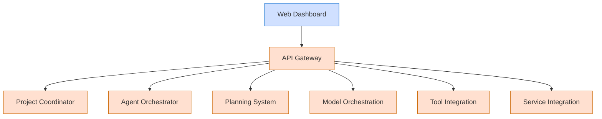

# Berrys_AgentsV2 Onboarding Guide

**Last Modified:** 2025-03-29  
**Doc Type:** Onboarding  

---

## Welcome to Berrys_AgentsV2

Welcome to the Berrys_AgentsV2 platform team! This guide will help you get started quickly with our multi-agent orchestration platform. It provides essential information on setup, architecture, development workflows, and key resources.

## Getting Started

### 1. Environment Setup

Set up your development environment with these steps:

```bash
# Clone the repository
git clone git@github.com:berry/Berrys_AgentsV2.git
cd Berrys_AgentsV2

# Run the setup script for your platform
# For Windows:
.\setup-env.bat

# For Linux/macOS:
./setup-env.sh

# Start the development environment
docker-compose up -d
```

### 2. Core Architecture

Berrys_AgentsV2 follows a microservices architecture with these key components:



For a more detailed architecture overview, see [System Overview](../reference/architecture/system-overview.md).

### 3. Development Workflow

Our development workflow follows these steps:

1. **Issue Assignment**: Tasks are assigned via GitHub issues
2. **Local Development**: Develop and test locally
3. **Code Review**: Submit a PR for review
4. **Integration Testing**: Automated and manual testing
5. **Deployment**: Automated deployment via CI/CD pipeline

## Key Services

Here's a quick overview of our key services:

| Service | Purpose | Local URL | Documentation |
|---------|---------|-----------|---------------|
| **API Gateway** | Central entry point | http://localhost:8080 | [API Gateway](../reference/services/api-gateway.md) |
| **Web Dashboard** | User interface | http://localhost:3000 | [Web Dashboard](../reference/services/web-dashboard.md) |
| **Project Coordinator** | Project management | http://localhost:8081 | [Project Coordinator](../reference/services/project-coordinator.md) |
| **Agent Orchestrator** | Agent management | http://localhost:8082 | [Agent Orchestrator](../reference/services/agent-orchestrator.md) |
| **Planning System** | Task planning | http://localhost:8083 | [Planning System](../reference/services/planning-system.md) |
| **Model Orchestration** | Model interface | http://localhost:8084 | [Model Orchestration](../reference/services/model-orchestration.md) |
| **Tool Integration** | External tools | http://localhost:8085 | [Tool Integration](../reference/services/tool-integration.md) |
| **Service Integration** | Workflow management | http://localhost:8086 | [Service Integration](../reference/services/service-integration.md) |

## Essential Commands

Here are some common commands you'll use:

```bash
# Start all services
docker-compose up -d

# Start a specific service
docker-compose up -d service-name

# View logs
docker-compose logs -f [service-name]

# Run tests for a service
cd services/service-name
./run_tests.sh

# Apply database migrations
cd shared/database
./data_management.sh apply-migrations

# Create a new migration
cd services/service-name/migrations
alembic revision -m "description"
```

## Common Workflows

### Creating a New Service

1. Copy the service template: `cp -r docs/service-template services/new-service-name`
2. Customize the service files
3. Add the service to docker-compose.yml
4. Run and test the service

### Debugging Issues

1. Check service logs: `docker-compose logs -f service-name`
2. Use the troubleshooting guide: [Troubleshooting](../guides/developer-guides/troubleshooting.md)
3. Check for similar issues in GitHub

## Documentation Resources

To get a better understanding of the platform, review these resources:

1. [System Overview](../reference/architecture/system-overview.md)
2. [Communication Patterns](../reference/architecture/communication-patterns.md)
3. [Developer Guides](../guides/developer-guides/index.md)
4. [Best Practices](../best-practices/documentation-maintenance-plan.md)

## Getting Help

- **Team Chat**: Join the #berrys-agents-v2 channel on Slack
- **Technical Issues**: File a GitHub issue with the "help wanted" tag
- **Documentation Gaps**: Use the "documentation" tag in GitHub issues
- **Weekly Meetings**: Tuesday stand-up at 10:00 AM CST

## Next Steps

1. Complete the onboarding tasks assigned to you
2. Review the [Next Milestone](../next-milestone-prompt.md) to review next milestone, if needed


Welcome aboard! We're excited to have you join the team.
