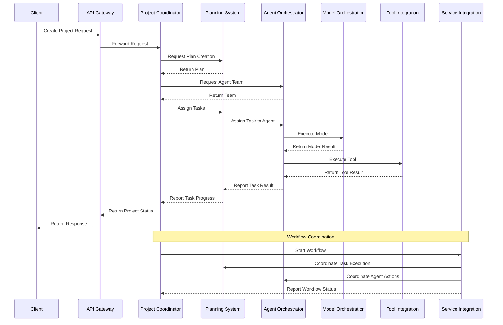
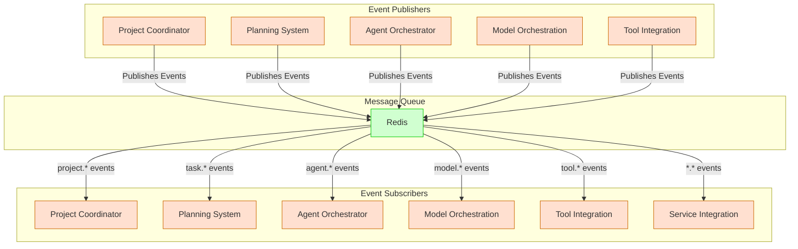
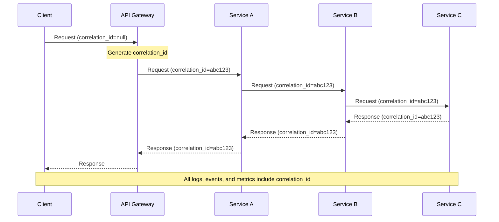
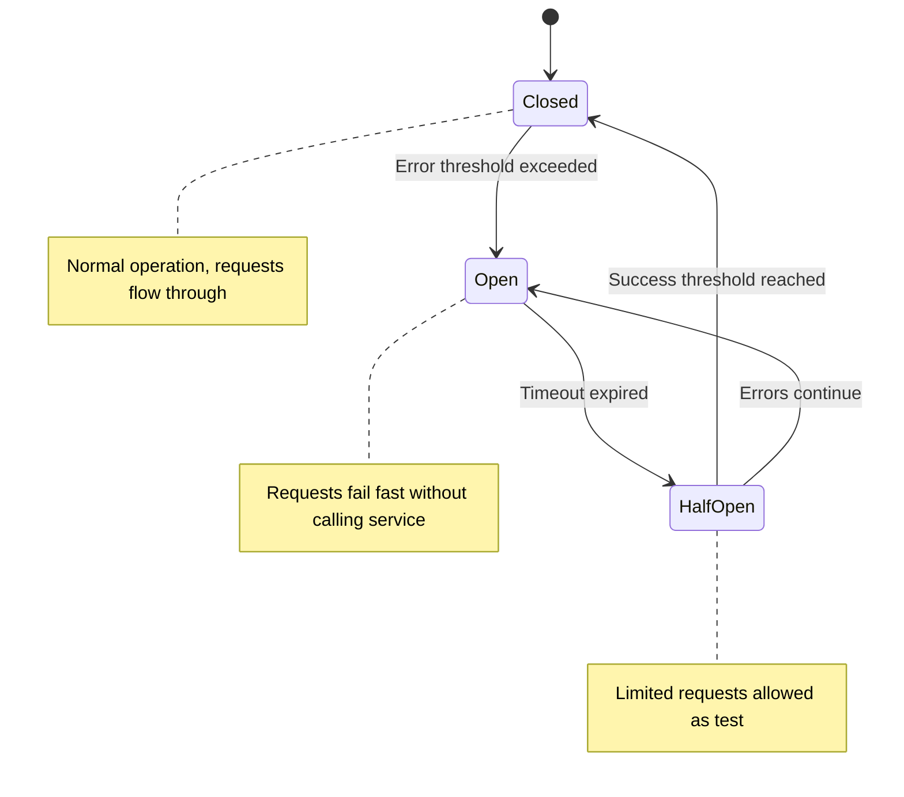
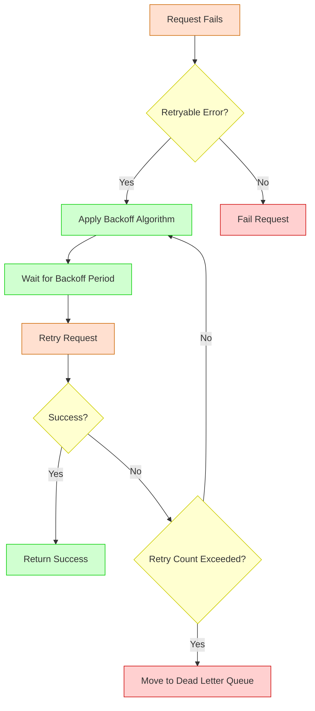
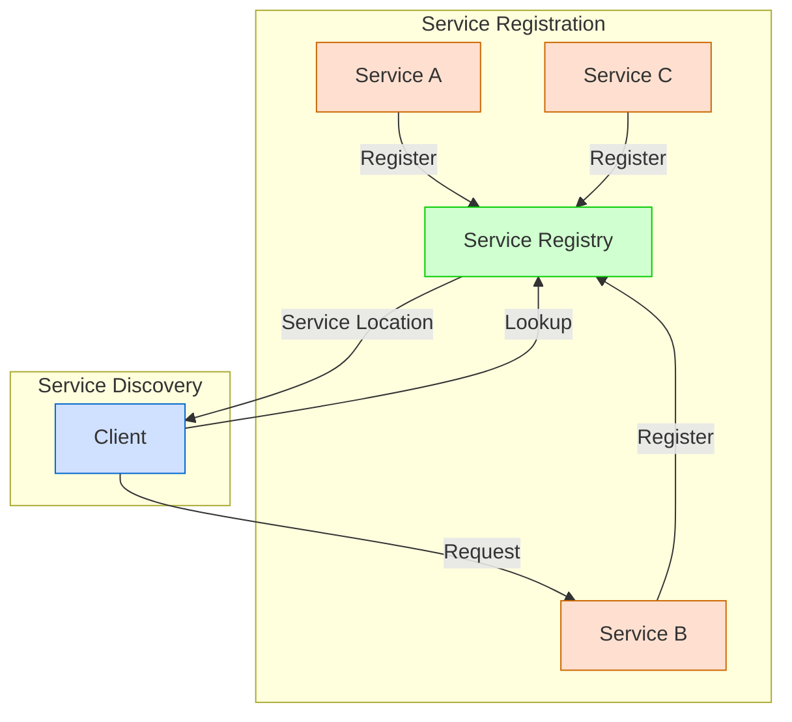
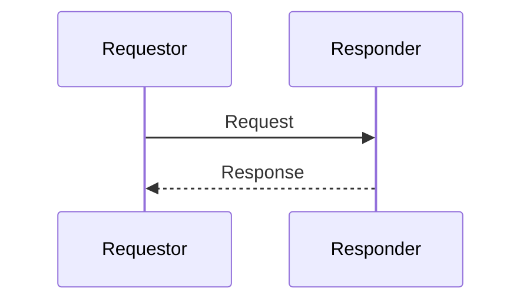
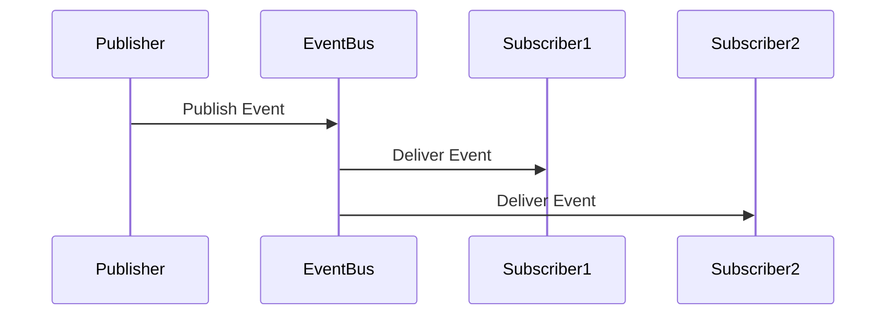
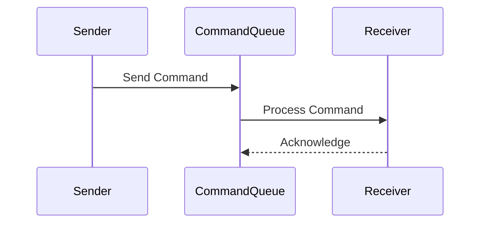
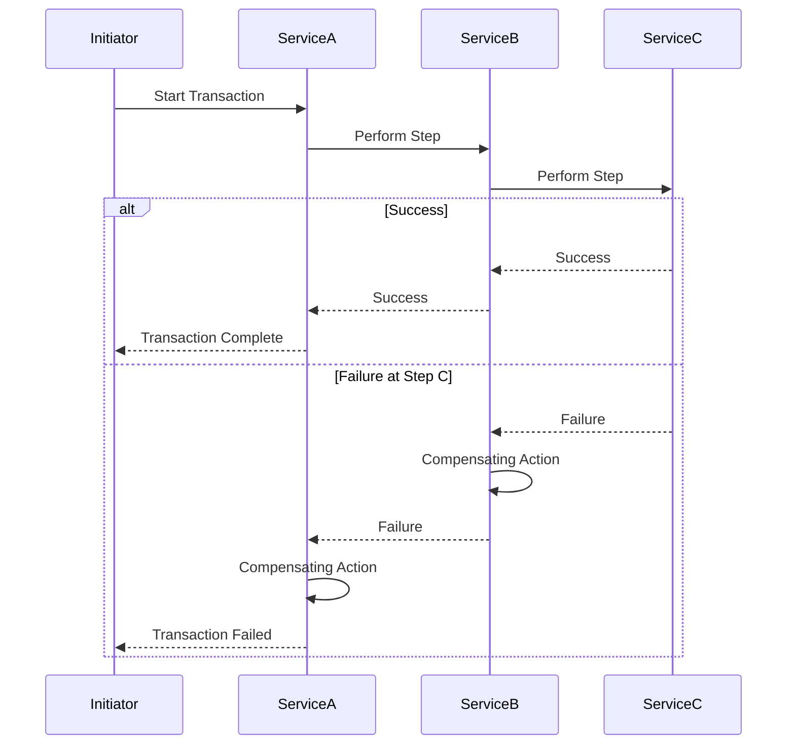

# Communication Patterns

**Last Modified:** 2025-03-29  
**Completion Date:** 2025-03-29  
**Doc Type:** Reference  

---

## Overview

This document describes the communication patterns used within the Berrys_AgentsV2 platform. It covers synchronous and asynchronous communication methods, messaging formats, and event-driven architecture patterns that enable service interaction.

## Communication Styles

The platform employs multiple communication styles depending on the interaction requirements:

### Synchronous Communication

- **REST API**: Used for request-response interactions between services
- **GraphQL**: Used for flexible data retrieval in the Web Dashboard
- **gRPC**: Used for high-performance internal service communication

### Asynchronous Communication

- **Message Queue**: Used for event publishing and subscription
- **Event Streaming**: Used for processing ordered event sequences
- **Webhooks**: Used for external system notifications

### Hybrid Communication

- **Request-Async Response**: Used for long-running operations
- **Polling**: Used for status checking on background processes
- **WebSockets**: Used for real-time updates in the Web Dashboard

## Service-to-Service Communication



## Event-Driven Architecture

The platform uses an event-driven architecture pattern for decoupled communication:



## Event Categories

The platform uses a categorized event scheme:

| Category | Example Events | Publishers | Subscribers |
|----------|----------------|------------|-------------|
| **project.\*** | project.created, project.updated, project.completed | Project Coordinator | Project Coordinator, Planning System |
| **task.\*** | task.created, task.assigned, task.completed | Planning System | Planning System, Agent Orchestrator, Project Coordinator |
| **agent.\*** | agent.created, agent.task_assigned, agent.ready | Agent Orchestrator | Agent Orchestrator, Planning System, Project Coordinator |
| **model.\*** | model.execution_requested, model.execution_completed | Model Orchestration | Model Orchestration, Agent Orchestrator |
| **tool.\*** | tool.execution_requested, tool.execution_completed | Tool Integration | Tool Integration, Agent Orchestrator |
| **workflow.\*** | workflow.started, workflow.step_completed, workflow.completed | Service Integration | Service Integration, Project Coordinator |

## Message Formats

### Event Message Format

```json
{
  "id": "550e8400-e29b-41d4-a716-446655440000",
  "type": "project.created",
  "source": "project-coordinator",
  "timestamp": "2025-03-29T12:34:56.789Z",
  "correlation_id": "5d976e66-8c32-483f-a9d1-8feaade0e1e0",
  "data": {
    "project_id": "a1b2c3d4-e5f6-g7h8-i9j0-k1l2m3n4o5p6",
    "name": "Customer Data Analysis",
    "created_by": "user-123"
  }
}
```

### Command Message Format

```json
{
  "id": "550e8400-e29b-41d4-a716-446655440001",
  "type": "agent.assign_task",
  "source": "planning-system",
  "timestamp": "2025-03-29T12:35:56.789Z",
  "correlation_id": "5d976e66-8c32-483f-a9d1-8feaade0e1e0",
  "data": {
    "agent_id": "b2c3d4e5-f6g7-h8i9-j0k1-l2m3n4o5p6q7",
    "task_id": "c3d4e5f6-g7h8-i9j0-k1l2-m3n4o5p6q7r8",
    "priority": "high"
  }
}
```

## REST API Conventions

The platform follows these REST API conventions:

### Resource Naming

- **Collection Resources**: Plural nouns (e.g., `/projects`, `/agents`)
- **Singleton Resources**: Singular nouns (e.g., `/projects/{id}/status`)
- **Controller Resources**: Verbs for operations (e.g., `/projects/{id}/cancel`)

### HTTP Methods

- **GET**: Retrieve resources
- **POST**: Create resources or execute operations
- **PUT**: Replace resources
- **PATCH**: Partially update resources
- **DELETE**: Delete resources

### HTTP Status Codes

- **2xx**: Success (200 OK, 201 Created, 204 No Content)
- **4xx**: Client error (400 Bad Request, 401 Unauthorized, 404 Not Found)
- **5xx**: Server error (500 Internal Server Error, 503 Service Unavailable)

### Request/Response Formats

Standard request format:

```json
{
  "resource_property": "value",
  "nested_property": {
    "sub_property": "value"
  }
}
```

Standard response format:

```json
{
  "data": {
    "resource_property": "value",
    "nested_property": {
      "sub_property": "value"
    }
  },
  "meta": {
    "version": "1.0",
    "timestamp": "2025-03-29T12:34:56.789Z"
  }
}
```

## Message Delivery Guarantees

The platform implements different message delivery guarantees:

- **At-least-once delivery**: Ensures messages are delivered but may be duplicated
- **Idempotent receivers**: Safely handles duplicate messages
- **Message ordering**: Preserves order within specific event categories
- **Dead letter queues**: Captures failed message processing attempts
- **Retry mechanisms**: Automatically retries failed deliveries

## Correlation and Tracing

The platform uses correlation IDs and tracing:



## Circuit Breaker Pattern

The platform implements circuit breakers for resilient communication:



## Retry Strategy

The platform employs a sophisticated retry strategy:



## Authentication and Authorization

Communication security is implemented with:

- **JWT tokens**: For service-to-service authentication
- **API keys**: For external client authentication
- **Role-based access control**: For authorization
- **mTLS**: For secure service-to-service communication
- **Encrypted payloads**: For sensitive data protection

## Performance Considerations

The platform addresses several communication performance factors:

- **Connection Pooling**: Reuse connections for repeated communications
- **Batching**: Combine multiple messages for efficient transmission
- **Compression**: Reduce payload size for network efficiency
- **Protocol Selection**: Choose appropriate protocols for different needs
- **Partial Response**: Support filtering of response fields
- **Pagination**: Chunk large data sets for efficient transfer
- **Caching**: Cache repeated responses for performance

## Service Discovery

The platform implements service discovery:



## Communication Monitoring

The platform monitors communication with:

- **Latency Tracking**: Measure and track request/response times
- **Throughput Metrics**: Monitor message volume
- **Error Rate Monitoring**: Track communication failures
- **Circuit Breaker Status**: Monitor service health
- **Queue Depth**: Track message backlog
- **Event Processing Lag**: Monitor event processing delays
- **Correlation Tracing**: Follow request paths through services

## Common Communication Patterns

### Request-Response



### Publish-Subscribe



### Command



### Saga



## References

- [System Overview](system-overview.md)
- [Data Flow](data-flow.md)
- [Security Model](security-model.md)
- [Message Contracts](../message-contracts.md)
- [Agent Orchestrator Service](../services/agent-orchestrator.md)
- [Planning System Service](../services/planning-system.md)
- [Service Integration Service](../services/service-integration.md)
