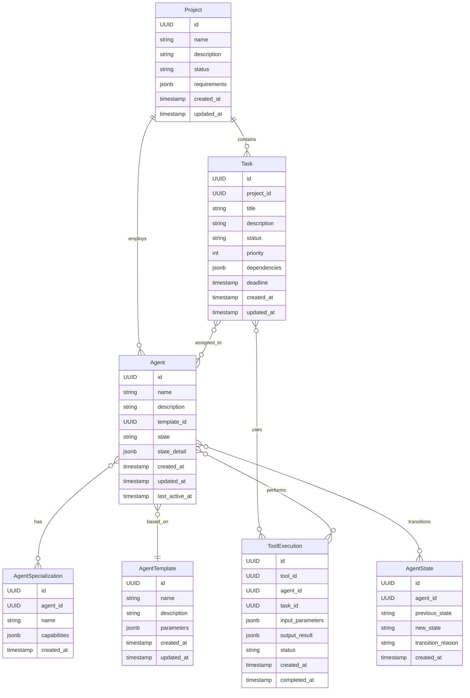
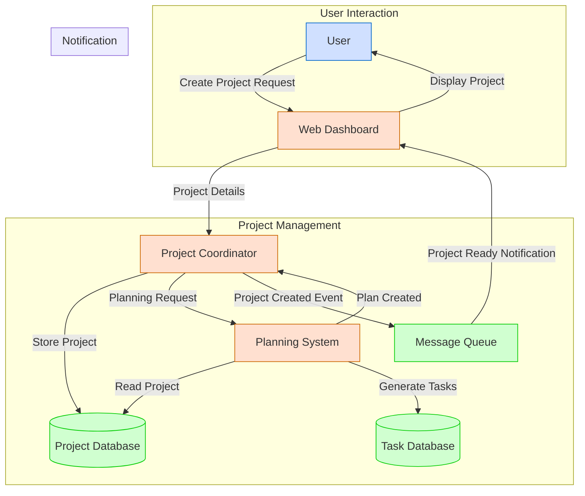
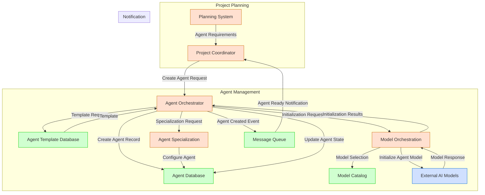
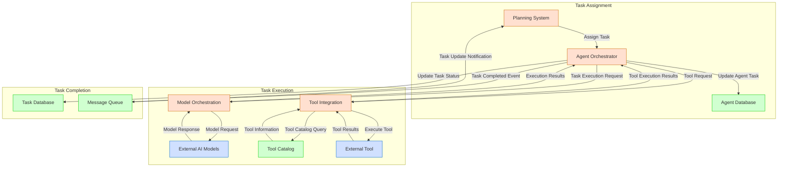
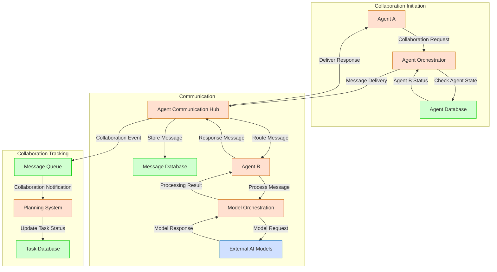
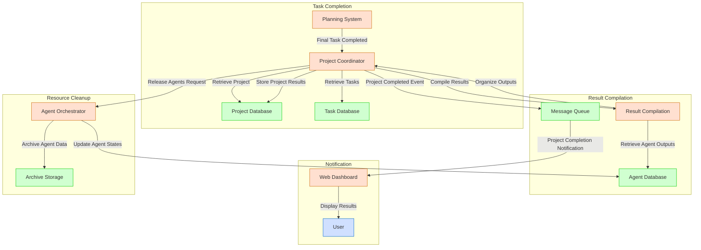
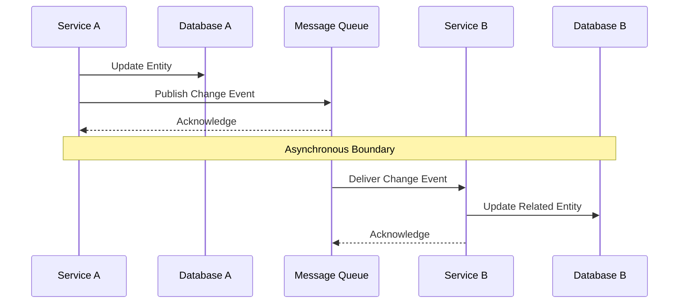

# Data Flow

**Last Modified:** 2025-03-29  
**Completion Date:** 2025-03-29  
**Doc Type:** Reference  

---

## Overview

This document describes the data flow patterns within the Berrys_AgentsV2 platform. It maps how information flows between services, databases, message queues, and external systems throughout various key processes.

## Core Data Entities

The platform operates on these primary data entities:

## Service Data Ownership

Each service has primary ownership of specific data entities:

| Service | Primary Data Entities | Secondary Access |
|---------|----------------------|-------------------|
| Project Coordinator | Project | Task, Agent |
| Planning System | Task, Task Dependencies | Project, Agent |
| Agent Orchestrator | Agent, AgentState, AgentSpecialization | Task, AgentTemplate |
| Model Orchestration | Model, ModelExecution | Agent |
| Tool Integration | Tool, ToolExecution | Agent, Task |
| Service Integration | Workflow, WorkflowState | Project, Task, Agent |

## Data Flow Diagrams

### Project Creation and Planning

### Agent Creation and Initialization

### Task Execution Flow

### Agent Collaboration Flow

### Project Completion Flow

## Data Storage Patterns

### Database Partitioning

The platform uses a partitioned database approach to ensure scalability:

- **Service-specific databases**: Each service has its own database schema
- **Shared references**: Cross-service references use UUIDs
- **Data consistency**: Maintained through event-based synchronization

### Data Access Patterns

| Pattern | Use Case | Implementation |
|---------|----------|----------------|
| CQRS | High-read services | Separate read and write models |
| Event Sourcing | Agent state history | Store state transitions as events |
| Materialized Views | Dashboards and reports | Pre-computed aggregates |
| Cache Aside | Frequently accessed data | Redis-based caching layer |
| Repository | Entity access | Repository pattern abstractions |

### Data Migration Strategy

For schema evolution:
- Use Alembic for migration management
- Maintain backward compatibility for at least one version
- Apply migrations in controlled, sequential order
- Test migrations in staging before production
- Create backups before applying migrations

## Cross-Service Data Consistency

To maintain consistency across service boundaries:

Strategies for consistency:
- **Eventually consistent**: Most cross-service data follows eventual consistency
- **Change events**: All state changes broadcast events for synchronization
- **Idempotent operations**: All operations are idempotent to allow retries
- **Outbox pattern**: Ensures reliable event publishing with database transactions

## Privacy and Data Protection

Data classification:
- **Sensitive data**: User information, API keys, credentials
- **System data**: Service configurations, logs, metrics
- **Content data**: Agent inputs, outputs, and artifacts

Data protection strategies:
- **Encryption at rest**: For all databases and object storage
- **Encryption in transit**: TLS for all service communication
- **Field-level encryption**: For sensitive data fields
- **Access control**: Role-based access control for all data access
- **Data retention**: Automated purging of data beyond retention period

## References

- [System Overview](system-overview.md)
- [Communication Patterns](communication-patterns.md)
- [Database Schema Reference](../database-schema.md)
- [Message Contracts Reference](../message-contracts.md)
