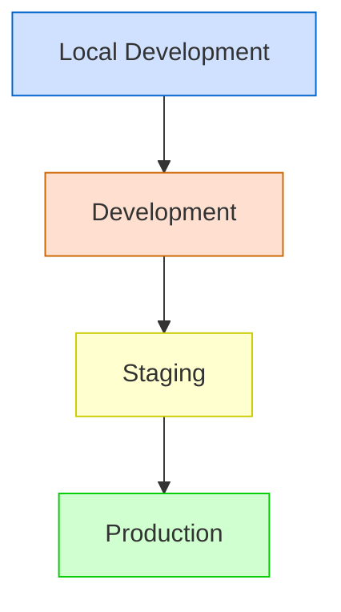
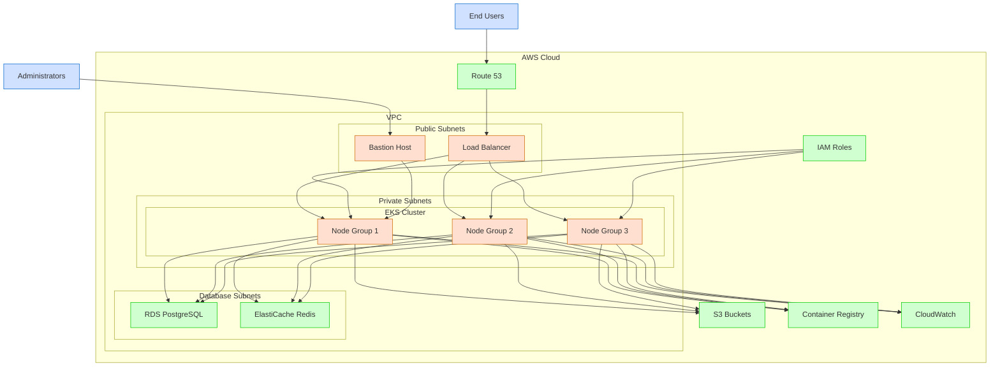
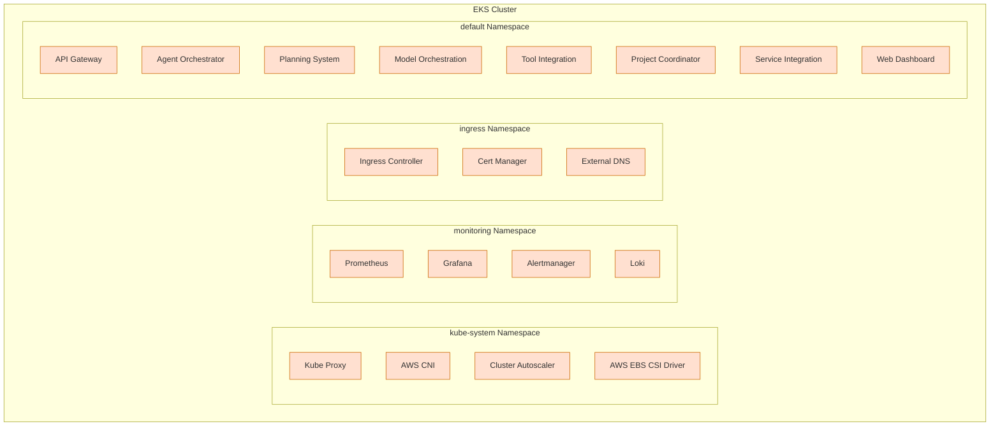
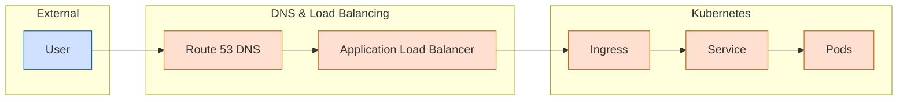
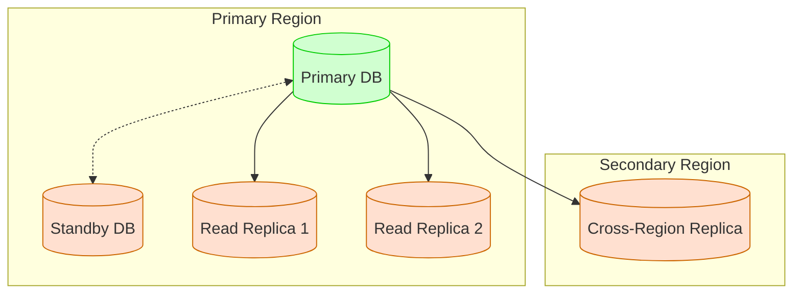
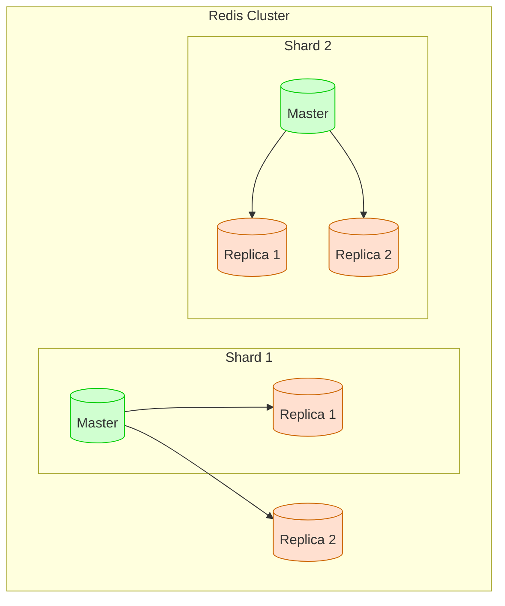
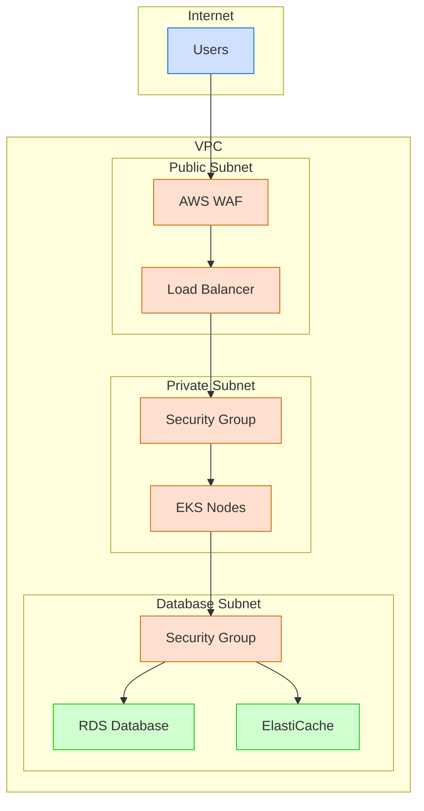
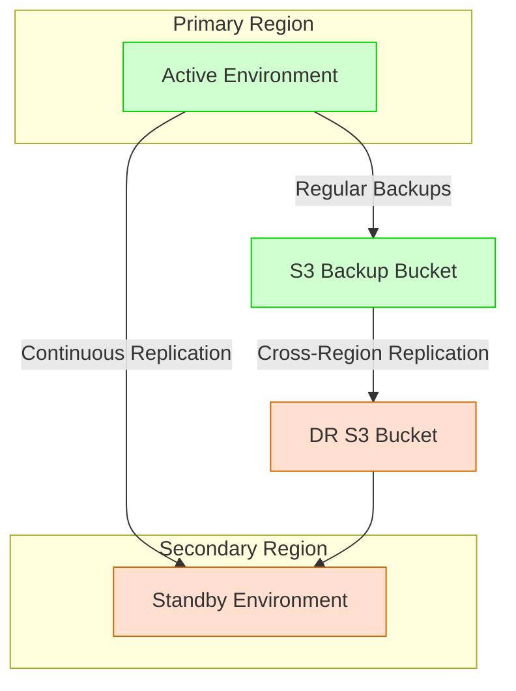
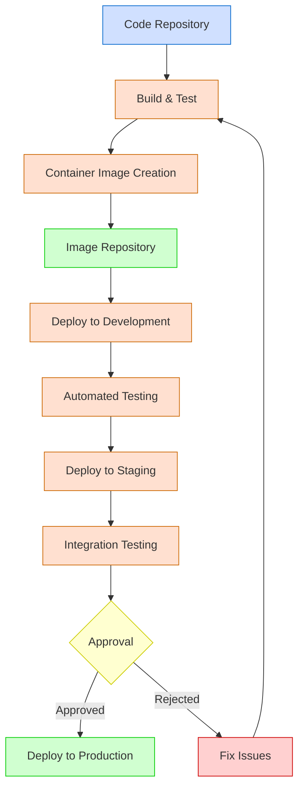

# Deployment Architecture

**Last Modified:** 2025-03-29  
**Completion Date:** 2025-03-29  
**Doc Type:** Reference  

---

## Overview

This document describes the deployment architecture for the Berrys_AgentsV2 platform across various environments. It covers infrastructure components, configurations, and deployment patterns used to ensure scalability, reliability, and security.

## Deployment Environments

The platform supports multiple deployment environments with increasing levels of infrastructure resources and security controls:



### Environment Characteristics

| Environment | Purpose | Scaling | Data | Access |
|-------------|---------|---------|------|--------|
| Local Development | Individual developer work | Single-node | Ephemeral, sample data | Developer only |
| Development | Team integration | Limited scaling | Refreshable test data | Team members |
| Staging | Pre-production validation | Production-like | Anonymized production data | Authorized team |
| Production | Live operation | Full auto-scaling | Real production data | End-users, admins |

## Infrastructure Architecture

### Production Environment

The production environment uses a Kubernetes-based architecture on AWS:



### Kubernetes Architecture

The EKS cluster is organized into namespaces with the following components:



### Node Group Configuration

The EKS cluster uses node groups with different characteristics to optimize resource allocation:

| Node Group | Instance Type | Purpose | Scaling |
|------------|--------------|---------|---------|
| General | t3.xlarge | API Gateway, Web Dashboard | 2-5 nodes |
| Compute | c5.2xlarge | Model Orchestration, Planning System | 3-10 nodes |
| Memory | r5.2xlarge | Agent Orchestrator, Project Coordinator | 2-8 nodes |

## Service Deployment

### Kubernetes Deployment Configuration

Each service is deployed using Kubernetes manifests:

```yaml
apiVersion: apps/v1
kind: Deployment
metadata:
  name: agent-orchestrator
  namespace: default
spec:
  replicas: 3
  selector:
    matchLabels:
      app: agent-orchestrator
  strategy:
    type: RollingUpdate
    rollingUpdate:
      maxSurge: 1
      maxUnavailable: 0
  template:
    metadata:
      labels:
        app: agent-orchestrator
    spec:
      containers:
      - name: agent-orchestrator
        image: ${ECR_REPOSITORY}/agent-orchestrator:${VERSION}
        ports:
        - containerPort: 8080
        resources:
          requests:
            cpu: "500m"
            memory: "1Gi"
          limits:
            cpu: "1000m"
            memory: "2Gi"
        readinessProbe:
          httpGet:
            path: /health/readiness
            port: 8080
          initialDelaySeconds: 10
          periodSeconds: 5
        livenessProbe:
          httpGet:
            path: /health/liveness
            port: 8080
          initialDelaySeconds: 60
          periodSeconds: 15
        env:
        - name: DATABASE_URL
          valueFrom:
            secretKeyRef:
              name: database-credentials
              key: url
        - name: REDIS_URL
          valueFrom:
            secretKeyRef:
              name: redis-credentials
              key: url
        - name: LOG_LEVEL
          value: "INFO"
        - name: MODEL_ORCHESTRATION_URL
          value: "http://model-orchestration.default.svc.cluster.local:8080"
        - name: TOOL_INTEGRATION_URL
          value: "http://tool-integration.default.svc.cluster.local:8080"
        - name: PLANNING_SYSTEM_URL
          value: "http://planning-system.default.svc.cluster.local:8080"
```

### Service Exposure

Services are exposed through a multi-tier approach:



### Internal Service Communication

Services communicate internally using Kubernetes services:

```yaml
apiVersion: v1
kind: Service
metadata:
  name: agent-orchestrator
  namespace: default
spec:
  selector:
    app: agent-orchestrator
  ports:
  - port: 8080
    targetPort: 8080
  type: ClusterIP
```

## Scaling Configuration

### Horizontal Pod Autoscaling

Services scale based on CPU and memory utilization:

```yaml
apiVersion: autoscaling/v2
kind: HorizontalPodAutoscaler
metadata:
  name: agent-orchestrator
spec:
  scaleTargetRef:
    apiVersion: apps/v1
    kind: Deployment
    name: agent-orchestrator
  minReplicas: 3
  maxReplicas: 10
  metrics:
  - type: Resource
    resource:
      name: cpu
      target:
        type: Utilization
        averageUtilization: 70
  - type: Resource
    resource:
      name: memory
      target:
        type: Utilization
        averageUtilization: 80
```

### Cluster Autoscaling

Node groups scale automatically based on pod scheduling requirements:

```yaml
apiVersion: v1
kind: ConfigMap
metadata:
  name: cluster-autoscaler-config
  namespace: kube-system
data:
  config.yaml: |
    ---
    scaleDownUnneededTime: 5m
    scaleDownDelayAfterAdd: 5m
    scaleDownUtilizationThreshold: 0.5
```

## Database Architecture

### RDS Configuration

The PostgreSQL database uses a multi-AZ deployment with read replicas:



### ElastiCache Configuration

Redis is deployed as a cluster with replication:



## Network Architecture

### Network Security

The network is secured through multiple layers:



### Network Policies

Kubernetes network policies control pod-to-pod communication:

```yaml
apiVersion: networking.k8s.io/v1
kind: NetworkPolicy
metadata:
  name: agent-orchestrator-policy
spec:
  podSelector:
    matchLabels:
      app: agent-orchestrator
  policyTypes:
  - Ingress
  - Egress
  ingress:
  - from:
    - podSelector:
        matchLabels:
          app: api-gateway
    ports:
    - protocol: TCP
      port: 8080
  egress:
  - to:
    - podSelector:
        matchLabels:
          app: model-orchestration
    ports:
    - protocol: TCP
      port: 8080
  - to:
    - podSelector:
        matchLabels:
          app: tool-integration
    ports:
    - protocol: TCP
      port: 8080
```

## High Availability and Disaster Recovery

### High Availability Architecture

The system is designed for high availability across multiple layers:

| Layer | HA Strategy | Recovery Time Objective |
|-------|-------------|-------------------------|
| Load Balancing | Multi-AZ ALB | < 1 minute |
| Kubernetes | Multi-AZ EKS, multiple nodes | < 1 minute |
| Application | Multiple pods, readiness/liveness probes | < 30 seconds |
| Database | Multi-AZ RDS with automated failover | < 2 minutes |
| Cache | Multi-AZ ElastiCache with replication | < 1 minute |
| Object Storage | S3 with cross-region replication | Zero downtime |

### Disaster Recovery Strategy

The DR strategy uses a warm standby approach:



### Backup Strategy

Data is protected through a comprehensive backup approach:

| Data Type | Backup Frequency | Retention Period | Storage |
|-----------|------------------|------------------|---------|
| Database | Daily full backup | 30 days | S3 |
| Database | Transaction logs | 7 days | S3 |
| ElastiCache | Daily snapshot | 7 days | S3 |
| Configuration | On change | 90 days | S3 |
| User data | Daily incremental | 90 days | S3 |

## Infrastructure as Code

All infrastructure is defined as code using Terraform:

```hcl
module "eks" {
  source = "./modules/eks"
  
  cluster_name    = "berrys-agents-v2-${var.environment}"
  cluster_version = "1.22"
  vpc_id          = module.vpc.vpc_id
  subnet_ids      = module.vpc.private_subnet_ids
  
  node_groups = {
    general = {
      instance_types = ["t3.xlarge"]
      min_size       = 2
      max_size       = 5
      desired_size   = 2
    }
    
    compute = {
      instance_types = ["c5.2xlarge"]
      min_size       = 3
      max_size       = 10
      desired_size   = 3
    }
    
    memory = {
      instance_types = ["r5.2xlarge"]
      min_size       = 2
      max_size       = 8
      desired_size   = 2
    }
  }
}
```

## Deployment Pipeline

The deployment process follows a CI/CD pipeline:



## References

- [System Overview](system-overview.md)
- [Communication Patterns](communication-patterns.md)
- [Data Flow](data-flow.md)
- [Security Model](security-model.md)
- [Production Deployment Guide](../../guides/deployment/production.md)
- [Deployment Workflow](../../guides/process-flows/deployment-workflow.md)
