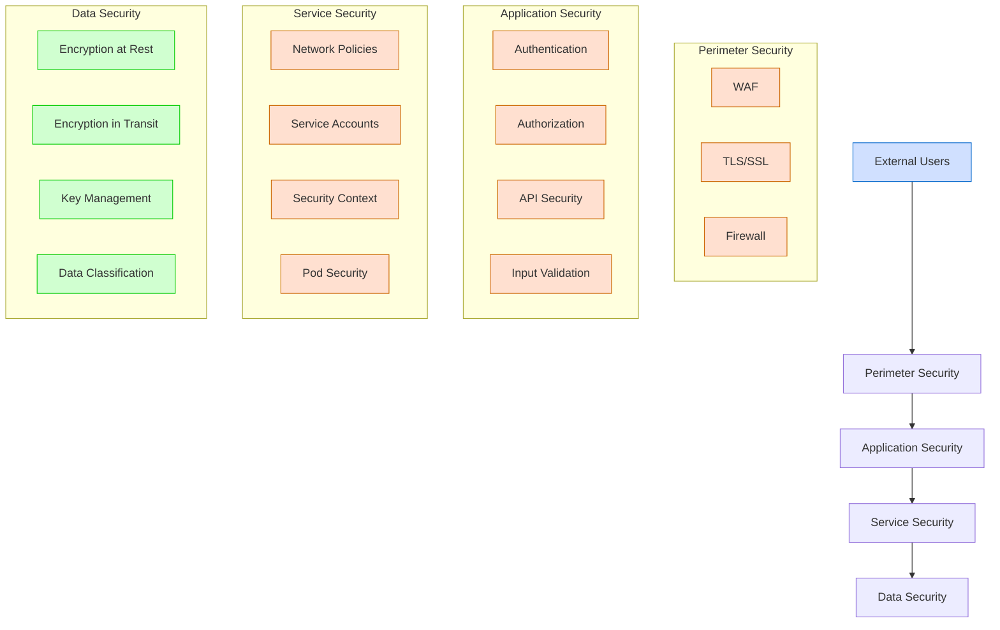
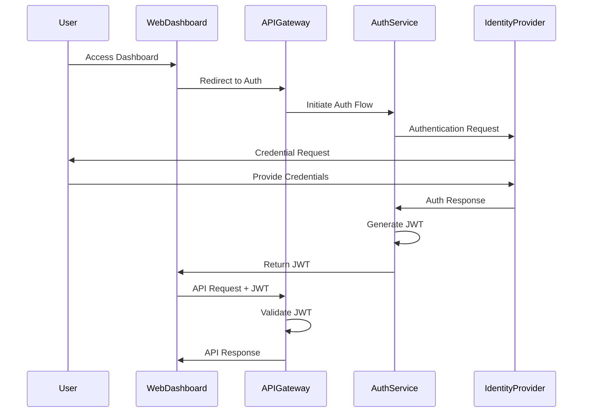
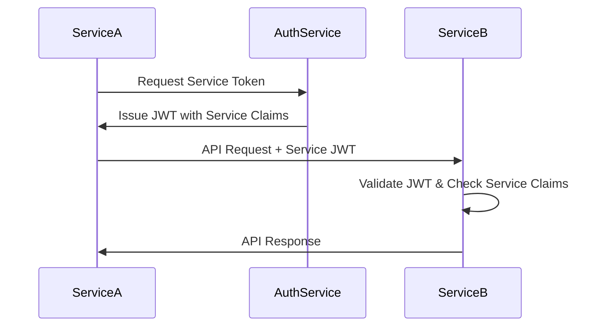
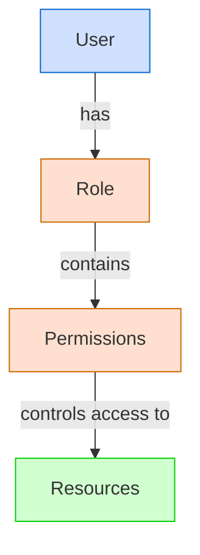
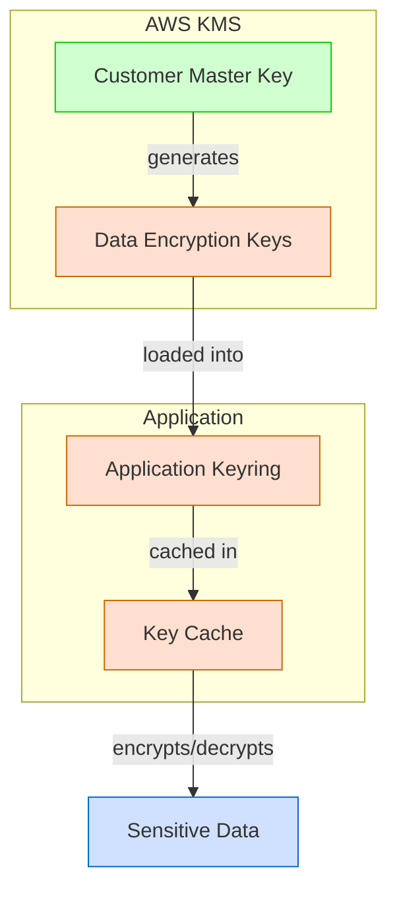
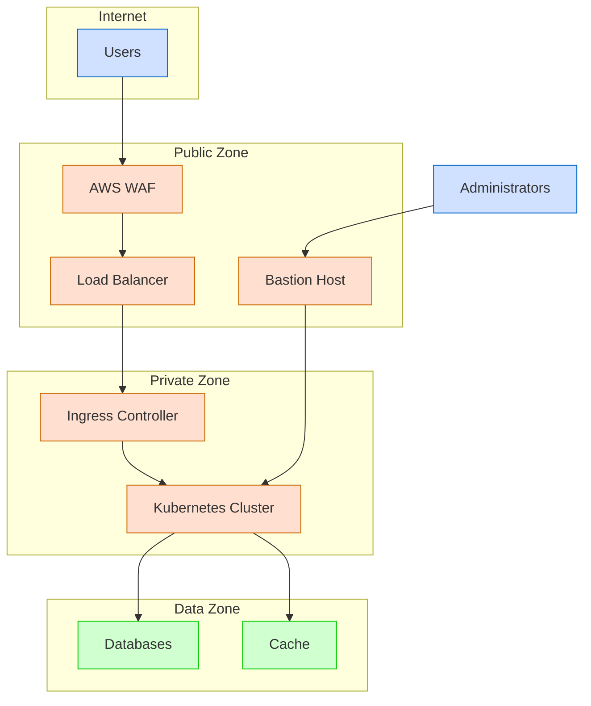
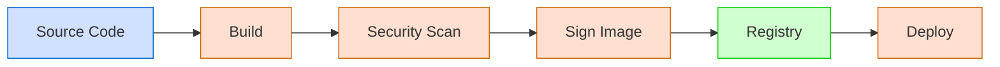
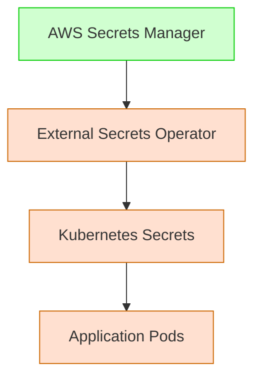
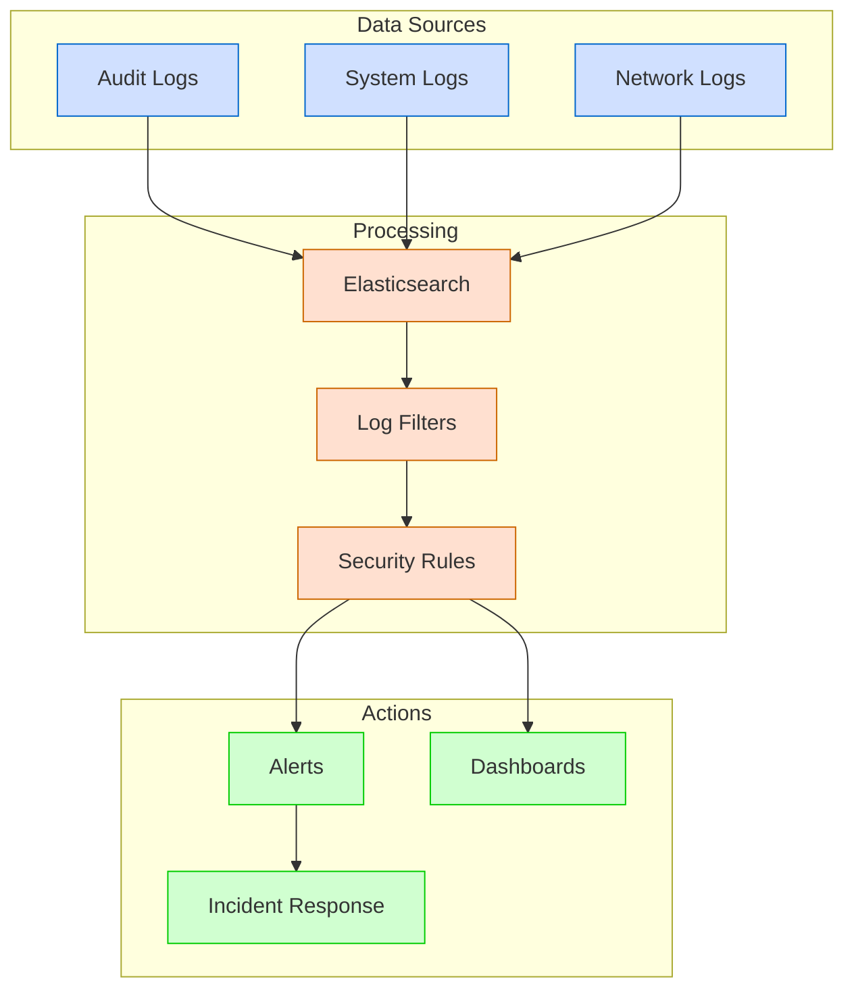
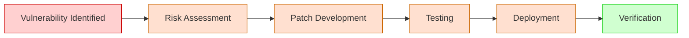

# Security Model

**Last Modified:** 2025-03-29  
**Completion Date:** 2025-03-29  
**Doc Type:** Reference  

---

## Overview

This document outlines the security architecture and controls implemented in the Berrys_AgentsV2 platform. It covers authentication, authorization, data protection, network security, and compliance measures that protect the system and its data.

## Security Architecture

The platform implements a defense-in-depth approach with multiple security layers:



## Authentication and Identity Management

### User Authentication

The platform uses a multi-layered authentication system:



Authentication features:
- OpenID Connect/OAuth 2.0 compatibility
- Multi-factor authentication support
- JWT-based session management
- Configurable password policies
- Brute force protection

### Service-to-Service Authentication

Services authenticate with each other using:



Service authentication features:
- Short-lived service tokens (15-minute expiry)
- Service-specific claims and scopes
- Automatic token renewal
- Token revocation on service restart

## Authorization and Access Control

### Role-Based Access Control (RBAC)

The platform implements a comprehensive RBAC model:



Default roles include:
- Administrator: Full system access
- Project Manager: Create/manage projects and teams
- Agent Designer: Design and configure agents
- Operator: Monitoring and operations access
- Viewer: Read-only access to assigned resources

### Resource-Level Permissions

Fine-grained access control is implemented for all resources:

| Resource Type | Permission Types | Scope Control |
|---------------|------------------|--------------|
| Project | Create, Read, Update, Delete | Project-level |
| Agent | Create, Read, Update, Delete, Execute | Agent-level |
| Tool | Register, Read, Configure, Execute | Tool-level |
| Model | Register, Read, Configure, Execute | Model-level |
| User | Create, Read, Update, Delete | System-level |

### API Gateway Authorization

The API Gateway enforces authorization for all requests:

```yaml
# Example API Gateway authorization rule
paths:
  /projects/{project_id}:
    get:
      security:
        - JWT: []
      x-amazon-apigateway-auth:
        type: "jwt"
        jwtConfiguration:
          audience: ["berrys-agents-v2"]
          issuer: "https://auth.berrys-agents.com"
      x-amazon-apigateway-integration:
        uri: "http://project-coordinator-svc/projects/{project_id}"
        passthroughBehavior: "when_no_match"
        httpMethod: "GET"
        type: "http_proxy"
```

## Data Protection

### Data Classification

All data in the system is classified according to sensitivity:

| Classification Level | Description | Examples | Protection Measures |
|----------------------|-------------|----------|---------------------|
| Public | Non-sensitive data | Product documentation, Public APIs | Basic controls |
| Internal | Business data not for public | Project metadata, Agent templates | Standard encryption, access control |
| Confidential | Sensitive business data | User data, Project details | Strong encryption, strict access control |
| Restricted | Highly sensitive data | API keys, Credentials | Field-level encryption, audit logging |

### Encryption

Data encryption is implemented at multiple levels:

#### Encryption at Rest

- **Database**: AES-256 encryption for PostgreSQL
- **Object Storage**: Server-side encryption for S3 buckets
- **File System**: LUKS encryption for persistent volumes
- **Secrets**: Kubernetes secrets encrypted using envelope encryption

#### Encryption in Transit

- **External Traffic**: TLS 1.3 with strong cipher suites
- **Internal Traffic**: mTLS between services
- **API Gateway**: TLS termination with forward secrecy
- **Database Connections**: TLS-encrypted connections

### Key Management



Key management features:
- Automatic key rotation (90 days)
- Key separation by environment
- Hardware Security Module (HSM) support
- Key access audit logging

## Network Security

### Network Architecture

The network is secured through multiple layers:



### Kubernetes Network Policies

The platform uses Kubernetes Network Policies to enforce micro-segmentation:

```yaml
apiVersion: networking.k8s.io/v1
kind: NetworkPolicy
metadata:
  name: api-gateway-policy
  namespace: default
spec:
  podSelector:
    matchLabels:
      app: api-gateway
  policyTypes:
  - Ingress
  - Egress
  ingress:
  - from:
    - ipBlock:
        cidr: 10.0.0.0/8
    ports:
    - protocol: TCP
      port: 8080
  egress:
  - to:
    - podSelector:
        matchLabels:
          app: agent-orchestrator
    ports:
    - protocol: TCP
      port: 8080
  - to:
    - podSelector:
        matchLabels:
          app: project-coordinator
    ports:
    - protocol: TCP
      port: 8080
```

### Web Application Firewall

The WAF protects against common web application attacks:

- SQL injection
- Cross-site scripting (XSS)
- Cross-site request forgery (CSRF)
- Command injection
- Path traversal
- Request rate limiting
- IP-based access control

## Container Security

### Container Hardening

Container images are hardened using:

- Minimal base images (distroless/slim variants)
- No unnecessary packages or tools
- Non-root user execution
- Read-only file systems where possible
- Drop all capabilities except those required
- No privileged containers

### Image Security



Image security measures:
- Vulnerability scanning during build
- Image signing with Cosign/Notary
- Admission control for unsigned images
- Regular base image updates
- Image scanning in registry

### Pod Security

Kubernetes pods are secured using Pod Security Standards:

```yaml
apiVersion: v1
kind: Pod
metadata:
  name: agent-orchestrator
spec:
  securityContext:
    runAsUser: 1000
    runAsGroup: 3000
    fsGroup: 2000
    seccompProfile:
      type: RuntimeDefault
  containers:
  - name: agent-orchestrator
    image: agent-orchestrator:latest
    securityContext:
      allowPrivilegeEscalation: false
      readOnlyRootFilesystem: true
      capabilities:
        drop:
        - ALL
```

## Secrets Management

Sensitive configuration is managed securely:



Secret management features:
- Centralized secrets storage in AWS Secrets Manager
- Automatic secret synchronization to Kubernetes
- Secret rotation automation
- Access control and audit logging for secrets
- Application-level secrets encapsulation

## Audit and Monitoring

### Audit Logging

All security-relevant events are logged:

| Event Category | Events Logged | Retention Period |
|----------------|---------------|------------------|
| Authentication | Login attempts, failures, logouts | 90 days |
| Authorization | Access grants, denials | 90 days |
| Resource Access | Data access, modification | 90 days |
| Configuration | System configuration changes | 1 year |
| Administrative | Admin actions | 1 year |

### Security Monitoring



## Vulnerability Management

### Vulnerability Scanning

The platform implements continuous vulnerability scanning:

- Code scanning during development (SAST)
- Dependency scanning for known vulnerabilities
- Container image scanning
- Infrastructure as Code scanning
- Runtime vulnerability scanning
- Regular penetration testing

### Patch Management



Patch management process:
- Critical vulnerabilities: 24-hour response time
- High vulnerabilities: 7-day response time
- Medium vulnerabilities: 30-day response time
- Low vulnerabilities: Next release cycle

## Compliance and Governance

### Compliance Controls

The platform is designed to meet the following compliance standards:

- SOC 2 Type II
- GDPR
- HIPAA (with appropriate configuration)
- ISO 27001
- PCI DSS (payment data handling)

### Security Governance

Security governance is enforced through:

- Security policy documentation
- Regular security reviews
- Automated compliance checks
- Security training for developers
- Third-party security assessments

## References

- [System Overview](system-overview.md)
- [Deployment Architecture](deployment-architecture.md)
- [Production Deployment Guide](../../guides/deployment/production.md)
- [Troubleshooting Guide](../../guides/developer-guides/troubleshooting.md)
