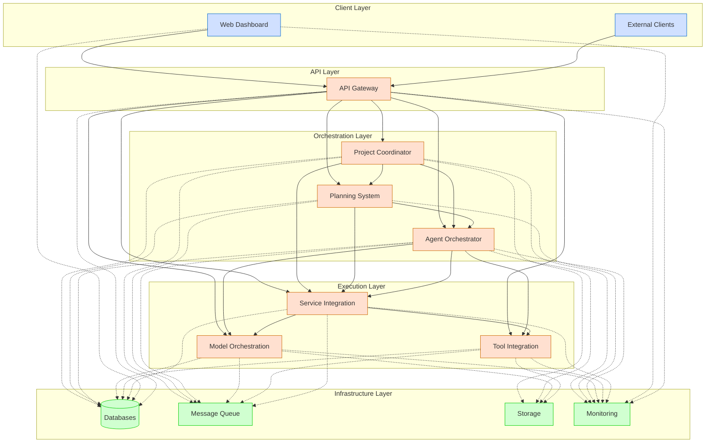
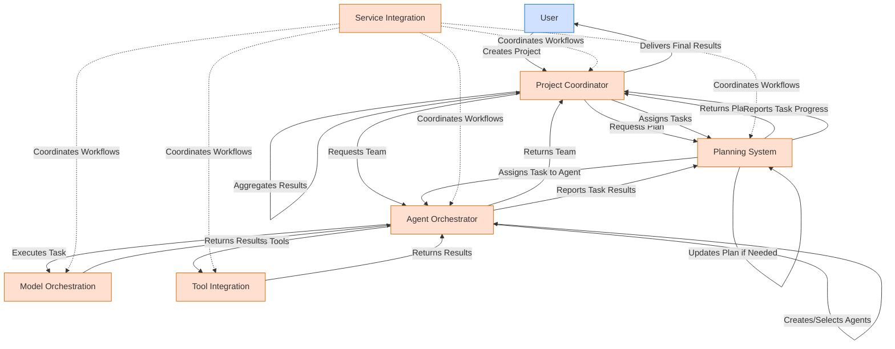
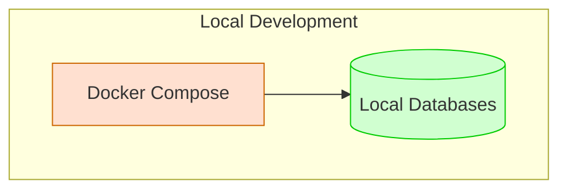
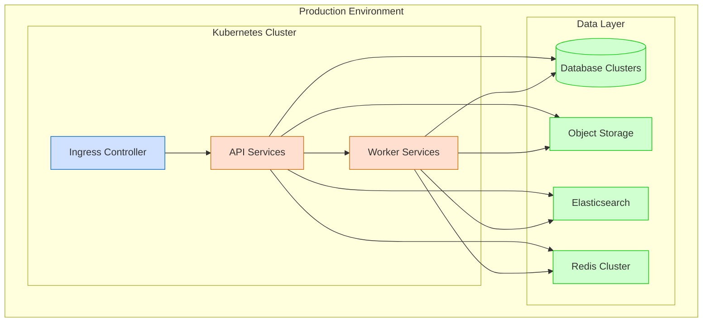
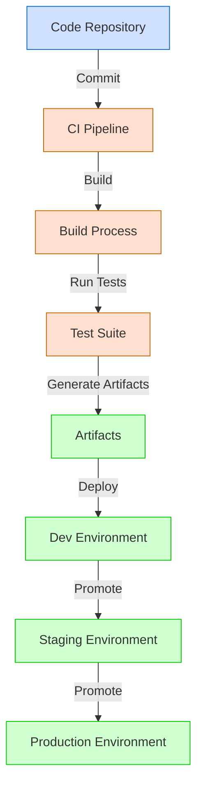

# System Overview

**Last Modified:** 2025-03-29  
**Completion Date:** 2025-03-29  
**Doc Type:** Reference  

---

## Overview

Berrys_AgentsV2 is a comprehensive multi-agent orchestration platform designed to enable intelligent agents to collaborate on complex tasks. This document provides a high-level overview of the system architecture, core components, and key interactions.

## System Architecture

The platform follows a microservices architecture with specialized services for different aspects of agent orchestration:

## Core Services

| Service | Purpose | Key Responsibilities |
|---------|---------|----------------------|
| **API Gateway** | Provides unified API access | Authentication, routing, rate limiting, documentation |
| **Web Dashboard** | Provides user interface | UI rendering, user interaction, visualization |
| **Project Coordinator** | Manages projects and workflows | Project lifecycle, team assembly, result aggregation |
| **Planning System** | Plans and coordinates tasks | Task decomposition, dependency management, assignment |
| **Agent Orchestrator** | Manages agent lifecycle | Agent creation, specialization, state management |
| **Model Orchestration** | Manages AI model interactions | Model selection, execution, context management |
| **Tool Integration** | Enables external tool usage | Tool discovery, execution, credential management |
| **Service Integration** | Coordinates workflows | Workflow orchestration, state management, error handling |

## High-Level Data Flow

The platform handles data flow across services in a coordinated manner:

## Key Design Patterns

The system employs several architectural and design patterns:

### Microservices Architecture

Each core service is implemented as an independent microservice with:

- Clear service boundaries and responsibilities
- Independent deployment capabilities
- Service-specific data stores when appropriate
- Standardized API contracts
- Health monitoring endpoints

### Event-Driven Communication

Services communicate through:

- Event publishing and subscription
- Message-based asynchronous communication
- Event sourcing for state management
- Command and event separation

### API-First Design

All services follow API-first principles:

- Clear API contracts defined via OpenAPI
- Strict versioning and backward compatibility
- Consistent response formats
- Comprehensive error handling

### Domain-Driven Design

Services are organized around business domains:

- Bounded contexts for services
- Ubiquitous language within domains
- Aggregates and entities matching business concepts
- Value objects for descriptive concepts

## Key Technologies

| Category | Technologies |
|----------|--------------|
| **Programming Languages** | Python, TypeScript |
| **Web Frameworks** | FastAPI, Flask, React |
| **Message Brokers** | Redis |
| **Databases** | PostgreSQL |
| **Containerization** | Docker, Kubernetes |
| **API Documentation** | OpenAPI, Swagger UI |
| **Monitoring** | Prometheus, Grafana |
| **Testing** | Pytest, Jest, Cypress |
| **CI/CD** | GitHub Actions |

## Security Model

The platform implements a comprehensive security model:

- **Authentication**: JWT-based authentication, API keys
- **Authorization**: Role-based access control, permission checks
- **Data Protection**: Encryption at rest and in transit
- **Audit Logging**: Comprehensive action logs
- **Rate Limiting**: Protection against abuse
- **Input Validation**: Strict request validation
- **Output Sanitization**: Response sanitization
- **Secrets Management**: Secure credential handling

## Infrastructure Architecture

The platform can be deployed in various environments:

### Development Environment

### Production Environment

## Scalability Considerations

The platform is designed for horizontal scalability:

- **Stateless Services**: Services designed to be stateless
- **Database Scaling**: Support for database replication and sharding
- **Load Balancing**: Service-level load balancing
- **Caching**: Strategic caching for performance
- **Asynchronous Processing**: Queue-based processing
- **Resource Optimization**: Efficient resource utilization
- **Autoscaling**: Automatic scaling based on load

## Observability Strategy

The platform implements comprehensive observability:

- **Logging**: Structured logging across services
- **Metrics**: System and business metrics collection
- **Tracing**: Distributed request tracing
- **Alerting**: Automated alert generation
- **Dashboards**: Real-time monitoring dashboards
- **Health Checks**: Service health monitoring
- **Performance Analytics**: Ongoing performance analysis

## Deployment Process

The platform uses a standardized deployment process:

## Performance Considerations

The platform addresses several performance considerations:

- **Response Time**: Optimization for low response times
- **Throughput**: High transaction throughput capabilities
- **Resource Utilization**: Efficient CPU and memory usage
- **Database Performance**: Query optimization and indexing
- **Caching Strategy**: Multi-level caching approach
- **Asynchronous Processing**: Background processing for long-running tasks
- **Bulk Operations**: Support for batch processing

## Failure Modes and Recovery

The platform is designed for resilience:

- **Service Failures**: Graceful degradation for service outages
- **Database Failures**: Failover capabilities for database issues
- **Network Failures**: Retry mechanisms for network interruptions
- **Inconsistent State**: State reconciliation procedures
- **Resource Exhaustion**: Circuit breakers to prevent cascading failures
- **Data Corruption**: Data validation and recovery procedures
- **External Dependency Failures**: Fallback mechanisms for external dependencies

## References

- [API Gateway Service](../services/api-gateway.md)
- [Web Dashboard Service](../services/web-dashboard.md)
- [Project Coordinator Service](../services/project-coordinator.md)
- [Planning System Service](../services/planning-system.md)
- [Agent Orchestrator Service](../services/agent-orchestrator.md)
- [Model Orchestration Service](../services/model-orchestration.md)
- [Tool Integration Service](../services/tool-integration.md)
- [Service Integration Service](../services/service-integration.md)
- [Communication Patterns](communication-patterns.md)
- [Data Flow](data-flow.md)
- [Security Model](security-model.md)
