# Database Schema and Migration Strategy

## Overview

The Berrys_AgentsV2 project requires a robust database schema and migration strategy to handle schema evolution over time while maintaining data integrity. This document outlines the database schema and approach for implementing and managing database migrations.

## Database Schema

The core data model for the system is as follows:

```mermaid
erDiagram
    PROJECT {
        uuid id PK
        string name
        json description
        timestamp created_at
        timestamp updated_at
        enum status
        jsonb project_metadata
    }
    
    PROJECT_STATE {
        uuid id PK
        uuid project_id FK
        string state
        timestamp transitioned_at
        text reason
        uuid transitioned_by
        timestamp created_at
        timestamp updated_at
    }
    
    AGENT {
        uuid id PK
        uuid project_id FK
        string name
        string type
        json configuration
        timestamp created_at
        json prompt_template
        enum status
    }
    
    AGENT_INSTRUCTION {
        uuid id PK
        string agent_name
        text purpose
        jsonb capabilities
        text tone_guidelines
        jsonb knowledge_domains
        jsonb response_templates
        timestamp created_at
        timestamp updated_at
        jsonb instruction_metadata
    }
    
    AGENT_CAPABILITY {
        uuid id PK
        uuid agent_instruction_id FK
        string capability_name
        text description
        jsonb parameters
        timestamp created_at
        timestamp updated_at
        jsonb capability_metadata
    }
    
    AGENT_KNOWLEDGE_DOMAIN {
        uuid id PK
        uuid agent_instruction_id FK
        string domain_name
        integer priority_level
        text description
        timestamp created_at
        timestamp updated_at
        jsonb domain_metadata
    }
    
    AGENT_PROMPT_TEMPLATE {
        uuid id PK
        uuid agent_instruction_id FK
        string template_name
        string template_version
        text template_content
        jsonb context_parameters
        timestamp created_at
        timestamp updated_at
    }
    
    CHAT_SESSION {
        string id PK
        uuid user_id
        jsonb session_metadata
        timestamp created_at
        timestamp updated_at
    }
    
    CHAT_MESSAGE {
        uuid id PK
        string session_id FK
        string role
        text content
        timestamp timestamp
        jsonb message_metadata
        timestamp created_at
        timestamp updated_at
    }
    
    TOOL {
        uuid id PK
        string name
        string version
        json schema
        string source
        timestamp registered_at
        json metadata
    }
    
    AGENT_TOOL {
        uuid agent_id FK
        uuid tool_id FK
        json configuration
    }
    
    TASK {
        uuid id PK
        uuid project_id FK
        uuid agent_id FK
        string name
        json description
        timestamp created_at
        timestamp completed_at
        enum status
        json result
    }
    
    COMMUNICATION {
        uuid id PK
        uuid from_agent_id FK
        uuid to_agent_id FK
        timestamp sent_at
        json content
        enum type
        json metadata
    }
    
    AUDIT_LOG {
        uuid id PK
        uuid entity_id
        string entity_type
        timestamp created_at
        string action
        json previous_state
        json new_state
        uuid actor_id
    }
    
    PERFORMANCE_METRIC {
        uuid id PK
        uuid entity_id
        string entity_type
        timestamp recorded_at
        string metric_name
        float metric_value
        json context
    }
    
    OPTIMIZATION_SUGGESTION {
        uuid id PK
        timestamp created_at
        string category
        string description
        json evidence
        enum status
        float impact_score
    }
    
    HUMAN_INTERACTION {
        uuid id PK
        uuid entity_id
        string entity_type
        timestamp created_at
        enum interaction_type
        json content
        json response
        timestamp response_time
    }
    
    PROJECT ||--o{ PROJECT_STATE : "has history of"
    PROJECT ||--o{ AGENT : "contains"
    PROJECT ||--o{ TASK : "has"
    AGENT ||--o{ TASK : "performs"
    AGENT ||--o{ COMMUNICATION : "sends"
    AGENT }o--o{ TOOL : "uses"
    AGENT_TOOL }|--|| AGENT : "configures for"
    AGENT_TOOL }|--|| TOOL : "configured as"
    AGENT_INSTRUCTION ||--o{ AGENT_CAPABILITY : "defines"
    AGENT_INSTRUCTION ||--o{ AGENT_KNOWLEDGE_DOMAIN : "has"
    AGENT_INSTRUCTION ||--o{ AGENT_PROMPT_TEMPLATE : "uses"
    CHAT_SESSION ||--o{ CHAT_MESSAGE : "contains"
```



## Migration Framework

We use Alembic with SQLAlchemy for database migrations, which provides:
- Version control for database schema
- Automatic migration generation based on model changes
- Support for both auto-generated and hand-written migrations
- Upgrade and downgrade paths for each migration

## Directory Structure

```
shared/
├── database/
│   ├── migrations/
│   │   ├── versions/           # Migration version files
│   │   ├── env.py              # Alembic environment configuration
│   │   ├── script.py.mako      # Migration script template
│   │   └── alembic.ini         # Alembic configuration
│   └── init.sql                # Initial database setup script
```

## Migration Workflow

### Initial Setup

1. Initialize Alembic:
   ```
   alembic init shared/database/migrations
   ```
2. Configure Alembic to use our SQLAlchemy models
3. Create the initial migration:
   ```
   alembic revision --autogenerate -m "Initial schema"
   ```

### Development Workflow

1. When making model changes:
   - Update SQLAlchemy models
   - Run: `alembic revision --autogenerate -m "Description of changes"`
   - Review the generated migration file and adjust if necessary
   - Run: `alembic upgrade head` to apply the migration

2. When deploying to environments:
   - Production/Staging: `alembic upgrade head`
   - Include migrations in CI/CD pipeline

### Testing Migrations

1. Create a test database for migration testing
2. Run the full migration sequence: `alembic upgrade head`
3. Test downgrade operations: `alembic downgrade -1`
4. Test data integrity after migrations

## Handling Complex Migrations

For complex migrations that cannot be auto-generated:

1. Create a manual migration:
   ```
   alembic revision -m "Complex schema change"
   ```
2. Implement the `upgrade()` and `downgrade()` functions manually
3. Include data migration code if needed

Example of a complex migration:

```python
def upgrade():
    # Add new table
    op.create_table(
        'new_table',
        sa.Column('id', sa.UUID(), nullable=False),
        sa.Column('name', sa.String(), nullable=False),
        sa.PrimaryKeyConstraint('id')
    )
    
    # Data migration
    connection = op.get_bind()
    
    # Query existing data
    results = connection.execute("SELECT id, data FROM old_table")
    for row in results:
        # Transform data
        new_name = row.data.get('name', 'Default')
        
        # Insert into new table
        connection.execute(
            f"INSERT INTO new_table (id, name) VALUES ('{row.id}', '{new_name}')"
        )
```

## Migration Safety Measures

1. **Backup**: Always back up the database before applying migrations
2. **Transaction Management**: Run migrations in transactions where possible
3. **Downgrade Path**: Ensure every migration has a working downgrade path
4. **Testing**: Test migrations on a copy of production data before deploying

## Handling Production Migrations

For production environments:

1. Schedule migrations during low-traffic periods
2. Use database replication for zero-downtime migrations where possible
3. Monitor database performance during and after migrations
4. Have a rollback plan ready in case of issues

## Version Control Integration

1. Include all migration files in version control
2. Add `.revision` file tracking current migration version
3. Document migration-related changes in commit messages

## SQLAlchemy Model Best Practices

When defining SQLAlchemy models, follow these best practices:

1. **Avoid Reserved Column Names**: Don't use `metadata` as a column name in SQLAlchemy models as it causes conflicts with SQLAlchemy's internal metadata.

2. **Handle Circular Dependencies**: Use string references and late binding for circular relationships:

   ```python
   # Use string references in relationship definitions
   tools = relationship("ToolModel", secondary="agent_tools", back_populates="agents")
   ```

3. **Use Appropriate Relationship Types**: Choose the right relationship type for your data model:

   ```python
   # One-to-many relationship
   agents = relationship("AgentModel", back_populates="project", cascade="all, delete-orphan")
   
   # Many-to-many relationship
   tools = relationship("ToolModel", secondary=agent_tool_association, back_populates="agents")
   
   # Self-referential relationship
   dependencies = relationship(
       "TaskModel",
       secondary=task_dependency,
       primaryjoin="TaskModel.id == task_dependencies.c.dependent_task_id",
       secondaryjoin="TaskModel.id == task_dependencies.c.dependency_task_id",
       backref="dependents"
   )
   ```

4. **Use Explicit Join Conditions**: For complex relationships, use explicit join conditions:

   ```python
   from_agent = relationship(
       "AgentModel", 
       foreign_keys=[from_agent_id],
       primaryjoin="CommunicationModel.from_agent_id == AgentModel.id",
       back_populates="sent_communications"
   )
   ```

5. **Use Cascade Delete**: Use cascade delete for parent-child relationships:

   ```python
   agents = relationship("AgentModel", back_populates="project", cascade="all, delete-orphan")
   ```

6. **Use Indexes**: Add indexes to frequently queried columns:

   ```python
   project_id = Column(UUID(as_uuid=True), ForeignKey("projects.id", ondelete="CASCADE"), nullable=False, index=True)
