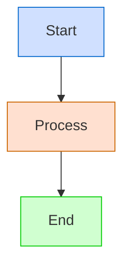

# Document Title

**Last Modified:** YYYY-MM-DD  
**Completion Date:** YYYY-MM-DD  
**Doc Type:** [Reference|Guide|Onboarding]  

---

## Overview

Brief introduction to the document purpose and content. This should be 2-4 sentences that explain what the document covers and why it's important.

## Main Content Sections

Structure your document with clear headings and concise content. Use tables, lists, and diagrams where appropriate to improve clarity.

### Guidelines for Different Document Types

#### Reference Documents

- Focus on accuracy and completeness
- Organize information logically
- Use tables for structured data
- Include diagrams for complex relationships
- Link to related reference materials

#### Guide Documents

- Provide step-by-step instructions
- Include examples and sample code
- Explain why certain approaches are recommended
- Highlight best practices
- Include troubleshooting tips

#### Onboarding Documents

- Start with the basics
- Use clear, simple language
- Provide context for new concepts
- Include links to more detailed documentation
- Structure content in a logical learning sequence

## Common Elements

### Code Examples

Keep code examples concise and focused:

```python
# Example code should demonstrate a specific concept
def example_function():
    """Include docstrings for clarity."""
    return "Keep examples simple and to the point"
```

### Diagrams

Use Mermaid diagrams for visualizing processes, architecture, and relationships:



### Tables

Use tables for structured information:

| Column 1 | Column 2 | Column 3 |
|----------|----------|----------|
| Data 1   | Data 2   | Data 3   |
| Data 4   | Data 5   | Data 6   |

### References

Include references to related documentation:

- [Related Document 1](path/to/document1.md)
- [Related Document 2](path/to/document2.md)

## Version History

| Date | Changes | Author |
|------|---------|--------|
| YYYY-MM-DD | Initial version | Author Name |
| YYYY-MM-DD | Updates to section X | Author Name |
