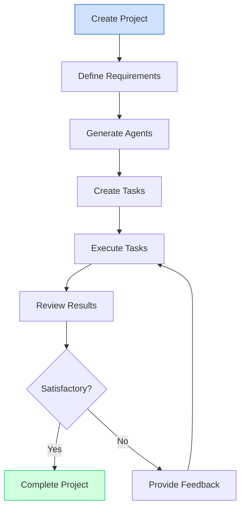

# User Guides

Welcome to the Berrys_AgentsV2 user guides. This section provides comprehensive documentation for users who want to use the system to create and manage projects with AI agents.

## Quick Navigation

- [Getting Started](getting-started.md): First steps with Berrys_AgentsV2
- [Creating Projects](creating-projects.md): How to create and configure projects
- [Working with Agents](working-with-agents.md): Understanding and interacting with agents
- [Managing Tasks](managing-tasks.md): Creating, assigning, and tracking tasks
- [Using Tools](using-tools.md): Integrating and using external tools
- [Human-in-the-Loop](human-in-the-loop.md): How to provide feedback and guidance to agents

## Overview

Berrys_AgentsV2 is a project-based multi-agent system that helps you accomplish complex tasks using AI agents. The system allows you to:

1. **Create Projects**: Define project goals, requirements, and constraints
2. **Work with Specialized Agents**: Utilize different types of agents for specific tasks
3. **Manage Tasks**: Break down projects into manageable tasks and track progress
4. **Integrate Tools**: Connect agents with external tools and services
5. **Provide Guidance**: Interact with agents to provide feedback and direction

## User Workflow

The typical user workflow in Berrys_AgentsV2 is illustrated below:

## Project Lifecycle

A project in Berrys_AgentsV2 goes through several stages:

1. **Draft**: Initial project setup and requirement definition
2. **Planning**: Breaking down the project into tasks and assigning agents
3. **In Progress**: Active work on project tasks
4. **Review**: Reviewing completed tasks and providing feedback
5. **Completed**: All tasks completed successfully
6. **Archived**: Project is no longer active but preserved for reference

## Agent Types

Berrys_AgentsV2 supports various types of specialized agents:

- **Researcher**: Gathers information and conducts research
- **Planner**: Creates detailed plans and breaks down complex tasks
- **Developer**: Writes and reviews code
- **Designer**: Creates visual designs and user interfaces
- **Writer**: Creates written content and documentation
- **Tester**: Tests and validates solutions
- **Deployment**: Handles deployment and infrastructure tasks

Each agent type has specific capabilities and is designed to excel at particular types of tasks.

## Human-in-the-Loop Interaction

Berrys_AgentsV2 is designed as a human-in-the-loop system, where human users provide guidance, feedback, and approval at key points in the project lifecycle. This ensures that the system produces high-quality results that meet your expectations.

Human interaction points include:

1. **Project Definition**: Defining project goals and requirements
2. **Plan Approval**: Reviewing and approving project plans
3. **Task Review**: Reviewing completed tasks and providing feedback
4. **Decision Points**: Making critical decisions that require human judgment
5. **Final Approval**: Approving the final project deliverables

## Getting Help

If you encounter any issues or have questions about using Berrys_AgentsV2, you can:

1. **Check the Documentation**: This documentation covers most aspects of the system
2. **Contact Support**: Reach out to the support team for assistance
3. **Join the Community**: Connect with other users to share experiences and best practices
